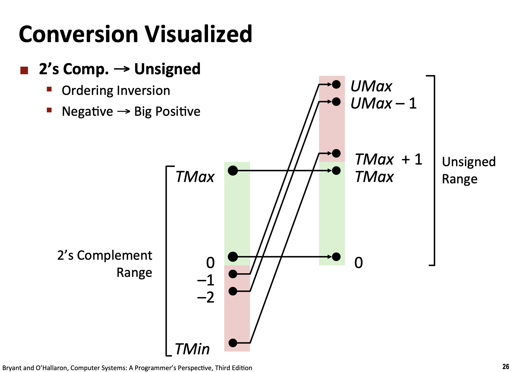

# Lecture 2 Bits, Bites and Integers

## Representing Information as Bits

- Base 2 Number representations (十进制和二进制的转化)
- 一个 Byte 等于 8 个 Bits
    - Bit 是二进制的
    - Byte 可以由 8 个二进制数表示，因此可以表示成 2 个十六进制数。`0x`
    - 计算机内存地址通常用十六进制表示，对于 64 位的系统，虚拟内存地址编码的长度为 8 字节。
        - 理论最大的可寻址单位是 $2^64$ 个。

## Bit-level Manipulations

### Boolean Algebra

- `A & B = 1` iff `A = 1` and `B = 1`
- `A | B = 1` iff `A = 1` or `B = 1`
- `~A = 1` iff `A = 0`
- Exclusive Or (XoR): `A ^ B = 1` iff (`A = 1` or `B = 1` but not the same)

我们可以施加这四种基本运算到 Bit vectors (bit-wise operations)

### Example: DP and Binaries

在动态规划的状态压缩中，核心就是使用一个二进制数来无损压缩当前的状态。考虑表示集合 ${0,1,2,\dots,w-1}$ 的一个**子集**，状态空间的大小为 $2^w$，可以使用一个 $w$ 位的二进制数来表示这个状态。 

表示为一个 Bit Vectors 之后，布尔代数的基本运算符就对应了若干集合的基本操作：

- `&`: Intersections of sets.
- `|`: Union of sets
- `~`: Complement （补集）
- `^`: Symmetric Difference $(A \cup B) \setminus (A \cap B)$

> 在集合中，可以使用 `A & (~B)` 来表示集合的差集 $A \setminus B = A \cap \overline{B}$

### Bit Level Operations & Logic Level Operations in C

- Bit Level Operations: `&`, `|`, `~` and `^`
    - Applied to any integer data type
    - View arguments as bit vectors (applied bit-wise)
- Logic Level Operations: `&&`, `||` and `!`
    - true if the return value is not zero
    - false iff 0

### Shift Operations

- Left Shift `x << y`: Shift bit vector left y positions and throw away extra bits on the right and fill with 0 on the left.

- Right Shift `x >> y`: Shift bit vector right y positions and throw away extra bits on the left and fill with 0 on the right.

> Attention! Doing shift operations for negative numbers is UB.

```c
void show_shift_operations() {
  unsigned char a = 0x41;

  printf("--- Shift Operations (unsigned char) ---\n");
  printf("Original: 0x%02X (Binary: ", a);
  print_binary(a);
  printf(")\n");

  unsigned char left_shift_result = (unsigned char)(a << 3);
  printf("Left Shift 3 positions:  0x%02X (Binary: ", left_shift_result);
  print_binary(left_shift_result);
  printf(")\n");

  unsigned char right_shift_result = (unsigned char)(a >> 2);
  printf("Right Shift 2 positions: 0x%02X (Binary: ", right_shift_result);
  print_binary(right_shift_result);
  printf(")\n");
}

void show_signed_shift_dangers() {
  // ! Undefined behaviors
  signed char a = -0x41;  // -65 in decimal
  unsigned char b = 0x41; // 65 in decimal for comparison

  printf(
      "\n--- Signed Shift Dangers (Arithmetic vs Logical Right Shift) ---\n");

  printf("\n[SIGNED CHAR - Arithmetic Right Shift]\n");
  printf("Original: %d (0x%02X) (Binary: ", a, (unsigned char)a);
  print_binary(a);
  printf(")\n");

  signed char right_shift_2 = (signed char)(a >> 2);
  printf("Right Shift 2 positions: %d (0x%02X) (Binary: ", right_shift_2,
         (unsigned char)right_shift_2);
  print_binary(right_shift_2);
  printf(")\n");
  signed char right_shift_4 = (signed char)(a >> 4);
  printf("Right Shift 4 positions: %d (0x%02X) (Binary: ", right_shift_4,
         (unsigned char)right_shift_4);
  print_binary(right_shift_4);
  printf(")\n");

  printf("\n[UNSIGNED CHAR - Logical Right Shift]\n");
  printf("Original: %d (0x%02X) (Binary: ", b, b);
  print_binary(b);
  printf(")\n");

  unsigned char right_shift_2_u = b >> 2;
  printf("Right Shift 2 positions: %d (0x%02X) (Binary: ", right_shift_2_u,
         right_shift_2_u);
  print_binary(right_shift_2_u);
  printf(")\n");
}
```

```text
--- Signed Shift Dangers (Arithmetic vs Logical Right Shift) ---

[SIGNED CHAR - Arithmetic Right Shift]
Original: -65 (0xBF) (Binary: 10111111)
Right Shift 2 positions: -17 (0xEF) (Binary: 11101111)
Right Shift 4 positions: -5 (0xFB) (Binary: 11111011)

[UNSIGNED CHAR - Logical Right Shift]
Original: 65 (0x41) (Binary: 01000001)
Right Shift 2 positions: 16 (0x10) (Binary: 00010000)
```

> [!NOTE]
> `unsigned_char` 类型的字段在 C/Cpp 中被严格定义为 1 个字节即 8 个比特位，正好可以对应一个**两位的二进制数**。从计算机的视角，一个 char 字符也可以看成是一个两位的二进制数！并且使用 `unsigned` 防止负号影响对应的行为。

```text
--- Shift Operations (unsigned char) ---
Original: 0x41 (Binary: 01000001)
Left Shift 8 positions:  0x00 (Binary: 00000000)
Right Shift 8 positions: 0x00 (Binary: 00000000)
--- Shift Operations (unsigned char) ---
Original: 0xFFFFFFBF (Binary: 10111111)
Left Shift 8 positions:  0x00 (Binary: 00000000)
Right Shift 8 positions: 0xFF (Binary: 11111111)
```
 
## Integers

### Encoding Integers

我们首先需要在计算机中表示（十进制）整数。一个 int 类型的变量是 4 字节。

- 对于无符号整数，32 位字节全部用来存储整数的二进制数据，即一个 $w = 32$ 的二进制字符串。

$$
\text{B2U}(X) = \sum_{i=0}^{w-1} x_i 2^i
$$

- 二进制转补码成为有符号整数 (Binary to Two's Complement)，因为需要预留一个比特给 0/1 的位置，因此需要额外加上符号位。

$$
\text{B2T} = - x_{w-1} 2^{w-1} + \sum_{i=0}^{w-2} x_i 2^i
$$

> [!NOTE]
> 补码的计算方式（正数不变、负数取反加一）对应的就是这个核心的计算模式。在 $w$ 位的二进制中，最高位（MSB）的权重在无符号（$B2U$）时是 $2^{w-1}$，而在补码（$B2T$）时是 $-2^{w-1}$。这两者之间的差值恰好是：$$2^{w-1} - (-2^{w-1}) = 2 \times 2^{w-1} = 2^w$$这意味着，补码本质上是在模 $2^w$ 的系统下进行的运算。这也对应这整数的溢出现象。
> 假设我们有一个正数 $x$（源码为 $0 \dots$），我们要得到它的相反数 $-x$ 的补码表示。将 $x$ 的每一位取反，数学上等同于用全 1 的二进制数（即 $2^w - 1$）减去 $x$。
$$\text{取反结果} = (2^w - 1) - x$$
$$\text{补码} = ((2^w - 1) - x) + 1 = 2^w - x$$
对应 $B2T$ 公式：当你计算 $2^w - x$ 时，在 $w$ 位长的容器里，最高位的溢出会被丢弃（对应数学上的取模运算），留下的位模式正好满足 $B2T$ 公式中 $-2^{w-1}$ 的权重分配，使得最终结果的数学意义等同于 $-x$。


无论是有符号整数的补码表示，还是无符号整数，其表示的整数的区间长度都是固定不变的，都是 $2^w$，这也说明了整数在计算机中就像一个时钟一样，二进制位的长度使其走完一圈的模长为 $2^w$。在这个基础上，只要保证模长相同的条件下，我们可以保证**补码合成的整数**和无符号整数之前存在**一一对应的函数关系**。这为后续语言的进制转换提供了理论基础（保证这种转换存在唯一性）



```c
void show_integers(short number) {
  printf("\n--- Integer Representations (short: 16 bits) ---\n");

  printf("\n[Input Number]\n");
  printf("Value: %d (0x%04hX) (Binary: ", number, number);
  SHOW_BINARY(number);
  printf(")\n");

  printf("\n[Special Values]\n");

  unsigned short max_unsigned_short = 0xFFFF;
  printf("Max unsigned short: %6hu (0x%04hX) (Binary: ", max_unsigned_short, max_unsigned_short);
  SHOW_BINARY(max_unsigned_short);
  printf(")\n");

  short max_short = 0x7FFF;
  printf("Max signed short:   %6hd (0x%04hX) (Binary: ", max_short, max_short);
  SHOW_BINARY(max_short);
  printf(")\n");

  short min_short = 0x8000;
  printf("Min signed short:   %6hd (0x%04hX) (Binary: ", min_short, min_short);
  SHOW_BINARY(min_short);
  printf(")\n");

  short minus_1 = -1;
  printf("Minus one for short (-1):     %6hd (0x%04hX) (Binary: ", minus_1, (unsigned short)minus_1);
  SHOW_BINARY(minus_1);
  printf(")\n");

  short zero = 0;
  printf("Zero (0):           %6hd (0x%04hX) (Binary: ", zero, zero);
  SHOW_BINARY(zero);
  printf(")\n");
}
```

```text
--- Integer Representations (short: 16 bits) ---

[Input Number]
Value: 32 (0x0020) (Binary: 0000000000100000)

[Special Values]
Max unsigned short:  65535 (0xFFFF) (Binary: 1111111111111111)
Max signed short:    32767 (0x7FFF) (Binary: 0111111111111111)
Min signed short:   -32768 (0x8000) (Binary: 1000000000000000)
Minus one (-1):         -1 (0xFFFF) (Binary: 1111111111111111)
Zero (0):                0 (0x0000) (Binary: 0000000000000000)
```

可以看到，同样都是 1111111111111111 的二进制表示（16 个 bits），对于不同的类型声明（比如 unsigned short 和 short），其解析的方式和最终的结果大相径庭。

