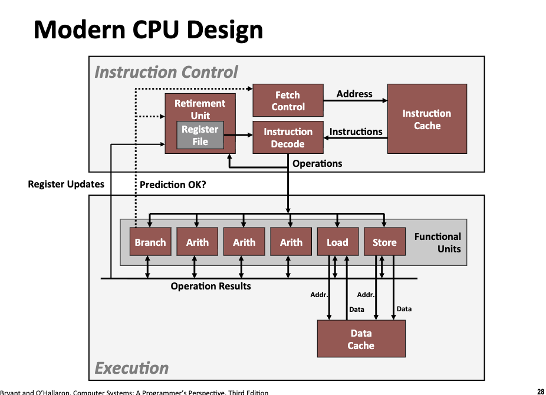
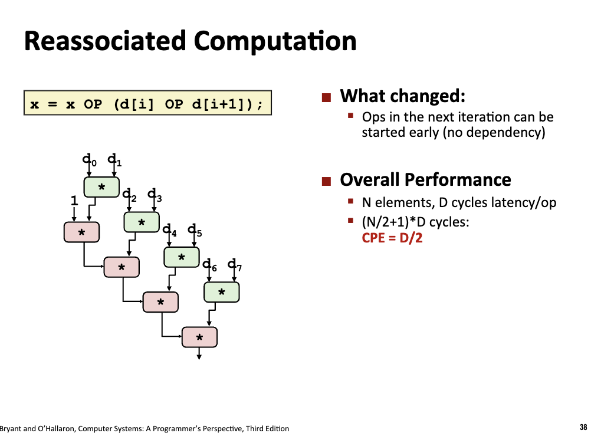

# Program Optimizations

<link rel="stylesheet" href="https://cdn.jsdelivr.net/npm/katex@0.16.9/dist/katex.min.css">

<script defer src="https://cdn.jsdelivr.net/npm/katex@0.16.9/dist/katex.min.js"></script>

<script defer src="https://cdn.jsdelivr.net/npm/katex@0.16.9/dist/contrib/auto-render.min.js" onload="renderMathInElement(document.body, {delimiters: [
    {left: '$$', right: '$$', display: true},
    {left: '\\[', right: '\\]', display: true},
    {left: '$', right: '$', display: false},
    {left: '\\(', right: '\\)', display: false}
]});"></script>

## General Useful Optimizations

在算法侧主要针对程序进行时间复杂度的大幅优化、但是在真实的程序运行时中，**常数时间优化**也是一个非常重要的命题。

- Multiple Levels:
    - Algorithms
    - Data representations
    - Procedures
    - Loops
- Understand system to optimize performance.

> **上述优化必须是针对一般机器和底层硬件上的优化**！针对特定机器特定型号的优化往往并不具有很强的现实意义。

### Code Motion

在编译器设计和代码优化领域，Code Motion（代码移动）是一种重要的优化策略。将程序中某些计算指令从**执行频率较高的区域**（如循环内部）移动到**执行频率较低的区域**（如循环外部），或者移动到更合适的位置，以减少重复计算或提高执行效率。

- 循环不变量外提 (Loop Invariant Code Motion, LICM): 如果一段代码在循环中每次迭代的结果都相同（即“循环不变量”），编译器会将这段代码移出循环体，只在循环开始前执行一次。

```c
void set_row(double *a, double *b, long i, long n) {
  long j;
  for (j = 0; j < n; j++) {
    a[n * i + j] = b[j];
  }
}

void set_row_licm(double *a, double *b, long i, long n) {
  long j;
  long ni = n * i;
  double *rowp = a + ni;
  for (j = 0; j < n; j++) {
    // faster :)
    *rowp++ = b[j];
  }
}
```

```text
	.file	"licm.c"
	.text
	.globl	set_row
	.type	set_row, @function
set_row:
.LFB0:
	.cfi_startproc
	testq	%rcx, %rcx
	jle	.L1
	imulq	%rcx, %rdx
	leaq	(%rdi,%rdx,8), %rdx
	movl	$0, %eax
	.p2align 5
.L3:
	movsd	(%rsi,%rax,8), %xmm0
	movsd	%xmm0, (%rdx,%rax,8)
	addq	$1, %rax
	cmpq	%rax, %rcx
	jne	.L3
.L1:
	ret
	.cfi_endproc
.LFE0:
	.size	set_row, .-set_row
	.globl	set_row_licm
	.type	set_row_licm, @function
set_row_licm:
.LFB1:
	.cfi_startproc
	testq	%rcx, %rcx
	jle	.L5
	imulq	%rcx, %rdx
	leaq	(%rdi,%rdx,8), %rdx
	movl	$0, %eax
	.p2align 5
.L7:
	movsd	(%rsi,%rax,8), %xmm0
	movsd	%xmm0, (%rdx,%rax,8)
	addq	$1, %rax
	cmpq	%rax, %rcx
	jne	.L7
.L5:
	ret
	.cfi_endproc
.LFE1:
	.size	set_row_licm, .-set_row_licm
	.ident	"GCC: (GNU) 15.2.0"
	.section	.note.GNU-stack,"",@progbits
```

> 可以看到，后者函数代码中的运算次数更少，计算更迅速，但是在开启 O1 优化的前提下，编译器将两者转化为了完全相同的代码，磨平了性能上的差异！

### Reduction in Strength

- Replace costly opera;on with simpler one
    - e.g. 移位操作的整数乘除法
    - e.g. 把昂贵的乘法操作转化为加法操作

```c
void set_value(double *a, double *b, long n) {
  long i, j;
  for (i = 0; i < n; i++) {
    // 每次都要进行昂贵的乘法操作
    long ni = n * i;
    for (j = 0; j < n; j++) {
      a[ni + j] = b[j];
    }
  }
}

void set_value_faster(double *a, double *b, long n) {
  long i, j;
  long ni = 0;
  for (i = 0; i < n; i++) {
    for (j = 0; j < n; j++) {
      a[ni + j] = b[j];
    }
    // 转化为加法操作 :)
    ni += n;
  }
}
```

### Share Common Subexpressions

- 自动提取共用的变量，减少计算次数
    - 好的编程习惯会自动实现这一点，尤其是**编译器无法识别的情况** :)

## Optimization Blockers

### Procedures Calls

```c
#include <stddef.h>
#include <string.h>

void lower(char *s) {
  size_t i;
  for (i = 0; i < strlen(s); i++) {
    // call strlen every time!
    if (s[i] >= 'A' && s[i] <= 'Z') {
      s[i] -= ('A' - 'a');
    }
  }
}
// O(N^2)

void lower_faster(char *s) {
  size_t i;
  size_t length = strlen(s);
  for (i = 0; i < length; i++) {
    // call strlen every time!
    if (s[i] >= 'A' && s[i] <= 'Z') {
      s[i] -= ('A' - 'a');
    }
  }
}
// O(N)
```

- Question: 为什么编译器无法自动优化这一点?
    - 循环的运行可能存在副作用，全局变量、函数输入参数等等内容可能会发生变化
    - 编译器的优化是在保证正确性的前提之上的，**编译器会把函数视为黑盒**。
    - 解决方案：
        - 程序员良好的编程习惯
        - **内联函数**：实现函数的直接替换，使得编译器可以深入到函数的内部中

### Memory Aliasing

不必要的对内存变量的频繁读写操作是极度编译器不友好的：

- 从性能上，频繁的读写会涉及 CPU/寄存器/主存之间的数据交互过程，严重影响程序的性能
- 从优化上，编译器必须做最坏的打算（函数存在副作用、可能会对程序造成影响）

```c
void sum_rows1(double *a, double *b, long n) {
  long i, j;
  for (i = 0; i < n; i++) {
    // 频繁的对数组 b 进行读和写的操作
    b[i] = 0;
    for (j = 0; j < n; j++) {
      b[i] += a[i * n + j];
      // * 但是编译器无法自动优化这一点！
      // * 他必须要做最坏的打算: b 变量可能对程序全局的运行产生影响
    }
  }
}

void sum_rows2(double *a, double *b, long n) {
  long i, j;
  for (i = 0; i < n; i++) {
    double val = 0;
    for (j = 0; j < n; j++) {
      val += a[i * n + j];
    }
    b[i] = val;
  }
}
```

例如，上面两个函数在绝大多数的 general case 中都会产生相同的行为，但是**并不是所有情况都是这样**！

```c
void print_rows(double *array, size_t length) {
  size_t i;
  for (i = 0; i < length; i++) {
    printf("array[%ld]: %f\n", i, array[i]);
  }
}

int main() {
  double a[10] = {0.1, 0.2, 0.3, 0.4, 0.5, 0.6, 0.7, 0.8, 0.9, 1};
  sum_rows1(a, a + 2, 2);
  print_rows(a, 10);
  printf("\n\n");

  double c[10] = {0.1, 0.2, 0.3, 0.4, 0.5, 0.6, 0.7, 0.8, 0.9, 1};
  print_rows(c, 10);
  sum_rows2(c, c + 2, 2);
}
```

```text
array[0]: 0.100000
array[1]: 0.200000
array[2]: 0.300000
array[3]: 0.600000
array[4]: 0.500000
array[5]: 0.600000
array[6]: 0.700000
array[7]: 0.800000
array[8]: 0.900000
array[9]: 1.000000


array[0]: 0.100000
array[1]: 0.200000
array[2]: 0.300000
array[3]: 0.400000
array[4]: 0.500000
array[5]: 0.600000
array[6]: 0.700000
array[7]: 0.800000
array[8]: 0.900000
array[9]: 1.000000
```

两者程序产生了不一致的行为！如果编译器非常激进的实现了这样的优化，就会产生非常严重的后果！（优化的前提是结果正确）

> 人往往从真实的程序运行结果进行代码编写，但是编译器的出发点是**无损地**转义原始程序的行为，在此基础上进行性能的优化。

- 这种情况叫做 memory aliasing，编译器不可以非常粗暴的**优化掉内存读写的操作**，因为编译器对内存地址是无知的，最坏的情况就是两个变量指向的是相同的一块内存区域，因此任何对内存的读写更新都会导致一系列的状态变化。
    - 不过程序员是了解的！程序员从任务需求出发，因此仍然需要程序员进行代码习惯的优化

## Exploiting Instruction­‐Level Parallelism

在之前的汇编学习中，我们假设指令是**严格串行**的，机器会严格按照顺序读取汇编代码并执行指令集操作更新寄存器和主存对应的值，并进行一系列跳转操作。

随着现代 CPU 的快速发展，程序的运行可以进行**并行**加速（就像 GPU 加速计算图一样）,如何让编译器生成可以 Instruction­‐Level Parallelism 的代码是一个重要的优化方向。

### Benchmarking

Cycles per element: 单位操作的时钟周期数

$$
T = CPE * n + Overhead
$$

- 良好的编程习惯可以生成编译器友好的代码，减少 CPE 的值
- 与此同时，编译器友好的代码也可以减少循环中的 overhead，从整体的时间上减少计算时间。

### Modern CPU Design



### SuperScaler Processor

定义：在一个时钟周期中，可以处理**多条指令**。

- The instructions are retrieved from a sequential instruction stream and are usually scheduled dynamically.

### Pipelined Functional Units

计算机为了提高 CPU 的利用率，实现了**流水线技术**，流水线技术允许 CPU 在没有完成上一条指令的时候开始进行下一条指令的计算。具体来说：

- Computation is divided into stages
- Pass partial computations from stage to stage
- Stage `i` can start on new computation once values passed to `i+1`.

### Loop Unrolling

现代 CPU 哪怕是单核单处理器，在一个时钟周期中也可以同时处理多个运算操作。而流水线运行则充分利用 CPU 的性能，极大的压缩了程序运行的时间。但是，对于那种**严格依赖顺序进行计算**的计算图，CPU 很难进行流水线操作，因为下一步运算的值往往需要依赖上一步的循环结果。(Sequential Dependency)

例如，如果对一个数组遍历，进行如下的计算：

```
x = x OP d[i]
```

原始的代码编译器无法进行计算图的优化，因为是严格的 sequential 的结构，我们尝试做出了如下的优化:

```
x = (x OP d[i]) OP d[i+1]
# 一次处理两个元素
```

在当前运算顺序下，处理器会先计算括号内部的逻辑，但是**括号外部的运算依赖于先进行的括号内部的运算结果**，因此此处的 CPE 并没有变！但是如果优化运算顺序:

```
x = x OP (d[i] OP d[i+1])
```

> 因为操作数的溢出等问题，编译器无法自动优化 CPE（这会潜在的导致程序的输出结果和正确性不同），因此需要程序员进行手动优化。



可以发现，**上一步循环的第二步和下一步循环的第一步**可以同时进行！CPE 直接减半。

> 程序的性能不会无止境的优化，程序性能的上限主要由**延迟(Latency)** 和 **吞吐量极限(Throughput Limit)** 决定。延迟主要由代码的逻辑顺序决定（是否存在恼人的 linear dependency），而吞吐量极限只要由硬件的上限决定。对于程序而言，我们更希望硬件满功率运行，即程序的运行上限不断毕竟硬件的吞吐量上限。

### Unrolling and Accumulating

对于一个线性的循环，我们可以一般化上述**展开-并行计算**的逻辑。

- Unroll to any degree $L$（循环展开度 L）
*   **含义**：把循环体里的代码复制 $L$ 份，每次循环处理 $L$ 个数据，而不是 1 个。
*   **作用**：减少了循环控制指令（如判断 `i < N`、跳转）的开销。

- Accumulate K results in parallel（并行累积 K 路结果）
*   **含义**：这是最关键的一步！不再只用一个变量 `result` 累加，而是开辟 $K$ 个独立的累加器（`result_0`, `result_1`, ..., `result_K`）。
*   **操作**：
    *   第 1 个数乘给 `result_0`
    *   第 2 个数乘给 `result_1`
    *   ...
    *   第 $K+1$ 个数再乘给 `result_0`
*   **作用**：**打破了数据依赖链！**
    *   计算 `result_0` 的新值时，不需要等待 `result_1` 完成。
    *   这 $K$ 条计算路径是**完全独立**的，CPU 可以同时在 $K$ 条路径上发射指令，充分利用**吞吐量**。

> 为了保证代码整齐，通常让展开的倍数 $L$ 是并行路数 $K$ 的整数倍。这样每一轮大循环里，每个累加器正好工作 $L/K$ 次。（保证最优展开）

## Dealing with Conditionals

流水线技术可以极大程度优化人类程序员编写的循环代码，但是一个很关键的问题是**如何让流水线正确的预测分支**。如果流水线预测分支错误，将会昂贵的浪费非常多的计算时间。

- Branch Taken: Transfer control to branch target
- Branch Not-Taken: Continue with next instruction in sequence.

### Branch Predictions

流水线技术本身（作为一种硬件执行策略）不会“凭空”改变寄存器或主存中的值，值的改变是由具体的指令（如 ADD, STORE, JUMP）决定的。但是，当遇到分支跳转时，流水线的处理方式（如冲刷、预测失败恢复）会直接影响“**哪些指令最终被执行**”，并且不会对寄存器和主存产生实际影响。

当硬件发现预测错误时，会立即触发异常处理机制。硬件会丢弃（Discard/Flush） 所有在错误路径上已经进入流水线但尚未正式提交（Commit）的指令结果。这些指令产生的临时数据会被标记为无效，绝不会写入**最终的寄存器文件或主存**。

如何在更加激进的流水线策略下实现更高的分支预测正确的成功率是现代 CPU 设计和硬件优化的一个非常关键的方向！


