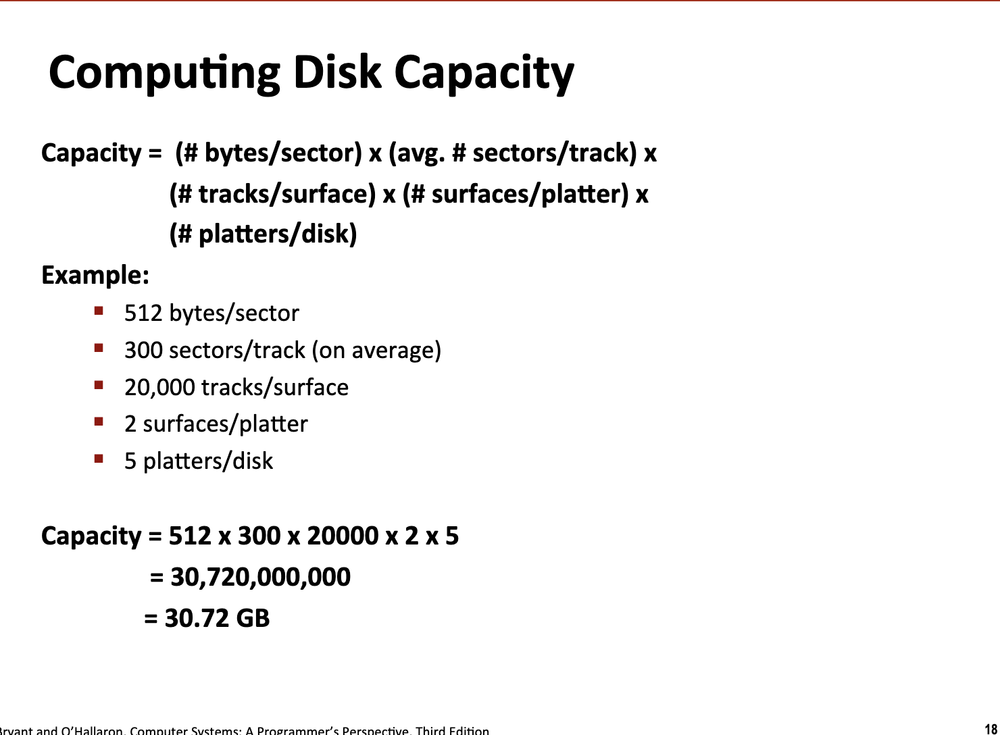
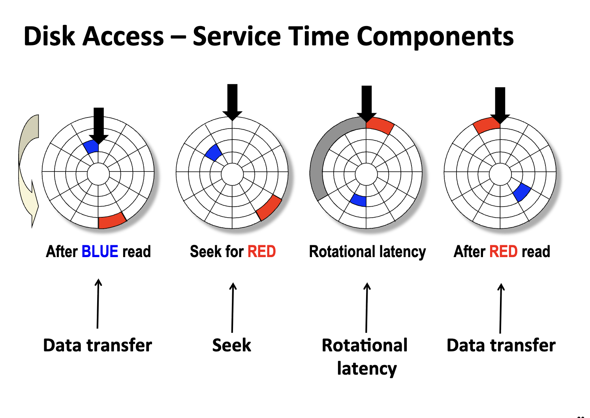
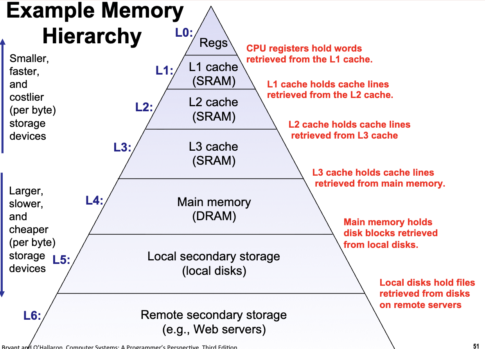
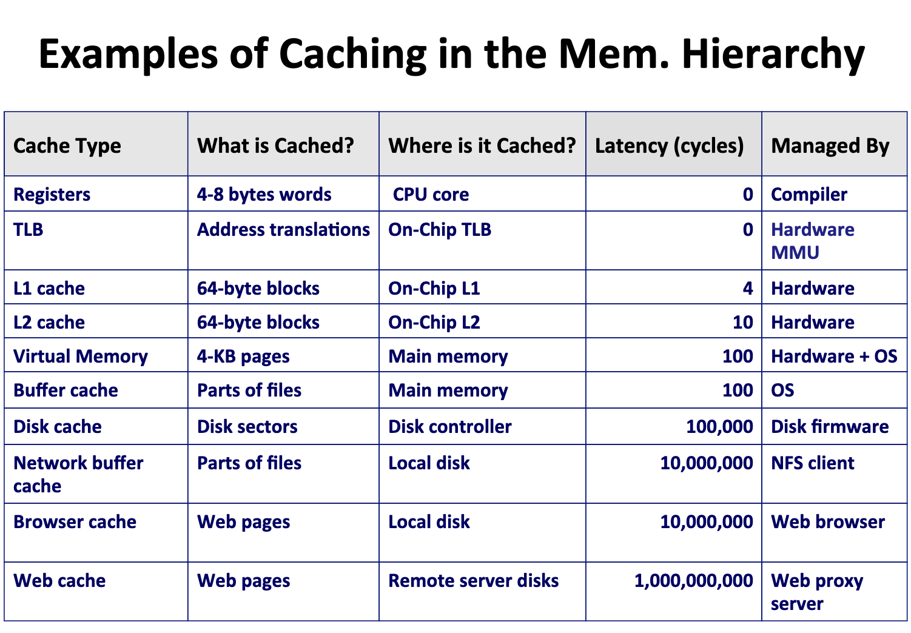

# Memory Hierarchy and Cache Memories

<link rel="stylesheet" href="https://cdn.jsdelivr.net/npm/katex@0.16.9/dist/katex.min.css">

<script defer src="https://cdn.jsdelivr.net/npm/katex@0.16.9/dist/katex.min.js"></script>

<script defer src="https://cdn.jsdelivr.net/npm/katex@0.16.9/dist/contrib/auto-render.min.js" onload="renderMathInElement(document.body, {delimiters: [
    {left: '$$', right: '$$', display: true},
    {left: '\\[', right: '\\]', display: true},
    {left: '$', right: '$', display: false},
    {left: '\\(', right: '\\)', display: false}
]});"></script>

## Storage technologies and Trends

### RAM: Random Access Array

- SRAM: 静态 RAM，速度快，但是结构设计复杂，适合 Cached Memories
- DRAM: 动态 RAM，速度慢，但是价格便宜，适合主要的内存和 frame buffers

当然可以！以下是根据你提供的幻灯片内容整理的中文表格，介绍各种非易失性存储器（Nonvolatile Memories）及其特性：

| 类型 | 全称 | 是否可写 | 擦除方式 | 特点/用途 |
|------|------|----------|----------|-----------|
| ROM | Read-Only Memory（只读存储器） | 不可编程（出厂时已固化） | — | 用于存储固件，如 BIOS、显卡/网卡控制器等 |
| PROM | Programmable ROM（可编程只读存储器） | 仅一次编程 | — | 用户可一次性写入数据，之后不可更改 |
| EPROM | Erasable PROM（可擦除可编程只读存储器） | 可多次编程 | UV 紫外线或 X 射线批量擦除 | 需专用设备擦除，常用于早期嵌入式系统 |
| EEPROM | Electrically Erasable PROM（电可擦除可编程只读存储器） | 可多次编程 | 电子信号逐字节擦除 | 支持在线修改，适合小量数据存储（如配置参数） |
| Flash Memory | 闪存（基于 EEPROM 技术） | 可多次编程 | 按块（block-level）部分擦除 | 广泛用于 U 盘、SSD、手机、平板、MP3 播放器等；寿命约 10 万次擦写 |

### Bus Structure

- Bus: 数据总线，支持数据流从主存和 CPU 直接的快速传输
    - e.g. 汇编指令中有 CPU 从主存中读取数据，存储到寄存器中，这就具体涉及到了数据总线的功能

在具体设计上，寄存器和 ALU 等 CPU 中的核心计算单元首先和**总线接口**进行交互，然后：
- 总线接口和 IO 桥之间存在**系统总线**进行 IO 交互
- IO 桥和主存之间存在**内存总线**进行存储数据交互

### Disk: Geometry and Capacity

#### Geometry

- 磁盘，移动条
- 读取速度远低于 RAM，但是断电数据不会消失

#### Capacity



- 盘片（Platter）：磁性材料圆盘，高速旋转（5400~15000 RPM）
- 磁头（Head）：悬浮在盘片上方，负责读/写磁性信号
- 磁道（Track）：盘片上 concentric circles（同心圆），数据按磁道存储
- 扇区（Sector）：每个磁道被划分为多个扇区，传统为 512 字节，现代多为 4KB（Advanced Format）
- 柱面（Cylinder）：所有盘片同一半径位置的磁道组成一个柱面
- 寻道臂（Actuator Arm）：带动磁头移动到目标磁道



寻道臂移动磁头到目标柱面，并等待旋转（Rotational Latency），等待目标扇区转到磁头下方

Seek 和 Rotation Latency 是磁盘读写的关键时间瓶颈（毫秒级别）

### Logical Disk Blocks

**操作系统**负责处理上层软件和底层硬件系统的交互，从上层来看，操作系统提供了一种极为便利的抽象，让上层软件无需考虑底层设计的硬件细节，通过统一的接口进行存储器的读取（内存/硬盘）

- 物理的硬盘存储器会被操作系统映射为不同编号的 logical disk blocks.
- 一个 LBA 往往代表一个 sector (4KB)
- 两者之间的映射查表由专门的部分进行处理 (FFL)

### IO Bus

在上文中，system bus, memory bus 串联起来了 IO 总桥、CPU 中的 Bug interface 和主存。与此同时，**IO Bus**也在比较低速的外部设备（外部 IO 设备、Disk 等）和 IO 总线连接。

因为有了 IO 总桥，计算机可以实现从磁盘中读取数据，并存储到内存中。

- CPU 直接对 Disk 发出指令
- 磁盘通过 IO Bus 和 Memory Bus 直接对内存进行更新
- 数据复制读取完成后，磁盘通过 IO Bus 和 System Bus 通过 Interrupt 的机制来告知 CPU

> 磁盘读写非常耗时，如果 CPU 等待磁盘完成读写，会严重阻碍 CPU 的运行。

### SSD

- 从接口上和 Rotating Disk 完全保持一致，但是在硬件上读取速度更快。
- Flash Translation Layer: 类似于传统的磁盘控制器

SSD 在物理上和传统的机械硬盘不同，无法实现**数据的原地覆写**，无法擦除原始的物理页，而是找一个新的数据块并写入新数据，然后更新映射表。现代 SSD 会通过垃圾回收，负载均衡等操作进行优化，尽可能避免 SSD 中存在大量的无效数据块。

- SSD 的数据读取，能源消耗都显著低于 Rotating Disks
- 这也导致了更加高昂的造价和更宝贵的使用寿命。

> CPU-Memory Gap

计算机的整体提速是一个非常系统的工程难题：
- 不同组件相互制约，限制速度的因素可能有很多
- Scale Up 的工程美学

## Locality of Reference

局部性原理: Principle of Locality: Programs tend to use data and instructions with **addresses near or equal to those they have used recently**

- temporal locality: 时间局部性、缓存
- spatial locality: 空间局部性


例如，对于一个数组遍历求和：

- Data References
    - 数组是一段连续的内存：空间局部性
    - 求和变量 `sum` 在循环中被循环使用：时间局部性
- Instructions References
    - 循环内部按照顺序读取指令: 空间局部性
    - 循环在一段时间中持续运行: 时间局部性

从程序员的角度，在**保证正确性的前提下**养成良好的局部性编程习惯会很好的提升程序运行的速度。

```c
#include <stdio.h>
#include <stdlib.h>
#include <time.h>

#define M 5000
#define N 5000

int sum_array_rows_1(int a[M][N]) {
  int i, j, sum = 0;
  for (i = 0; i < M; i++) {
    for (j = 0; j < N; j++) {
      sum += a[i][j];
    }
  }
  return sum;
}

int sum_array_rows_2(int a[M][N]) {
  int i, j, sum = 0;
  for (j = 0; j < N; j++) {
    for (i = 0; i < M; i++) {
      sum += a[i][j];
    }
  }
  return sum;
}

int main() {
  static int a[M][N];

  for (int i = 0; i < M; i++) {
    for (int j = 0; j < N; j++) {
      a[i][j] = 1;
    }
  }

  clock_t start, end;
  double cpu_time_used;

  // 测试 sum_array_rows_1 (行优先 - 顺着内存走)
  start = clock();
  int res1 = sum_array_rows_1(a);
  end = clock();
  cpu_time_used = ((double)(end - start)) / CLOCKS_PER_SEC;
  printf("Method 1 (Row-major) Result: %d, Time: %f seconds\n", res1,
         cpu_time_used);

  // 测试 sum_array_rows_2 (列优先 - 跳着内存走)
  start = clock();
  int res2 = sum_array_rows_2(a);
  end = clock();
  cpu_time_used = ((double)(end - start)) / CLOCKS_PER_SEC;
  printf("Method 2 (Column-major) Result: %d, Time: %f seconds\n", res2,
         cpu_time_used);

  return 0;
}
```

```text
Method 1 (Row-major) Result: 25000000, Time: 0.020722 seconds
Method 2 (Column-major) Result: 25000000, Time: 0.073935 seconds
```

从局部性的角度考虑，`sum_array_rows_2` 的遍历顺序和内存的顺序不一致，导致内存访问不连续，这就直接导致局部性较差，存在时间上的损失。


### Memory Hierarchy



- 存储量越小，存储速度越快，价格越贵
- 存储量越大，存储速度越慢，价格越便宜

- 存储器层次结构中的每一层都包含下一层更大体量数据存储器的索引。
    - For each k, the faster, smaller device at level k serves as **a cache** for the larger, slower device at level k+1.

## Caching in Memory Hierarchy

- 狭义定义：L1, L2, L3 Cache，计算机存储结构的最上层的高速数据存储单元
- 广义定义：**计算机存储结构的上一层都是下一层的缓存机制**：更小但是更快

**Cache works as locality**!

“存储层次结构创造了一个巨大的存储池，其成本接近底部廉价存储的水平，但能以顶部高速存储的速度为程序提供数据。”

Cache line 是内存和缓存之间交换的最基本单元，当 CPU 需要读取内存中的某个数据时，如果缓存里没有（Cache Miss），缓存控制器不会只把那一个数据取回来，而是会把包含该数据在内的一整段连续内存都搬进缓存。对于 64 位的系统而言，一个 Cache line 的大小是 64 bytes (* 注意不是 8 字节！)

## Cache Misses

- Cold miss: 冷启动，缓存中不存在数据
- Conflict miss: 内存中特定地址的数据只能放在特定位置的缓存块中，例如 mod (本质是一个哈希映射!)，因此重复访问占据相同缓存地址的内存块会导致频繁的缓存未命中。
- Capacity miss: 缓存容量超过上限

缓存的存储是一个非常有意思的问题：
- 如何实时更新缓存？
- 如何清理不用的旧缓存？



## Cache Memory Organization and Operations

## Performance Impact of Caches

### Memory Mountains

### Rearranging Loops to Improve Spatial Locality

### Using Blocking to Improve temporal Locality