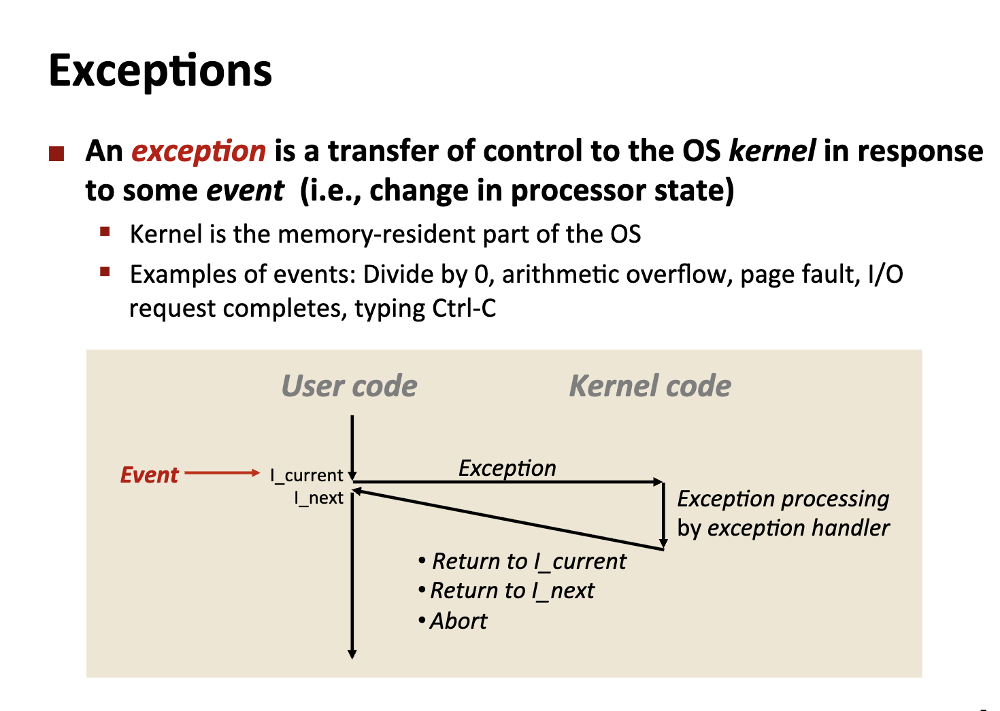
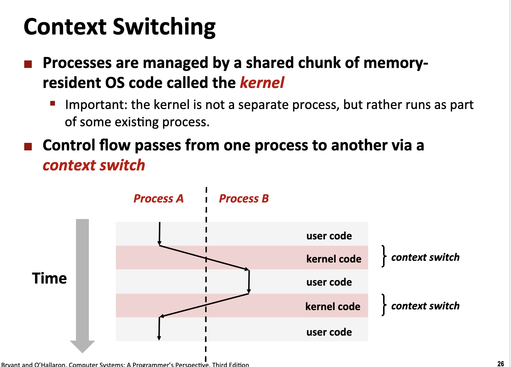
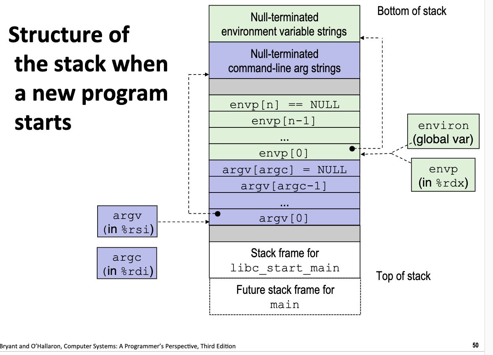

# Exceptional Control Flow

<link rel="stylesheet" href="https://cdn.jsdelivr.net/npm/katex@0.16.9/dist/katex.min.css">

<script defer src="https://cdn.jsdelivr.net/npm/katex@0.16.9/dist/katex.min.js"></script>

<script defer src="https://cdn.jsdelivr.net/npm/katex@0.16.9/dist/contrib/auto-render.min.js" onload="renderMathInElement(document.body, {delimiters: [
    {left: '$$', right: '$$', display: true},
    {left: '\\[', right: '\\]', display: true},
    {left: '$', right: '$', display: false},
    {left: '\\(', right: '\\)', display: false}
]});"></script>

## Execeptional Control Flow

### Control Flow

CPU 随着时间顺序执行不同的指令, from startup to shutdown.

- 分支跳转
- 函数的调用和返回

两个可以在 program state 修改 control flow

但是，对于计算机而言，需要**system state**的 control flow 的切换: Exceptional Control Flow

### Execeptional Control Flow

- Low level mechanisms
    - 改变系统状态
    - 使用 Hardware 和 OS Software 的组合
- High level mechanisms
    - Process Context Switch: 执行异常执行，跳转到执行异常处理的分支
    - Signals: 异常处理的信号，由操作系统发送
    - Non-local jumps: 函数间跳转（切断栈帧）

### Exceptions

用户程序在运行中，抛出异常，程序的控制流转移到 Kernel Code，内核中的 Exception Handler 可以确定下一步的状态：
- 继续运行当前 I_current 指令
- 运行下一个指令 I_next
- Abort



在内核代码中，具体的异常处理指令的跳转指令是固定的，具体由一张 Exception Tables 进行查询。

#### Asynchronous Interrupts

上述的异常机制叫做**同步异常**，程序在运行 user code 的过程中遇到异常，将程序的控制流直接转移到内核代码。而**异步异常**是由外部硬件事件随机触发、与当前执行的指令无关的中断信号，CPU 必须在"任意时刻"暂停当前程序去处理它。

例如：

- Time Interrupt: 允许内核从用户程序重新接管控制权
- IO Interrupt from external device: 网络、磁盘、键盘输入

#### Synchronous Exceptions

- Trap:
    - 由用户程序 intentionally 的抛出（主动异常）
    - system calls: 用户程序向操作系统请求功能，内核获得程序的控制权。
- Faults
    - Unintentional but (possibly) recoverable
- Aborts
    - Unintentional and unrecoverable

### System Calls

在汇编代码中，系统会直接使用 `syscall` 代表进行 system calls，`%rax` 存储了 sys-call 的编号（每一个编号对应不同 sys-call 的操作，例如读文件，写文件没打开关闭文件，创建/终止/杀死一个进程，运行一个程序等等）

在操作系统的视角，sys_call 被特定的函数封装。

### Fault

- 例如，Page Fault 的异常错误往往因为数据没有从硬盘搬运到特定地址的内存中，在系统调用 `movl` 之后抛出了 Page Fault 的异常错误，并在 Kernel 将 Page 复制到主存中，并实现 return and re-execute movl.
- Invalid Memory Reference:
    - Looks like a page fault
    - Kernel: 检查发现是一个 invalid address
    - 执行 Signal Process，中断当前 Process

## Processes

Def: A process is an instance of a running program.

Process provides each program with 2 abstractions:
- Logical Control Flow: 操作系统提供了一种幻觉，每一个程序都独占了 CPU 和寄存器，程序本身无需担心别的进程会修改当前的寄存器和 CPU 状态。
    - Context Switching
- Private Address Space:
    - 每一个程序都有自己的内存空间
    - Virtual Memory (操作系统将物理内存映射到当前进程可独占的一段 内存空间)

> 进程是资源分配的最小单位（内存、文件、FD 等），线程是CPU 调度的最小单位（执行流）。

实际计算机的运行过程是多进程的，并行的运行很多进程:
- Process executions interleaved (multi-tasking)
- Address spaces managed by virtual memory systems
    - 虚拟内存可以高效的管理不同进程的内存，避免这些内存产生冲突
- Register values for non-executing processed saved in memories.
    - 寄存器的值代表的当前运行程序的状态
    - 在当前进程静默的时候，保存寄存器的状态到内存中，将当前的 CPU 和寄存器运算单元留给其他激活的进程。

在多核 CPU 上，可能存在多个 CPU + registers，context switching 的情况仍然也会发生，每一个核都可以执行一个单独的进程。

### Concurrent Processes

并发的定义: Flows overlap in time.

在并发的过程中，CPU 可能会中断执行 Process A 的运行，在中途运行 Process B, 则两个进程之间是并发的，因为从时间上两个进程之间产生了 Overlap.

Otherwise: sequential

### Context Switching 

在并行执行的进程之间，不同的 Process 之间如何切换？通过内核代码实现 Context Switch.



## Process Control

### System Call Error Handling

System Call 利用返回值来判断执行的状态是否成功。

On error, Linux system-­level func&ons typically return ‐1 and set global variable `errno` to indicate cause.

例如，在 C 代码中 fork 一个新的进程。

```c
#include <stdio.h>
#include <stdlib.h>
#include <unistd.h>
#include <sys/types.h>
#include <string.h>
#include <errno.h>

int main() {
    pid_t pid;
    
    if ((pid = fork()) < 0) {
        // fork 失败
        fprintf(stderr, "fork error: %s\n", strerror(errno));
        exit(1);
    }
    else if (pid == 0) {
        printf("Hello from CHILD process!\n");
        printf("Child PID: %d\n", getpid());
        printf("Parent PID: %d\n", getppid());
        exit(0);
    }
    else {
        printf("Hello from PARENT process!\n");
        printf("Parent PID: %d\n", getpid());
        printf("Child PID: %d\n", pid);
        
        wait(NULL);
        printf("Child process finished.\n");
    }
    
    return 0;
}
```

> 系统级编程和用户级编程的理念存在很大的差异，系统级编程中，内核中任何微小的 bug 都可能会被快速放大，造成严重的错误，因此，对于那些内核函数，一旦检测到返回值为异常返回值，就会立刻中断程序。而对于用户级编程而言，存在更加高级易用的异常处理机制。

当然，操作系统封装了对应的操作函数，也自带了 Error Handling 的机制。

### Creating and Terminating Processes

- Running
- Stopped
- Terminated
    - 接受操作系统的 signal（专门 terminate 一个 process）
    - returning from the main routine
    - calling the `exit` functions: returning **void**

创建进程的方式可以调用 `fork` 函数:
- 在一个父进程中创建一个新的子进程（在父进程中调用）
- **在子进程和父进程中都返回**
    - child: 0
    - parent: child process id

通过 Fork 创建的子进程在初始化时会复制父进程的大部分上下文：
- 包括代码段、数据堆、环境变量、打开的文件目录等等
- 但是在出生之后，其进程 ID (PID), 父进程 ID (PPID), 内存空间等内容均相互独立。

> 写时复制（COW） 是一种资源管理优化技术：多个进程共享同一块内存，只有当某个进程试图“修改”这块内存时，系统才会真正复制一份新的给它。是一种延迟复制来减少资源占用的机制。

```c
#include <errno.h>
#include <stdio.h>
#include <stdlib.h>
#include <string.h>
#include <sys/types.h>
#include <unistd.h>

pid_t Fork(void) {
    pid_t pid;
    
    if ((pid = fork()) < 0) {
        fprintf(stderr, "Fork error: %s\n", strerror(errno));
        exit(0);
    }
    
    return pid;
}

int main(){
  pid_t pid;
  int x = 1;
  pid = Fork();
  if (pid == 0){
    // child
    printf("Child : x=%d\n", ++x);
    exit(0);
  }

  // parent
  printf("Parent : x=%d\n", --x);
  exit(0);
}
```

```text
Parent : x=0
Child : x=2
```

- Call once, but return twice.
- Concurrent execution: 无法确定两次返回的具体顺序
- 两个进程的内存独立（fork 初始化的时候存在相同的内存）
- shared open files: `stdout` is the same in both parent and child
    - 这会带来一个隐患：多个进程共享相同的文件读写操作，可能带来 conditional race 的问题
    - 因为缓冲区文件也会共享，因此出现终端持续刷新的问题，Garbled Output

### Process Graph

我们使用一个树来建模不同进程之间的依赖关系：

- 唯一父进程：每个进程（除了 PID 0）有且只有一个父进程（PPID）。
- 唯一根节点：所有进程最终都可以追溯到根进程（PID 0 或 PID 1）。
- 无环：不可能出现 A 是 B 的父进程，B 又是 A 的父进程的情况。

对上述的进程树进行拓扑排序，可以得到一个启动进程的序列。

```c
void fork_2(){
  printf("L0\n");
  fork();
  printf("L1\n");
  fork();
  printf("L2\n");
  fork();
  printf("L3\n");
}
```

例如，该程序的运行结果如下：

```text
L0
L1
L1
L2
L2
L2
L2
L3
L3
L3
L3
L3
L3
L3
L3
```

每一次 fork，父进程都会创建一个新的子进程，同时父进程本身也持续执行代码，因此，在 3 此 fork 之后，就会存在 8 个正在执行的进程。

```c
void fork_4() {
  printf("L0\n");
  if (fork() != 0) {
    // * 只对父进程进行
    printf("L1\n");
    if (fork() != 0) {
      // 只对父进程执行
      printf("L2\n");
    }
  }
  printf("L3\n");
}
```

```text
L0
L1
L3
L2
L3
L3
```

### Reaping Processes

无论进程何时终止，内核会在回收阶段回收已经终止的进程。当子进程结束时，操作系统不会立刻把它的所有信息都删掉。它会保留一点点信息，直到它的父进程来查看。
- 例如 Exit Status, OS Tables 等信息会保留给父进程

Reap 的方式: 父进程调用 `wait()` 函数
- 在调用之后，僵尸进程被杀死
- 如果一个父进程在子进程还未终止的前提下提前退出，子进程就变成了**孤儿进程**，此时内核会自动让 PID 为 1 (`init` process) 的进程接管并释放


因此，总结一下：
- 僵尸进程：子进程已经终止、但是父进程认为释放子进程的资源
    - 内核会等待父进程的终止，然后释放子进程的资源
    - 如果父进程异常退出，此时子进程会被 init process 接管
- 孤儿进程：子进程未终止，但是父进程已经终止，未释放子进程的资源
    - 由 init 进程接管，当当前子进程终止之后，init 进程会自动清理释放子进程的资源

### `wait`: Synchronizing with Children

wait 函数是一个同步函数，父进程在调用之后，父进程的运行状态被阻塞，并等待任意一个子进程结束，在结束后父进程恢复执行，并且子进程的资源被内核释放。

```c
void fork_9_nonwait() {
  if (fork() == 0) {
    printf("L0\n");
    exit(0);
  } else {
    printf("L1\n");
    printf("L2\n");
  }
  printf("L3\n");
}

void fork_9_wait() {
  int child_status;
  if (fork() == 0) {
    printf("L0\n");
    exit(0);
  } else {
    printf("L1\n");
    wait(&child_status);
    printf("L2\n");
  }
  printf("L3\n");
}
```

```text
=== fork_9_nonwait
L1
L2
L3
L0
```

```text
=== fork_9_wait
L1
L0
* L2 和 L3 被阻塞，优先等待子进程运行完成
L2
L3
```

- `waitpid` 函数会等待一个指定的子进程终止。

### `execev`: Loading and Running Programs

这个函数可以在当前进程中读取并运行一个程序：


```c
int execve(char *filename, char *argv[], char *envp[])
```

三个参数：
- **filename**: 要执行的程序路径
- **argv[]**: 命令行参数数组
- **envp[]**: 环境变量数组

`execve` **不会创建新进程**，而是**替换当前进程**的代码、数据和栈。

```c
// 可以是二进制可执行文件
execve("/bin/ls", ...);

// 也可以是脚本文件（以 #! 开头）
execve("./script.sh", ...);  // 文件首行：#!/bin/bash
```

```c
// 例如执行：ls -l /home
char *argv[] = { "ls", "-l", "/home", NULL };
execve("/bin/ls", argv, envp);

// 约定：argv[0] 是程序名本身
```

> execve 只会被调用一次，并且不会有返回值。



在调用 execve 之后，当前的 PID 的数据段和代码会被替换：

- 在栈底，首先会存储 null-terminated environment variable strings & null-terminated command-line arg strings.
- 接下来，程序会将 argv 和 envp 进命令行参数的解析，数据存储在栈上，地址存储在寄存器中。（他们本身就是指针传入，作为 main 函数的输入参数）
- 接下来程序开始运行，首先运行 `libc_start_main` 的栈帧
- 然后运行 `main` 函数的栈帧

在实际运行时，通常会选择新建一个 child，在一个 child process 中运行 execev 函数：
- 如果未找到对应文件等异常，会返回非 0 返回值，子进程退出
- 如果找到了，后续的代码将不会继续执行，execev 的程序运行结束后该进程会被子进程回收。

```c
#include <stdio.h>
#include <stdlib.h>
#include <unistd.h>
#include <sys/types.h>
#include <sys/wait.h>
#include <errno.h>
#include <string.h>

int main() {
    pid_t pid;
    int status;
    
    // 1. 创建子进程
    pid = fork();
    
    if (pid < 0) {
        // fork 失败
        fprintf(stderr, "Fork failed: %s\n", strerror(errno));
        exit(1);
    }
    else if (pid == 0) {
        // ============================================
        // 子进程代码
        // ============================================
        printf("[Child %d] Starting...\n", getpid());
        printf("[Child %d] Current directory: ", getpid());
        
        // 获取并打印当前工作目录
        char cwd[1024];
        if (getcwd(cwd, sizeof(cwd)) != NULL) {
            printf("%s\n", cwd);
        }
        
        // 准备 execve 的参数
        // 相当于执行：ls -l
        char *filename = "/bin/ls";
        char *argv[] = { "ls", "-l", NULL };  // argv[0] 约定为程序名
        char *envp[] = { NULL };               
        
        printf("[Child %d] Executing: %s\n", getpid(), filename);
        
        execve(filename, argv, envp);
        
        fprintf(stderr, "[Child %d] execve failed: %s\n", getpid(), strerror(errno));
        exit(127);  
    }
    else {
        printf("[Parent %d] Child created with PID %d\n", getpid(), pid);
        printf("[Parent %d] Waiting for child to complete...\n", getpid());
        
        // 4. 等待子进程结束并回收资源
        pid_t wpid = wait(&status);
        
        // 5. 检查子进程退出状态
        if (WIFEXITED(status)) {
            int exit_code = WEXITSTATUS(status);
            printf("[Parent %d] Child %d exited normally with status %d\n", 
                   getpid(), wpid, exit_code);
            
            if (exit_code == 0) {
                printf("[Parent %d] ✅ Child completed successfully!\n", getpid());
            } else {
                printf("[Parent %d] ⚠️  Child completed with error code %d\n", 
                       getpid(), exit_code);
            }
        }
        else if (WIFSIGNALED(status)) {
            printf("[Parent %d] Child %d was killed by signal %d\n", 
                   getpid(), wpid, WTERMSIG(status));
        }
        
        printf("[Parent %d] All done, exiting.\n", getpid());
    }
    
    return 0;
}
```

```text
[Parent 32680] Child created with PID 32682
[Parent 32680] Waiting for child to complete...
[Child 32682] Starting...
[Child 32682] Current directory: /Users/xiyuanyang/Desktop/Dev/CSAPP
[Child 32682] Executing: /bin/ls
total 40
-rw-r--r--@  1 xiyuanyang  staff    97 Feb 18 21:25 Dockerfile
-rw-r--r--@  1 xiyuanyang  staff  4223 Mar 17 00:02 README.md
drwxr-xr-x@ 67 xiyuanyang  staff  2144 Mar 24 12:13 build
drwxr-xr-x@  8 xiyuanyang  staff   256 Mar 24 08:29 docs
-rw-r--r--@  1 xiyuanyang  staff   975 Jan  9 17:05 makefile
-rw-r--r--@  1 xiyuanyang  staff    32 Jan  9 14:04 run.sh
drwxr-xr-x@  4 xiyuanyang  staff   128 Feb 18 21:29 scripts
drwxr-xr-x@ 28 xiyuanyang  staff   896 Mar 21 16:56 slides
drwxr-xr-x@ 17 xiyuanyang  staff   544 Mar 24 10:31 src
[Parent 32680] Child 32682 exited normally with status 0
[Parent 32680] ✅ Child completed successfully!
[Parent 32680] All done, exiting.
```

## Signals

### Shells

Shell: an application program that runs programs on behalf of the user:
- `sh`
- `tcsh`/`csh`
- `bash`/`zsh`

```c
int main() {
  char cmdline[MAXLINE];
  while (1) {
    // read
    fgets(cmdline, MAXLINE, stdin);
    if (feof(stdin)) {
      exit(0);
    }

    // evaluate
    eval(cmdline);
  }
}

```

Shell 执行的功能是和用户的字符串输入进行交互，并将对应的指令解析、发送到操作系统内核。

- 读取用户输入直到 EOF 终止符
- 对用户输入的字符串数组 `cmdline` 进行解析:
    - `argv` 是根据空格解析出的数组
    - `argv[0]` 是程序的名称，剩下的都是后缀和参数
        - 如果系统识别是对应的 builtin_command，系统会创建一个子进程运行 `execve(argv[0], argv, environ)`
    - 命令行交互的时候可以选择是 run in background or run in foreground:
        - run in background: 需要在命令最后加上一个 `&`，这样子进程就会放入后台运行
            - 存在问题: 子进程变成僵尸进程，进程资源不会被回收
        - run in fg: 不需要加上 `&`，但是父进程的后续进行需要等待子进程的完成（这也是一般的 shell 交互逻辑）
            - 需要等待 waitpid 的结束

```c
#include <errno.h>
#include <stdio.h>
#include <stdlib.h>
#include <string.h>
#include <sys/types.h>
#include <unistd.h>
#define MAXLINE 100
#define MAXARGS 100
extern char **environ;

void unix_error(char *msg) {
  fprintf(stderr, "%s: %s\n", msg, strerror(errno));
  exit(1);
}

pid_t Fork(void) {
  pid_t pid;

  if ((pid = fork()) < 0) {
    fprintf(stderr, "Fork error: %s\n", strerror(errno));
    exit(0);
  }

  return pid;
}

int parseline(char *buf, char **argv) {
  char *delim; /* Points to first space delimiter */
  int argc;    /* Number of args */
  int bg;      /* Background job? */

  buf[strlen(buf) - 1] = ' ';   /* Replace trailing '\n' with space */
  while (*buf && (*buf == ' ')) /* Ignore leading spaces */
    buf++;

  /* Build the argv list */
  argc = 0;
  while ((delim = strchr(buf, ' '))) {
    argv[argc++] = buf;
    *delim = '\0';
    buf = delim + 1;
    while (*buf && (*buf == ' ')) /* Ignore spaces */
      buf++;
  }
  argv[argc] = NULL;

  if (argc == 0) /* Ignore blank line */
    return 1;

  /* Should the job run in the background? */
  if ((bg = (*argv[argc - 1] == '&')) != 0)
    argv[--argc] = NULL;

  return bg;
}

int builtin_command(char **argv) {
  if (!strcmp(argv[0], "quit")) /* quit command */
    exit(0);
  if (!strcmp(argv[0], "&")) /* Ignore singleton & */
    return 1;

  return 0; /* Not a builtin command */
}

void eval(char *cmdline) {
  char *argv[MAXARGS]; /* Argument list execve() */
  char buf[MAXLINE];   /* Holds modified command line */
  int bg;              /* Should the job run in bg or fg? */
  pid_t pid;           /* Process id */

  strcpy(buf, cmdline);
  bg = parseline(buf, argv);
  if (argv[0] == NULL)
    return; /* Ignore empty lines */

  if (!builtin_command(argv)) {
    if ((pid = Fork()) == 0) { /* Child runs user job */
      if (execve(argv[0], argv, environ) < 0) {
        printf("%s: Command not found.\n", argv[0]);
        exit(0);
      }
    }

    /* Parent waits for foreground job to terminate */
    if (!bg) {
      int status;
      if (waitpid(pid, &status, 0) < 0)
        unix_error("waitfg: waitpid error");
    } else
      printf("%d %s", pid, cmdline);
  }
  return;
}

int main() {
  char cmdline[MAXLINE];
  while (1) {
    // read
    fgets(cmdline, MAXLINE, stdin);
    if (feof(stdin)) {
      exit(0);
    }

    // evaluate
    eval(cmdline);
  }
}

```

```text
bash run.sh src/Lecture14/shellex.c

/bin/ls
build           docs            README.md       scripts         src
Dockerfile      makefile        run.sh          slides
/bin/pwd
/Users/xiyuanyang/Desktop/Dev/CSAPP
/usr/bin/whoami
xiyuanyang
quit
```

可以看到，我们写了一个非常简单的 eval 函数，可以实现 shell 的最基本的一些功能。

### Signals

Signal: a small message that nofifies a process that an event of some type has occured in the systems:

- 由内核发出到某一个进程中，有时是在一个新进程创建的时候。
- signals have IDs
- Only information in a signal is its ID and the fact that it arrived.

### Sending a Signal

Kernel sends (delivers) a signal to a destination process by **updating some state in the context of the destination process**. Linux 系统没有额外设计一套复杂的内核和进程之间的通信机制来进行 signals 的传输和接受，内核并没有向进程的内存空间写入任何数据，也没有打断进程当前的指令流。内核只是在该进程对应的进程控制块（PCB，Linux 中是 task_struct）中，将某个比特位（bit）从 0 改为 1。

### Receiving a Signal

- Ignore the signal
- Terminate the process
- Catch the signal by executing a user-level function called signal handlers.

从执行上，当一个 process 接收到一个 signal 的时候，系统控制权会被移交给 Signal handler, 他会决定处理信号的具体方式（捕获信号）

> 处理信号的方式非常像 Exceptions

### Pending and Blocked Signals

- Pending: sent but not received
    - 对于某一个特定的 signal，只能最多存在一个 pending signals！
    - **Signals are not queued**.
      - 对于一个特定的 process，如果当前已经有一个 k-type 的 signal 处于 pending 状态，那么这个时候后续发送的 k-type 的 signals 就会被丢弃。
- A process can block the receipt of certain signals
  - 这不会影响 signals 的传递过程，但是会阻塞 signals 的接收过程

系统利用两个 bit-vectors 来存储 pending 和 blocked 的状态。

- Pending: represents the set of pending signals.
  - 当第 k 位被设置为 1，代表这个 pending signal 被发送
  - 当第 k 位被设置为 0，代表这个 pending signal 被接收
- Blocked: represents the set of blocked signals.
  - `sigprocmask` function used to be set and cleared.
  - **Signal Mask**.

### Process Group

每一个 process 属于一个唯一的 process group。当新的子进程被创建的过程中，`pid` 会成为每一个进程独有的标识符，但是 `pgid` 会继承自父进程。

`kill` 在命令行中和在系统调用中都可以用来向某一个特定的 process 发送一个 signal。

```c
void fork_12() {
  int N = 10;
  pid_t pid[N];
  int i, child_status;

  for (i = 0; i < N; i++)
    if ((pid[i] = fork()) == 0) {
      while (1) {
      }
    }
  
  // killing process by sending signals
  for (i = 0; i < N; i++){
    printf("Killing Process: %d\n", pid[i]);
    kill(pid[i], SIGINT);
  }

  for (i = 0; i < N; i++) { /* Parent */
    pid_t wpid = wait(&child_status);
    if (WIFEXITED(child_status))
      printf("Child %d terminated with exit status %d\r", wpid,
             WEXITSTATUS(child_status));
    else
      printf("Child %d terminate abnormally\n", wpid);
  }
}
```

```text
Killing Process: 71268
Killing Process: 71269
Killing Process: 71270
Killing Process: 71271
Killing Process: 71272
Killing Process: 71273
Killing Process: 71274
Killing Process: 71275
Killing Process: 71276
Killing Process: 71277
Child 71277 terminate abnormally
Child 71276 terminate abnormally
Child 71275 terminate abnormally
Child 71272 terminate abnormally
Child 71273 terminate abnormally
Child 71271 terminate abnormally
Child 71270 terminate abnormally
Child 71268 terminate abnormally
Child 71269 terminate abnormally
Child 71274 terminate abnormally
```

### Receiving Signals

Kernel computes: `pub = pending & ~blocked`: the set of pending and non-blocked signals for process p.

如果计算得到的 bit-vector 不等于 0，内核会选择最小的非零位，并传递这个信号，并且产生对应的 actions。

每一个 signal 都有不同的默认处理行为，但是我们也可以注册自定义的 signal handler!

```c
#include <signal.h>
#include <stdio.h>
#include <stdlib.h>
#include <unistd.h>

void sigint_handler(int sig) {
  printf("Custom defined signal handler");
  exit(0);
}

int main() {
  if (signal(SIGINT, sigint_handler) == SIG_ERR) {
    printf("Signal Error");
  }

  pause();
  return 0;
}
```

```text
^CCustom defined signal handler
```

### Signals Handlers as Concurrent Flows


