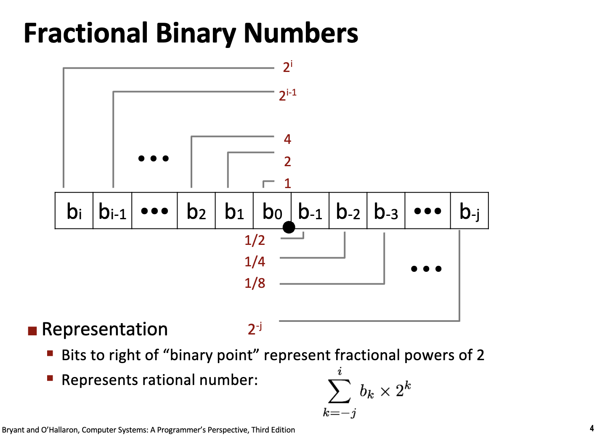
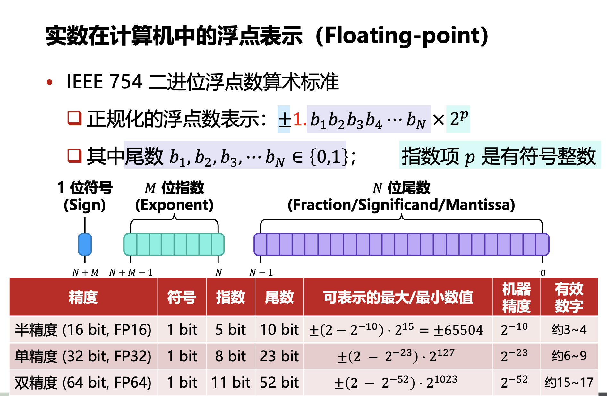
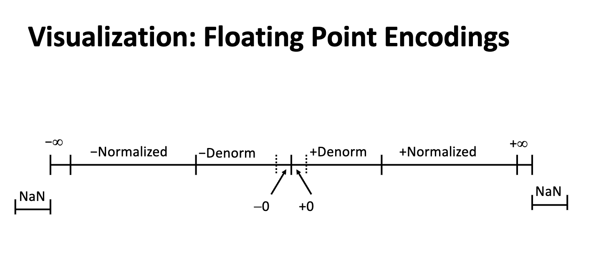
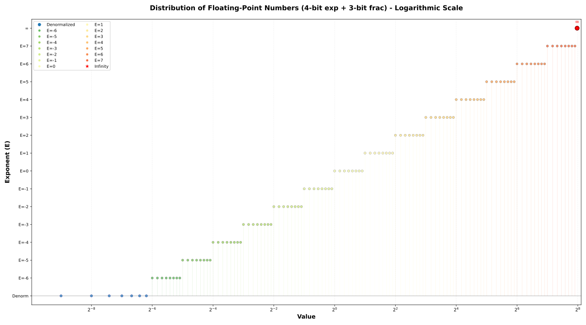
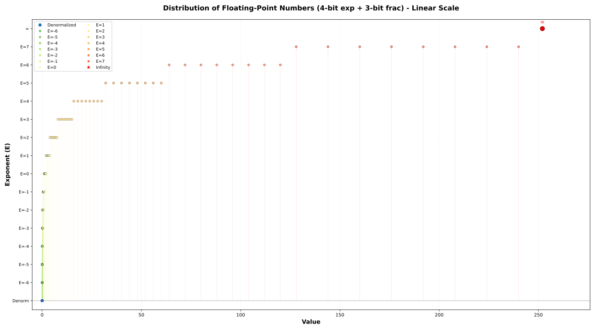
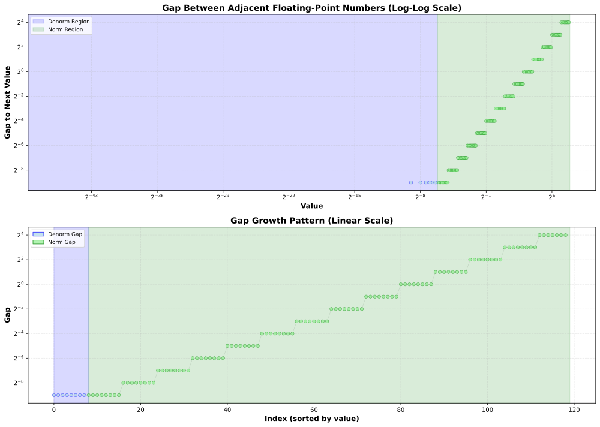
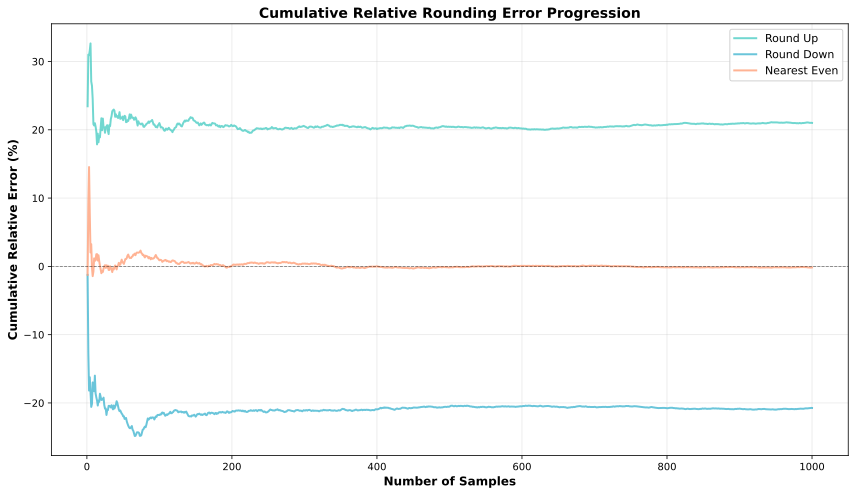
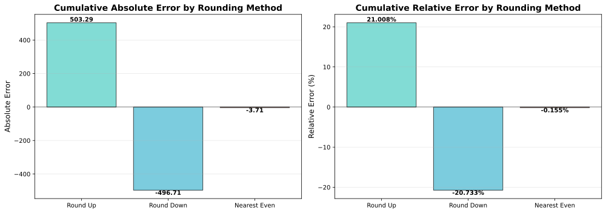
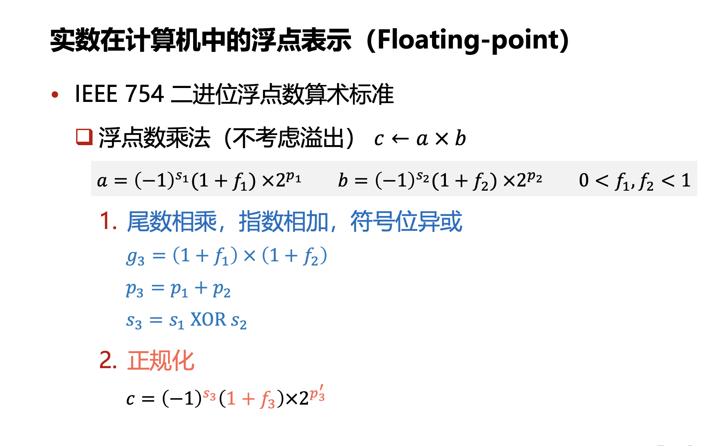
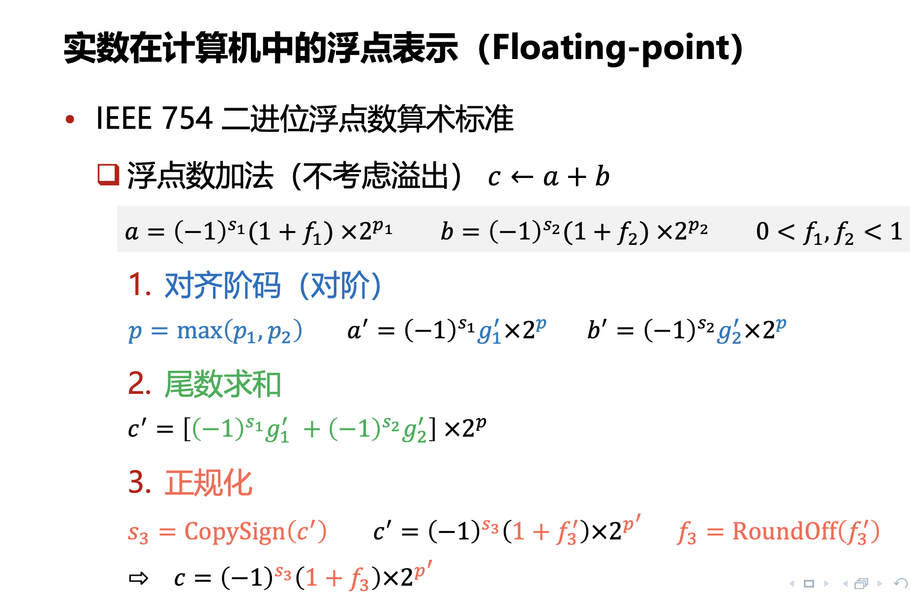

# Lecture 4 Floating Points

<link rel="stylesheet" href="https://cdn.jsdelivr.net/npm/katex@0.16.9/dist/katex.min.css">

<script defer src="https://cdn.jsdelivr.net/npm/katex@0.16.9/dist/katex.min.js"></script>

<script defer src="https://cdn.jsdelivr.net/npm/katex@0.16.9/dist/contrib/auto-render.min.js" onload="renderMathInElement(document.body, {delimiters: [
    {left: '$$', right: '$$', display: true},
    {left: '\\[', right: '\\]', display: true},
    {left: '$', right: '$', display: false},
    {left: '\\(', right: '\\)', display: false}
]});"></script>

## Fractional Floating Numbers

在小数部分，和十进制一样，二进制数也可以表示小数部分。

对于一个任意的二进制数 $N$，如果它有 $n$ 位整数和 $m$ 位小数，可以写成：

$$
(d_{n-1}d_{n-2}\dots d_1d_0 . d_{-1}d_{-2}\dots d_{-m})_2
$$

其对应的十进制数值 $V$ 的求和形式为：

$$V = \sum_{i=-m}^{n-1} d_i \cdot 2^i$$



For example, `0.11111111` = `1.0` - $\epsilon$

### Limitations

- 在十进制中很多有限小数和无限小数都需要被解释成无限循环小数，这会产生截断误差：

```c
#include <stdio.h>

void paradox() {
  double x = 0.1f;
  double y = 0.2f;
  double z = 0.3f;

  printf("The sum of 0.1 + 0.2:\t%.20f\n", x + y);
  printf("The value of 0.3:\t%.20f\n", z);
  printf("Are they the same? ");
  printf((x + y == z ? "True" : "False"));
  printf("\n");
}

int main(){
    paradox();
}
```

```text
The sum of 0.1 + 0.2:   0.30000000447034835815
The value of 0.3:       0.30000001192092895508
Are they the same? False
```


- precision 和 data range 是一对 trade-off，在单个数值的字长有限的情况下，计算机需要更多的小数位数来表示精确的数值，而需要更多的整数位数来表示更大的数据

## IEEE Floating Points

符号位，指数部分和尾数部分：

$$
(-1)^s \times M \times 2^E
$$



### Normalized Values

在上述的计数标准中，指数部分 $E$ 为一个有符号整数，假设一个浮点数中分配了 $M$ 位的字长给指数部分，则此时指数部分可以表示的大小为：$E \in [-2^{M-1} + 2, 2^{M-1} - 1]$

> $-2^{M-1}$ 和 $-2^{M-1} + 1$ 用于表示特殊的类型

此时指数部分 $E$ 的存储方式是**补码形式存储有符号整数**，此时因为首位符号位的权重为负数，不方便比较大小，因此选择**将有符号整数加上指数偏置变成无符号整数**。加上的项为 $2^{M-1} -1$ 后 $E' \in [1, 2^{M} - 2]$

> 归一化后 $E' = 0$ 和 $E' = 2^M - 1$(-1 转化为无符号整数会自动到最大值)，专门用于处理不正常的情况。

### Denormalized Values

Condition: `exp = 0000...00` (All zeros, $E' = 0$)
Exponent Value: `E = 1 - Bias`

如果去掉归一化的项 $2^{M-1} -1$，对应的指数退回到有符号表示就是 $-2^{M-1} +1$，这代表这最小的指数位的情况（一个非常小的小数）。如果需要表示的数比这个数小，浮点数的值就会突越到 0，导致数值误差。

因此，为了实现**极小数**的平滑过渡，我们引入**非规格化数** (Denormalized Values)，对应的条件是 `exp = 0000...00` 并且尾数位的首位是 0，来表示更小的数字。

For normalized values, the actual floating pointing is:

$$
V = (-1)^s \times (\mathbf{1}.f) \times 2^{E-2^{M-1}+1}
$$

For denormalized values, the actual floating point is:

$$
V = (-1)^s \times (\mathbf{0}.f) \times 2^{-2^{M-1}+1}
$$

可以做一个非常粗浅的计算，计算如果不使用非规格化数最终计算**绝对值**最小的非零浮点数值：

- 不使用非规格化数：

$$V_{min\_norm} = 1.0 \times 2^{-2^{M-1} + 2}$$

- 使用规格化数：

$$V_{min\_denorm} = 2^{-N} \times 2^{-2^{M-1} + 2} = 2^{-2^{M-1} + 2 - N}$$

> 为什么需要使用 `E = 1 - Bias`？
> 同样的，为了防止出现突然的断层：
> - 如果使用 `E = 1 - Bias`
>   - 最大的非规格化数（尾数全为 1）：$(0.111\dots1)_2 \times 2^{-126}$这个值无限接近于 $1.0 \times 2^{-126}$。
>   - 最小的规格化数：$(1.000\dots0)_2 \times 2^{-126}$
> - 如果使用 `E = 0 - Bias`
>   - 最大的非规格化数（尾数全为 1）：$(0.111\dots1)_2 \times 2^{-127} \approx 1.0 \times 2^{-1} \times 2^{-127} = \mathbf{1.0 \times 2^{-128}}$
>   - 最小的规格化数（$E'=1$）：$(1.000\dots0)_2 \times 2^{1-127} = \mathbf{1.0 \times 2^{-126}}$
>   - 两者存在 4 倍的偏差，此时浮点数的表示存在**真空地带**。

因此，IEEE-754 标准下的浮点数 ($M$ 位指数, $N$ 位尾数)，可以近似连续的表示 $[2^{-2^{M-1} + 2 - N}, (2 - 2^{-N}) \times 2^{2^{M-1} - 1}]$ 范围内的浮点数值。

> 考虑符号位都是 0

在 IEEE 754 规格化数中，要取到最大正值，各部分的取值如下：

- 符号位 (S)：0（代表正数）。
- 阶码位 (Exp)：不能全为 1（因为全 1 预留给了 $\infty$ 和 NaN）。所以阶码的最大值是 全 1 减 1。二进制表示：$111\dots10$，数值 $E'$：$2^M - 2$
- 尾数位 (Fraction)：全为 1。二进制表示：$1.11\dots1$，数值：$1 + (1 - 2^{-N})$

根据规格化数的求和公式 $V = (1 + f) \times 2^{E' - Bias}$：

- 实际指数 (E)：$$E = E'_{max} - Bias = (2^M - 2) - (2^{M-1} - 1)$$$$E = 2^{M-1} - 1$$

- 尾数 (1+f)：当 $N$ 位尾数全为 1 时，其值为：$$1 + \sum_{i=1}^{N} 2^{-i} = 1 + (1 - 2^{-N}) = 2 - 2^{-N}$$

最终最大值 $V_{max}$：$$V_{max} = (2 - 2^{-N}) \times 2^{2^{M-1} - 1}$$


### Special Values

Condition: `exp = 1111...11` (All ones, $E' = 2^M - 1$)

- `exp = 111...1`, `frac=000...0`: $\infin$
    - 代表正无穷 & 负无穷
- `exp = 111...1`, `frac=000...0`: NaN (Not a Number)
    - 状态传播（Pollution）：NaN 具有“传染性”。一旦你的计算中出现了一个 NaN，任何涉及它的后续运算（如 NaN + 5）结果都会是 NaN。
    - 同样，这些未定义的浮点数编码结果也可以用来实现 Nan Payload。




### Dynamic Ranges

假设指数位为 4 位，尾数位为 3 位，则简易的浮点数可以表示为：

<details>
  <summary>Full Floating-Point Representation Table</summary>

```text
Floating-Point Representation Table (4 exponent bits + 3 fraction bits)
==========================================================================================
s  exp    frac   E    Fraction                  Category    
------------------------------------------------------------------------------------------
0  0000   000    -6   0                         Denormalized
0  0000   001    -6   1/512                     Denormalized
0  0000   010    -6   1/256                     Denormalized
0  0000   011    -6   3/512                     Denormalized
0  0000   100    -6   1/128                     Denormalized
0  0000   101    -6   5/512                     Denormalized
0  0000   110    -6   3/256                     Denormalized
0  0000   111    -6   7/512                     Denormalized
0  0001   000    -6   1/64                      Normalized  
0  0001   001    -6   9/512                     Normalized  
0  0001   010    -6   5/256                     Normalized  
0  0001   011    -6   11/512                    Normalized  
0  0001   100    -6   3/128                     Normalized  
0  0001   101    -6   13/512                    Normalized  
0  0001   110    -6   7/256                     Normalized  
0  0001   111    -6   15/512                    Normalized  
0  0010   000    -5   1/32                      Normalized  
0  0010   001    -5   9/256                     Normalized  
0  0010   010    -5   5/128                     Normalized  
0  0010   011    -5   11/256                    Normalized  
0  0010   100    -5   3/64                      Normalized  
0  0010   101    -5   13/256                    Normalized  
0  0010   110    -5   7/128                     Normalized  
0  0010   111    -5   15/256                    Normalized  
0  0011   000    -4   1/16                      Normalized  
0  0011   001    -4   9/128                     Normalized  
0  0011   010    -4   5/64                      Normalized  
0  0011   011    -4   11/128                    Normalized  
0  0011   100    -4   3/32                      Normalized  
0  0011   101    -4   13/128                    Normalized  
0  0011   110    -4   7/64                      Normalized  
0  0011   111    -4   15/128                    Normalized  
0  0100   000    -3   1/8                       Normalized  
0  0100   001    -3   9/64                      Normalized  
0  0100   010    -3   5/32                      Normalized  
0  0100   011    -3   11/64                     Normalized  
0  0100   100    -3   3/16                      Normalized  
0  0100   101    -3   13/64                     Normalized  
0  0100   110    -3   7/32                      Normalized  
0  0100   111    -3   15/64                     Normalized  
0  0101   000    -2   1/4                       Normalized  
0  0101   001    -2   9/32                      Normalized  
0  0101   010    -2   5/16                      Normalized  
0  0101   011    -2   11/32                     Normalized  
0  0101   100    -2   3/8                       Normalized  
0  0101   101    -2   13/32                     Normalized  
0  0101   110    -2   7/16                      Normalized  
0  0101   111    -2   15/32                     Normalized  
0  0110   000    -1   1/2                       Normalized  
0  0110   001    -1   9/16                      Normalized  
0  0110   010    -1   5/8                       Normalized  
0  0110   011    -1   11/16                     Normalized  
0  0110   100    -1   3/4                       Normalized  
0  0110   101    -1   13/16                     Normalized  
0  0110   110    -1   7/8                       Normalized  
0  0110   111    -1   15/16                     Normalized  
0  0111   000    0    1                         Normalized  
0  0111   001    0    9/8                       Normalized  
0  0111   010    0    5/4                       Normalized  
0  0111   011    0    11/8                      Normalized  
0  0111   100    0    3/2                       Normalized  
0  0111   101    0    13/8                      Normalized  
0  0111   110    0    7/4                       Normalized  
0  0111   111    0    15/8                      Normalized  
0  1000   000    1    2                         Normalized  
0  1000   001    1    9/4                       Normalized  
0  1000   010    1    5/2                       Normalized  
0  1000   011    1    11/4                      Normalized  
0  1000   100    1    3                         Normalized  
0  1000   101    1    13/4                      Normalized  
0  1000   110    1    7/2                       Normalized  
0  1000   111    1    15/4                      Normalized  
0  1001   000    2    4                         Normalized  
0  1001   001    2    9/2                       Normalized  
0  1001   010    2    5                         Normalized  
0  1001   011    2    11/2                      Normalized  
0  1001   100    2    6                         Normalized  
0  1001   101    2    13/2                      Normalized  
0  1001   110    2    7                         Normalized  
0  1001   111    2    15/2                      Normalized  
0  1010   000    3    8                         Normalized  
0  1010   001    3    9                         Normalized  
0  1010   010    3    10                        Normalized  
0  1010   011    3    11                        Normalized  
0  1010   100    3    12                        Normalized  
0  1010   101    3    13                        Normalized  
0  1010   110    3    14                        Normalized  
0  1010   111    3    15                        Normalized  
0  1011   000    4    16                        Normalized  
0  1011   001    4    18                        Normalized  
0  1011   010    4    20                        Normalized  
0  1011   011    4    22                        Normalized  
0  1011   100    4    24                        Normalized  
0  1011   101    4    26                        Normalized  
0  1011   110    4    28                        Normalized  
0  1011   111    4    30                        Normalized  
0  1100   000    5    32                        Normalized  
0  1100   001    5    36                        Normalized  
0  1100   010    5    40                        Normalized  
0  1100   011    5    44                        Normalized  
0  1100   100    5    48                        Normalized  
0  1100   101    5    52                        Normalized  
0  1100   110    5    56                        Normalized  
0  1100   111    5    60                        Normalized  
0  1101   000    6    64                        Normalized  
0  1101   001    6    72                        Normalized  
0  1101   010    6    80                        Normalized  
0  1101   011    6    88                        Normalized  
0  1101   100    6    96                        Normalized  
0  1101   101    6    104                       Normalized  
0  1101   110    6    112                       Normalized  
0  1101   111    6    120                       Normalized  
0  1110   000    7    128                       Normalized  
0  1110   001    7    144                       Normalized  
0  1110   010    7    160                       Normalized  
0  1110   011    7    176                       Normalized  
0  1110   100    7    192                       Normalized  
0  1110   101    7    208                       Normalized  
0  1110   110    7    224                       Normalized  
0  1110   111    7    240                       Normalized  
0  1111   000    N/A  Infinity                  Infinity    
==========================================================================================
Statistics:
Denormalized numbers: 8
Normalized numbers: 112
Infinity: 1
Total: 121
==========================================================================================
```

</details>






## Rounding, Addition and Multiplications

### Basic Idea

- First compute **exact result** (assume infinite bits)
- Use **rounding** to make the computation available.
    - Possibly Overflow
    - Possibly round to fit into `frac`

$$
x +_{f} y = \text{Round}(x+y)
$$

$$
x \times_{f} y = \text{Round}(x \times y)
$$

### Rounding

舍入是一个非常深入的哲学命题，对于有限字长的计算机而言，**舍入**操作是必要的，也必定会带来微小误差。舍入存在不同的方式：

- Towards Zero
- Round Up ($\infin$)
- Round Down ($-\infin$)
- Nearest Even (default)

#### Towards Zero Rounding

- 逻辑：直接截断。不管正负，只保留能存下的位。
- 直观理解：正数变小，负数变大（向坐标轴原点靠拢）。
- 例子：$1.9 \rightarrow 1$，$ -1.9 \rightarrow -1$。
- 用途：C 语言中 (int) 强制类型转换的默认行为。

#### Round Up Rounding

* **逻辑**：结果总是取右侧最近的可表示数。
* **直观理解**：像天花板一样，往“大”的方向走。
* **例子**：，$ -1.9 \rightarrow -1$。
* **用途**：常用于区间算术，确保计算结果的上限是安全的。

#### Round Down Rounding

* **逻辑**：结果总是取左侧最近的可表示数。
* **直观理解**：像地板一样，往“小”的方向走。
* **例子**：，$ -1.1 \rightarrow -2$。
* **用途**：确保计算结果的下限是安全的。

#### Nearest Even Rounding (Round to Nearest, Ties to Even)

**IEEE 754 的默认模式**。

* **基本逻辑**：哪边近就往哪边舍 (Round Up/Round Down)。
* **特殊情况（Ties）**：如果刚好在两个数的中点（比如十进制的 $0.5$），**选择末尾是偶数的那一边**。(四舍六入五留双)
* 如果一律“逢五进一”，在大量计算后，误差会累积偏大。一半时间向后舍，一半时间向前入（偶数分布是均匀的），**统计学上的误差总和趋近于 0**。

### Rounding Binary Numbers

对于二进制，需要找到两个数的中点并进行判断：

例如，`10.00011` 需要舍入到小数点后两位 (`10.00` & `10.01`):

- Getting the average: `10.001`
- `10.00011` is smaller than `10.00011`, thus round **down** to `10.00`
- `10.00110` is bigger than `10.00011`, thus round **up** to `10.01`
- `10.11100`: compare with `10.11` and `11.00`, the medium number is `10.111`. 此时需要选择末尾是偶数(0) 的那一边，即 `11.00` (round up)
- `10.10100`: compare with `10.10` and `10.11`, the medium number is `10.101`, 此时需要选择末尾是偶数(0) 的那一边，即 `10.10` (round down)

从统计学上，如此的舍入方式可以很好的减少舍入误差，我们也可以做一个模拟实验展示 Round Up, Round Down, Nearest Even Rounding 三种不同的舍入方式：





### Floating Point Multiplications



### Floating Point Addition



- 对齐阶码是为了保证指数位是相同的，此时**指数部分**更小的数的**尾数部分**会发生右移位操作（移位的目标是对齐到**两个指数到其最大值**），此时会发生**截断误差**。

- 对齐阶码后，尾数部分进行求和，具体的求和过程本质上就是**无符号整数**的求和过程。

- 接下来，对浮点数的运算结果进行正规化操作（保证其符合浮点数的形式），此时也会发生因为移位而导致的截断误差。

- 最终会进行舍入操作，将超过位数的部分通过 Round 的方式进行舍入。（为了保证精度，当 CPU 的算术逻辑单元（ALU）处理尾数相加时，它不会只用 23 位（float）来算。它会在右侧增加三个额外的位，这就是 GRS 位）

> Mathematical Properties for Floating Point Additions
> - 满足交换律
> - 不满足结合律（考虑舍入误差）


## Floating Point in C

`float` and `double`

### Conversions and Castings

Casting between `int`, `float`, and `double` changes bit representation.

- `double`/`float` into `int`:
    - truncate fractional part **rounding towards zero**.
    - UB when out of range or NaN, always sets to TMIN.
- `int` into `double`:
    - as long as `int` has less than 53 bit word size. (e.g. `int64` will fail)
- `int` into `float`:
    - as long as `int` has less than 23 bit word size. (`int32` and `int64` will fail)

```c
#include <stdio.h>
#include <limits.h>
#include <math.h>

void show_casting(){
    // Casting between `int`, `float`, and `double` changes bit representation.

    // 1. double/float into int: truncate fractional part (rounding towards zero)
    printf("1. double/float to int (truncate towards zero):\n");
    double d1 = 3.7;
    double d2 = -3.7;
    float f1 = 2.9f;
    float f2 = -2.9f;

    printf("   double 3.7 -> int: %d\n", (int)d1);
    printf("   double -3.7 -> int: %d\n", (int)d2);
    printf("   float 2.9 -> int: %d\n", (int)f1);
    printf("   float -2.9 -> int: %d\n", (int)f2);

    // Overflow case: out of range sets to INT_MIN (undefined behavior)
    double d_overflow = 1.0e100;
    int i_overflow = (int)d_overflow;
    printf("   double 1e100 -> int: %d (overflow, UB)\n", i_overflow);

    // NaN case: NaN sets to INT_MIN (undefined behavior)
    double d_nan = NAN;
    int i_nan = (int)d_nan;
    printf("   double NaN -> int: %d (0, UB)\n\n", i_nan);

    // 2. int into double: works as long as int has less than 53 bit word size
    printf("2. int to double (works for < 53 bits):\n");
    int i1 = 123456789;
    long long ll_large = 9007199254740992LL;  // 2^53, boundary case

    double d_from_int = (double)i1;
    double d_from_ll = (double)ll_large;

    printf("   int 123456789 -> double: %.0f (exact)\n", d_from_int);
    printf("   int64 2^53 -> double: %.0f\n", d_from_ll);

    long long ll_very_large = 9007199254740993LL;  // 2^53 + 1
    double d_very_large = (double)ll_very_large;
    printf("   int64 (2^53+1) -> double: %.0f\n\n", d_very_large);

    // 3. int into float: works as long as int has less than 23 bit word size
    printf("3. int to float (works for < 23 bits):\n");
    int i2 = 1000000;  // < 2^23, should work exactly
    int i_large = 16777216;  // 2^24, exceeds precision

    float f_from_int = (float)i2;
    float f_from_large = (float)i_large;

    printf("   int 1000000 -> float: %.0f (exact)\n", f_from_int);
    printf("   int 16777216 (2^24) -> float: %.0f\n", f_from_large);

    int i_very_large = 16777217;  // 2^24 + 1
    float f_very_large = (float)i_very_large;
    printf("   int 16777217 (2^24+1) -> float: %.0f\n", f_very_large);
}

int main() {
    show_casting();
    return 0;
}
```

```text
1. double/float to int (truncate towards zero):
   double 3.7 -> int: 3
   double -3.7 -> int: -3
   float 2.9 -> int: 2
   float -2.9 -> int: -2
   double 1e100 -> int: 2147483647 (overflow, UB)
   double NaN -> int: 0 (0, UB)

2. int to double (works for < 53 bits):
   int 123456789 -> double: 123456789 (exact)
   int64 2^53 -> double: 9007199254740992
   int64 (2^53+1) -> double: 9007199254740992

3. int to float (works for < 23 bits):
   int 1000000 -> float: 1000000 (exact)
   int 16777216 (2^24) -> float: 16777216
   int 16777217 (2^24+1) -> float: 16777216
```