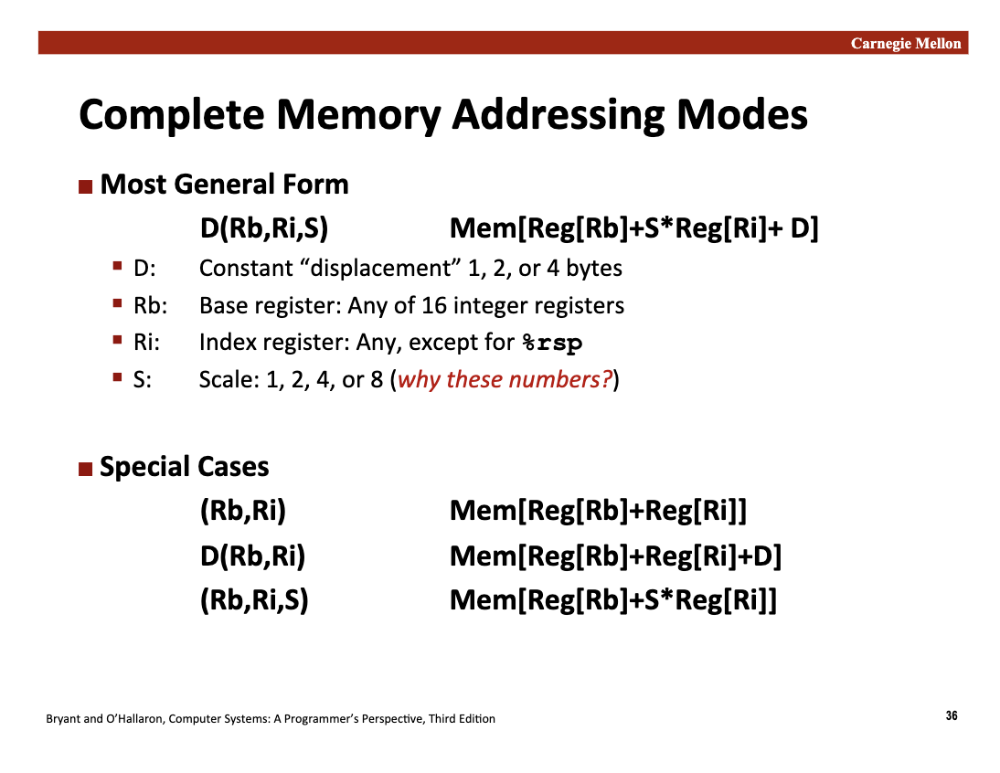
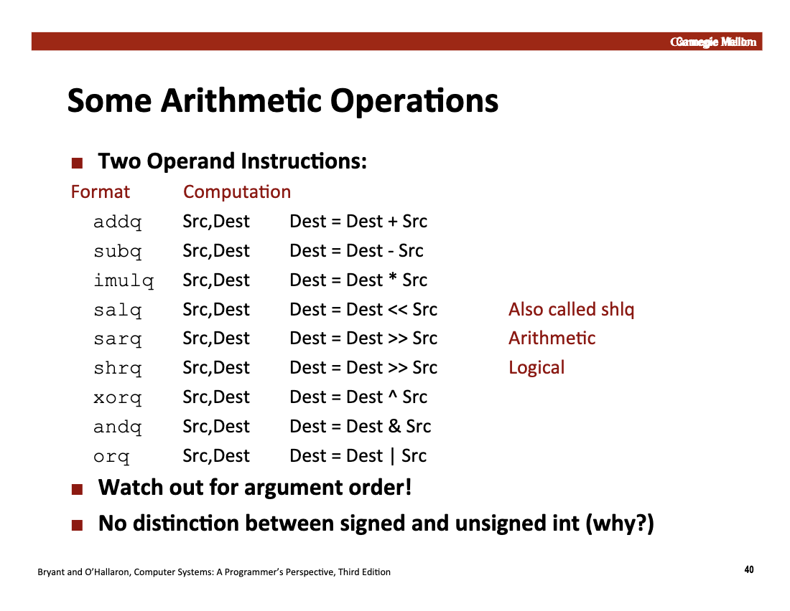

# Machine Level Programming I: Basics

<link rel="stylesheet" href="https://cdn.jsdelivr.net/npm/katex@0.16.9/dist/katex.min.css">

<script defer src="https://cdn.jsdelivr.net/npm/katex@0.16.9/dist/katex.min.js"></script>

<script defer src="https://cdn.jsdelivr.net/npm/katex@0.16.9/dist/contrib/auto-render.min.js" onload="renderMathInElement(document.body, {delimiters: [
    {left: '$$', right: '$$', display: true},
    {left: '\\[', right: '\\]', display: true},
    {left: '$', right: '$', display: false},
    {left: '\\(', right: '\\)', display: false}
]});"></script>


## C, Assembly and Machine Code

### Definitions

- Code Forms:
    - High-Level Programming Languages: C/C++/Java,高度人类可读的高级编程语言
    - Machine Code
    - Assembly Code

具体而言，程序运行的逻辑和抽象是：

- Software Transformation Stage
    - Compiler：将高级编程语言转化为汇编语言
    - Assembler: 将汇编语言转化为机器语言
- The **ISA Interface**
    - ISA (Instruction Set Architecture)：指令集架构，**软硬件之间的重要抽象**，约束了软件层面的机器码如何进行指令的下达。（ISA 定义了处理器能执行的所有动作类型。它将复杂的电路开关抽象为人类可读的助记符和机器可读的操作码。）
    - 软件层面：Machine Code 是 ISA 在软件层面的具体实现，包含操作码和操作数
    - 硬件层面：**微架构**负责通过电路执行机器码。（Implementation of the architecture，硬件层面的实现）
- 程序被加载到硬件中（寄存器，主存等等），实现程序的最终运行

常见的 ISA: `x86`, `x86-64`, `arm`, `IA32`...

### Assembly/Machine Code View: Programmer-Visible State

简单来说，如果一个状态是“可见”的，意味着程序员（或编译器）可以直接通过指令去**读取**、**修改**或**利用**它来改变程序的行为。

- Program Counter: 存储下一个执行的地址
- Register file: 寄存器
- Condition Codes: Store status information about most recent arithmetic or logical operations. (Used for conditional branching)
- Memory:
    - Byte addressable array (virtual memory)
    - Code and user data
    - Stack to support procedures

现代 CPU 内部其实有成千上万个物理寄存器和复杂的临时存储区域，但这些对程序员是不可见 (Hidden/Opaque) 的，这些 Programmer-Visible State 实际上是 ISA 指令集对上层软件的 Machine Code 所提供的一种封装和抽象。

Programmer-Visible State 对程序运行的性能非常重要，例如，当操作系统要把你的程序暂停、换另一个程序运行（Context Switch）时，它必须保存所有 Programmer-Visible State。相反，系统通常不需要保存 CPU 内部的流水线状态或缓存的具体内容。

> “缓存“ 不是 Programmer-Visible State

### Turning C into Object Code

在 `src/Lecture5/main.c` 中实现了一个披萨店的简单记账管理系统面板，具体的源代码如下：

```c
// src/Lecture5/main.c
#include "math_tool.h"
#include <stdio.h>
#include <string.h>

int main() {
  printf("========== Welcome to Pizza Shop ==========\n\n");

  double radius;
  printf("Input the radius of the pizza (cm): ");
  scanf("%lf", &radius);

  printf("\nInput the type of the pizza (square or circle): ");
  char type[10];
  scanf("%s", type);

  if (strcmp(type, "circle") != 0 && strcmp(type, "square") != 0) {
    printf("Error, the pizza type %s is not supported\n", type);
    return 1;
  }

  PizzaInfo pizza = create_pizza_info(radius, type);
  print_pizza_info(pizza);

  printf("Would you like to add toppings? (1 for yes, 0 for no): ");
  int add_toppings;
  scanf("%d", &add_toppings);

  if (add_toppings == 1) {
    int cheese_count = 0, pepperoni_count = 0, mushroom_count = 0;

    printf("Enter number of extra cheese portions: ");
    scanf("%d", &cheese_count);

    printf("Enter number of pepperoni portions: ");
    scanf("%d", &pepperoni_count);

    printf("Enter number of mushroom portions: ");
    scanf("%d", &mushroom_count);

    pizza.price = calculate_price_with_toppings(
        pizza.price, cheese_count, pepperoni_count, mushroom_count);
    printf("\nPrice updated with toppings!\n");
    print_pizza_info(pizza);
  }

  printf("Do you have a membership discount? (1 for yes, 0 for no): ");
  int has_discount;
  scanf("%d", &has_discount);

  if (has_discount == 1) {
    double discount_percentage;
    printf("Enter discount percentage (e.g., 10 for 10%%): ");
    scanf("%lf", &discount_percentage);

    double original_price = pizza.price;
    pizza.price = calculate_discount(pizza.price, discount_percentage);
    printf("\nDiscount applied: %.2f%% -> $%.2f\n", discount_percentage,
           original_price - pizza.price);
    print_pizza_info(pizza);
  }

  if (strcmp(type, "circle") == 0) {
    double circumference = calculate_circle_circumference(radius);
    printf("Circumference: %.2f cm\n", circumference);
  } else {
    double perimeter = calculate_square_perimeter(radius);
    printf("Perimeter: %.2f cm\n", perimeter);
  }

  double radius_inches = cm_to_inches(radius);
  printf("\nSize in inches: %.2f inches\n", radius_inches);

  printf("\nHow many people will be eating? ");
  int people_count;
  scanf("%d", &people_count);

  int recommended_radius = recommend_pizza_size(people_count);
  printf("Recommended pizza radius for %d people: %d cm\n", people_count,
         recommended_radius);

  if (radius < recommended_radius) {
    printf("Note: Your pizza might be too small for %d people!\n",
           people_count);
  } else {
    printf("Your pizza size is good for %d people!\n", people_count);
  }

  printf("\n========================================\n");
  printf("Thank you for your order!\n");
  printf("Total price: $%.2f\n", pizza.price);
  printf("========================================\n");

  return 0;
}
```

```c
// src/Lecture5/math_tool.c
#include "math_tool.h"
#include <math.h>
#include <string.h>

double calculate_circle_area(double radius) { return M_PI * pow(radius, 2); }

double calculate_square_area(double radius) { return pow(radius, 2); }

double calculate_circle_circumference(double radius) {
  return 2 * M_PI * radius;
}

double calculate_square_perimeter(double side) { return 4 * side; }

double inches_to_cm(double inches) { return inches * 2.54; }

double cm_to_inches(double cm) { return cm / 2.54; }

double calculate_base_price(double area, double price_per_square_cm) {
  return area * price_per_square_cm;
}

double calculate_price_with_toppings(double base_price, int cheese_count,
                                     int pepperoni_count, int mushroom_count) {
  double cheese_price = 1.5;
  double pepperoni_price = 2.0;
  double mushroom_price = 1.8;

  double topping_cost = (cheese_count * cheese_price) +
                        (pepperoni_count * pepperoni_price) +
                        (mushroom_count * mushroom_price);

  return base_price + topping_cost;
}

double calculate_total_calories(double area, double calories_per_square_cm) {
  return area * calories_per_square_cm;
}

double calculate_price_per_square_cm(double price, double area) {
  if (area == 0) {
    return 0;
  }
  return price / area;
}

void print_pizza_info(PizzaInfo info) {
  printf("\n========== Pizza Information ==========\n");
  printf("Area: %.2f square centimeters\n", info.area);
  printf("Price: $%.2f\n", info.price);
  printf("Calories: %.2f kcal\n", info.calories);
  printf("Price per square cm: $%.4f\n", info.price_per_square_cm);
  printf("======================================\n\n");
}

PizzaInfo create_pizza_info(double radius, const char *type) {
  PizzaInfo info;

  if (strcmp(type, "circle") == 0) {
    info.area = calculate_circle_area(radius);
  } else if (strcmp(type, "square") == 0) {
    info.area = calculate_square_area(radius);
  } else {
    info.area = 0;
  }

  info.price = calculate_base_price(info.area, PRICE_PER_SQUARE_CM);
  info.calories = calculate_total_calories(info.area, CALORIES_PER_SQUARE_CM);
  info.price_per_square_cm =
      calculate_price_per_square_cm(info.price, info.area);

  return info;
}

double calculate_discount(double price, double discount_percentage) {
  return price * (1 - discount_percentage / 100.0);
}

int recommend_pizza_size(int people_count) {
  const int calories_per_person = 500;

  double total_calories_needed = people_count * calories_per_person;
  double radius_squared =
      total_calories_needed / (M_PI * CALORIES_PER_SQUARE_CM);
  double recommended_radius = sqrt(radius_squared);

  return (int)ceil(recommended_radius);
}

double compare_value_for_money(double area1, double price1, double area2,
                               double price2) {
  double value1 = calculate_price_per_square_cm(price1, area1);
  double value2 = calculate_price_per_square_cm(price2, area2);

  if (value1 < value2) {
    return -1;
  } else if (value1 > value2) {
    return 1;
  } else {
    return 0;
  }
}
```

```c
// src/Lecture5/math_tool.h
#ifndef MATH_TOOL_H
#define MATH_TOOL_H

#include <stdio.h>

#define PRICE_PER_SQUARE_CM 0.05
#define CALORIES_PER_SQUARE_CM 2.5

typedef struct {
  double cheese;
  double pepperoni;
  double mushroom;
  double olive;
  double basil;
} ToppingPrices;

typedef struct {
  double area;
  double price;
  double calories;
  double price_per_square_cm;
} PizzaInfo;

double calculate_circle_area(double radius);

double calculate_square_area(double radius);

double calculate_circle_circumference(double radius);

double calculate_square_perimeter(double side);

double inches_to_cm(double inches);

double cm_to_inches(double cm);

double calculate_base_price(double area, double price_per_square_cm);

double calculate_price_with_toppings(double base_price, int cheese_count,
                                     int pepperoni_count, int mushroom_count);

double calculate_total_calories(double area, double calories_per_square_cm);

double calculate_price_per_square_cm(double price, double area);

void print_pizza_info(PizzaInfo info);

PizzaInfo create_pizza_info(double radius, const char *type);

double calculate_discount(double price, double discount_percentage);

int recommend_pizza_size(int people_count);

double compare_value_for_money(double area1, double price1, double area2,
                               double price2);

#endif
```

最终可以通过如下的 bash 脚本进行详细的编译：

- `src/Lecture5/compile_example.sh`: 默认编译脚本
- `src/Lecture5/show_temp_file.sh`: 开启了不同级别的编译器优化，生成若干中间文件。

### Assembly Characteristics

#### Data Types

和高级编程语言不同，汇编语言不存在**变量名**，而是**从更底层的内存视角**进行内存的指令和操作管理。

- data values: 1 byte, 2 bytes, 4 bytes and 8 bytes
- float: 4 bytes, 8 bytes or 10 bytes

**Untyped Pointer**: 在 64 位系统中，所有的内存地址都是 8 字节的整数。

具体的代码也会经过编译器转移成指令编码（一系列字节序列），对于 C 语言中的数组、结构体等高级数据类型，在汇编中也不存在。

> 汇编语言就像一份非常基础的操作指令，这份操作指令直接在抽象的内存数组上进行一些基本操作

#### Operations

- perform arithmetic function on register or memory data
    - CPU 执行的核心任务：将寄存器或者内存上的数据进行数学计算
    - 在汇编层面，数学计算被拆解为最基础的逻辑门操作。主要分为以下几类：
        * **算术运算 (Arithmetic)**：
            * `add` (加法)、`sub` (减法)。
            * `imul` (有符号乘法)、`idiv` (有符号除法)。
            * `inc` (自增 1)、`dec` (自减 1)。

        * **逻辑运算 (Logical)**：
            * `and` (与)、`or` (或)、`xor` (异或)、`not` (非)。

        * **位移运算 (Shift)**：
            * `sal`/`shl` (算术/逻辑左移)。
            * `sar`/`shr` (算术/逻辑右移)。
    - 具体的计算发生在：
        -  **寄存器到寄存器**（最快，CPU 在寄存器中读取数据并将计算结果放在寄存器中）
        - **内存到寄存器**：程序首先需要利用 `addq` 指令从内存特定地址上取址进行运算
        - **寄存器到内存**：最终程序的运算结果直接对内存进行修改

- transfer data between memory and register
    - 从内存中加载数据到寄存器中
    - 将寄存器中的数据储存到内存中
    
- transfer control：帮助 CPU 处理高级编程语言的**逻辑判断和循环**。例如**条件分支**、**循环**和**函数调用**。

### Examples

例如，我们实现一个非常简单的 C 程序，默认编译的 Assembly Code 是这样的：

```c
int main() {
  int demo_int = 10;
  int *dest = &demo_int;
  return 0;
}
```

```assembly
	.section	__TEXT,__text,regular,pure_instructions
	.build_version macos, 15, 0	sdk_version 26, 0
	.globl	_main                           ; -- Begin function main
	.p2align	2
_main:                                  ; @main
	.cfi_startproc
; %bb.0:
	sub	sp, sp, #16
	.cfi_def_cfa_offset 16
	mov	w0, #0                          ; =0x0
	str	wzr, [sp, #12]
	add	x8, sp, #8
	mov	w9, #10                         ; =0xa
	str	w9, [sp, #8]
	str	x8, [sp]
	add	sp, sp, #16
	ret
	.cfi_endproc
                                        ; -- End function
.subsections_via_symbols
```

> 笔者本地环境使用的是 MacOS ARM 架构芯片，指令集和一般的 Intel x86 存在差异。

- Stack Frame Preparations
    - `sub	sp, sp, #16`: 将栈指针(sp)向下移动16字节，为局部变量开辟空间
    - `.cfi_def_cfa_offset 16`: 调试信息：标记栈偏移
    - `mov	w0, #0`: 将 0 放入 w0 寄存器（这是 C 语言中 main 函数默认的返回值 return 0）
    - `str	wzr, [sp, #12]`: 将零寄存器(wzr)的值存入 [sp + 12] 的位置

- Processing `int demo_int = 10;`:
    - `add x8, sp, #8`: 计算栈上偏移为 8 的地址，并存入 x8 寄存器
    - `mov w9, #10`: 将立即数 10 放入 w9 寄存器
    - `str w9, [sp, #8]`: 将 10 存入栈上偏移为 8 的位置

- Processing `int *dest = &demo_int`:
    - `str	x8, [sp]`: 将 x8（即变量 a 的地址）存入栈顶

- Function return
    - `add sp, sp, #16`: 恢复栈指针（平栈），释放之前分配的16字节空间
    - `ret`: 返回调用者

### Object Codes

在 Object Code（目标文件，如 macOS 上的 Mach-O 或 Linux 上的 ELF）中，汇编指令不再以文本形式存在，而是被编码成了二进制机器码（Machine Code）。编译器会自动将 Assembly 中的若干指令转化成特定的二进制码（例如 ARM64 指令集的特点是定长编码，每一条指令严格占用 32 bits (4 Bytes)）

在 Object Code 中，汇编变成了一串连续的 32 位无符号整数。这些数字被存放在文件的 `__TEXT` 区域。CPU 执行时，PC 指针（程序计数器）指向对应的地址，硬件电路通过解码这些 32 位数字来触发加法、存储或跳转动作。

可以使用 `objdump` (`gobjdump` in MacOS) 来进行二进制 Object Code 的逆向工程：

```text
gobjdump -S src/Lecture5/compile/pointer.o

src/Lecture5/compile/pointer.o:     file format mach-o-arm64


Disassembly of section .text:

0000000000000000 <_main>:
   0:   d10043ff        sub     sp, sp, #0x10
   4:   52800000        mov     w0, #0x0                        // #0
   8:   b9000fff        str     wzr, [sp, #12]
   c:   910023e8        add     x8, sp, #0x8
  10:   52800149        mov     w9, #0xa                        // #10
  14:   b9000be9        str     w9, [sp, #8]
  18:   f90003e8        str     x8, [sp]
  1c:   910043ff        add     sp, sp, #0x10
  20:   d65f03c0        ret
```

### `gdb` & `lldb`

GDB 和 LLDB 等是功能非常强大的 Debugger，从系统层面监控程序的运行。具体的功能包含：

- Execution Control
    * **断点触发 (Breakpoint)**：通过在指定地址注入陷阱指令（如 x86 的 `INT 3`），使程序在特定位置挂起。
    * **逐行追踪 (Stepping)**：支持源码级（Step/Next）与指令级（Stepi/Nexti）的单步执行。
    * **状态控制 (Intervention)**：允许在运行时强行改变执行流（Jump）或函数返回路径。

- State Inspections: 提供对进程虚存空间及硬件状态的透明访问。
    * **数据读取**：实时监测任意内存地址、栈帧变量及全局符号的内容。
    * **寄存器监测**：读取 CPU 寄存器状态（如 PC、SP、通用寄存器），用于底层逻辑验证。
    * **回溯分析 (Backtracing)**：解析调用栈（Call Stack），重现导致当前状态的函数调用链路。

- Dynamic Manipulations
    * **变量篡改**：允许修改内存中的变量数值，以验证不同边界条件下的逻辑响应。
    * **环境仿真**：通过修改寄存器值或内存标志位，模拟特定的硬件返回或错误场景。

## Assembly Basic: Registers, operands, move

For `x86` architecture.

### Registers

x86-64 架构的寄存器拥有一套非常严谨且具有历史继承性的命名体系。 每个寄存器不仅有特定的名字，其命名还反映了它的位数（如 64 位、32 位等）和设计初衷。存在 **16** 个基本寄存器：

> 在 64 位系统中，单个寄存器的容量就是 8 字节。

- 经典通用寄存器

这类寄存器共有 8 个。它们的名字通常与其最初设计的用途（尽管现在大多通用）相关：

| 64位名字 | 32位名字 (低32位) | 历史含义 | 常见现代用途 |
| --- | --- | --- | --- |
| **RAX** | EAX | Accumulator | 存储**函数返回值** |
| **RBX** | EBX | Base | 基址寄存器 |
| **RCX** | ECX | Counter | 循环计数器 |
| **RDX** | EDX | Data | 辅助计算（如乘除法） |
| **RSI** | ESI | Source Index | 字符串/内存操作的源指针 |
| **RDI** | EDI | Destination Index | 字符串/内存操作的目标指针 |
| **RBP** | EBP | Base Pointer | 栈帧基址指针（指向栈底） |
| **RSP** | ESP | Stack Pointer | **栈顶指针**（始终指向当前栈顶） |

- 扩展寄存器

为了增强处理能力，x86-64 额外增加了 8 个寄存器，直接以数字命名，规则非常简单：

* **R8, R9, R10, R11, R12, R13, R14, R15**
* 它们的低位访问 （例如 R8 的低 32 位是 **R8D**，低 16 位是 **R8W**，低 8 位是 **R8B**）。

> 寄存器的嵌套命名结构

x86 架构最独特的地方在于，**可以实现不同的名字访问同一个 64 位寄存器的不同部分。** 这称为物理上的包含关系。

以 **RAX** 为例：

* **RAX**: 全 64 位。
* **EAX**: 低 32 位。
* **AX**: 低 16 位。
* **AH / AL**: 分别是 AX 的高 8 位和低 8 位。

寄存器和 CPU 之间的数据传输速度远高于 CPU 和内存之间的传输速度，但是如上可见，**寄存器被硬编码在了汇编语言中**，如果一味的 Scale Up 寄存器的数量会导致编码寄存器名称的长度扩展，对应到二进制文件就是灾难性的容量扩展。无论从硬件还是软件角度考虑，寄存器都难以像内存和本地磁盘一样容量快速扩展。

### Moving Data

Assembly 中最核心并且最重要的指令就是 **`moveq`** 指令，指令的作用是将数据从源地址 (Source) **复制**到目的地址 (Dest)。

#### `moveq` Data Sources & Destinations

`movq` 可以处理的三种基本数据来源或去向：

* **立即数 (Immediate)**：即常数。
  * 在汇编中以 `$` 开头（如 `$0x400`）。
  * 类似于 C 语言中的字面量常数。

* **寄存器 (Register)**：CPU 内部的 16 个 64 位通用寄存器之一。
  * 汇编中以 `%` 开头（如 `%rax`）。
  * **特殊限制**：`%rsp`（栈指针寄存器）被保留用于特殊用途（指向栈顶），通常不建议作为普通数据存储器使用。

* **内存 (Memory)**：存储在 RAM 中的数据。
  * 由寄存器中的地址指向。最简形式是用括号包围寄存器，如 `(%rax)`，这表示“地址存储在 `%rax` 中的那 8 个字节的数据”。
  * 支持多种复杂的“寻址模式”（Address Modes）。

#### `moveq` Examples

```c
int main() {
  int demo_int = 10;
  int *dest = &demo_int;
  return 0;
}
```

我们用如下的 Assembly 代码做示范：

```assembly
	.section	__TEXT,__text,regular,pure_instructions
	.build_version macos, 15, 0	sdk_version 26, 0
	.globl	_main                           ## -- Begin function main
	.p2align	4, 0x90
_main:                                  ## @main
## %bb.0:
	pushq	%rbp
	movq	%rsp, %rbp
	movl	$0, -4(%rbp)
	movl	$10, -8(%rbp)
	leaq	-8(%rbp), %rax
	movq	%rax, -16(%rbp)
	xorl	%eax, %eax
	popq	%rbp
	retq
                                        ## -- End function
.subsections_via_symbols

```

> `%rbp` 和 `(%rbp)` 是完全不一样的：前者是直接操作寄存器中存储的 64 位数据，后者是将 %rax 里的数值视为一个**内存地址**，然后去内存（RAM）中寻找该地址对应的数据（通常是连续的 8 个字节）

> 值得一提的是，**不支持在汇编语言中使用一条指令实现 memory-memory transformations**.


#### Simple Memory Addressing Modes

- `movq (%rcx), %rax`: pointer dereferencing in C. `(%rcx)` specifies the memory address.
- `movq 8(%rbp), %rdx`: `(%rbp)` specifies start of memory regions, and constant displacement D specifies offset.

#### Examples

我们使用一个更加复杂的 C 语言 x-86 汇编做示范，我们实现了两个 swap 函数：

```c
#include <stdio.h>

void swap(long *xp, long *yp) {
  // x_p 地址的值存储在临时变量 t0 中
  long t0 = *xp;
  // y_p 地址的值存储在临时变量 t1 中
  long t1 = *yp;
  // 把 t1 的值写入 x_p 的地址
  *xp = t1;
  // 把 t0 的值写入 y_p 的地址
  *yp = t0;
}

void swap_easier(long *xp, long *yp) {
  // * 只使用一个临时变量
  long temp = *xp;
  *xp = *yp;
  *yp = temp;
}

void print_numbers(long a, long b) {
  printf("\n");
  printf("The value of a is %ld\n", a);
  printf("The value of b is %ld\n", b);
  printf("\n");
}

int main() {
  long a = 10;
  long b = 20;
  print_numbers(a, b);

  // do swap 1
  swap(&a, &b);
  print_numbers(a, b);

  // do swap 2
  swap(&a, &b);
  print_numbers(a, b);
  return 0;
}
```

##### Understanding `swap()`

```assembly
.globl	_swap                           ## -- Begin function swap
	.p2align	4, 0x90
_swap:                                  ## @swap
## %bb.0:
	pushq %rbp           # 将调用者的栈基址指针压入栈中，保存现场
  movq  %rsp, %rbp     # 将当前栈指针赋给 %rbp，建立当前函数的栈帧
	movq	%rdi, -8(%rbp)
	movq	%rsi, -16(%rbp)
	movq	-8(%rbp), %rax
	movq	(%rax), %rax
	movq	%rax, -24(%rbp)
	movq	-16(%rbp), %rax
	movq	(%rax), %rax
	movq	%rax, -32(%rbp)
	movq	-32(%rbp), %rcx
	movq	-8(%rbp), %rax
	movq	%rcx, (%rax)
	movq	-24(%rbp), %rcx
	movq	-16(%rbp), %rax
	movq	%rcx, (%rax)
	popq	%rbp
	retq
                                        ## -- End function
```

```c
void swap(long *xp, long *yp) {
  // x_p 地址的值存储在临时变量 t0 中
  long t0 = *xp;
  // y_p 地址的值存储在临时变量 t1 中
  long t1 = *yp;
  // 把 t1 的值写入 x_p 的地址
  *xp = t1;
  // 把 t0 的值写入 y_p 的地址
  *yp = t0;
}
```

> 使用 `long` 类型是因为正好是 8 个字节，和 64 位寄存器对应的长度相同，生成的汇编代码最简单。

- `%rbp` 代表当前函数的**栈底指针**（栈基址指针），`%rsp` 代表当前函数的**栈顶指针**（会不断的变化移动）。
  - 第一句 `pushq %rbp` 都是**将调用者的栈基址指针压入栈中，保存现场**。
  - `movq  %rsp, %rbp`: 将当前栈顶指针赋给 %rbp，建立当前函数的栈帧
- 函数调用的第一个操作是**函数入栈**：
  - `%rdi` and `%rsi` means the first and the second argument of the function.
  - `movq	%rdi, -8(%rbp)` and `movq	%rsi, -16(%rbp)`: 因为类型是 long，因此将第一个参数存入栈中偏移 -8 的位置，第二个参数存入栈中偏移 -16 的位置。
- 接下来执行第一个语句：x_p 地址的值存储在临时变量 t0 中
  - `movq  -8(%rbp), %rax`: 从栈里取回 xp 的地址，存入 %rax（此时 rax 寄存器存储的是 x_p（第一个输入参数）的值在内存中**存储的地址**）
  - `movq  (%rax), %rax`: **原地更新**，将 rax 寄存器中的值解引用。（原来 rax 存储的值是一个地址，现在该寄存器存储的值是该地址对应的数据）
  - `movq  %rax, -24(%rbp)`: 将读取的值存入栈中偏移 -24 的位置（这个新的变量就是变量 t_0，存储在栈中）
- 类似的，如下的语句可以实现第二个读取语句：
  - `movq  -16(%rbp), %rax`: 从栈里取回 yp 的地址，存入 %rax
  - `movq  (%rax), %rax`: 解引用：去 %rax 指向的地址读数值，存入 %rax
  - `movq  %rax, -32(%rbp)`: 将读取的值（t1）存入栈中偏移 -32 的位置

> 此时，栈一共使用了 40 个字节的数据：32 个字节用于存储变量，剩下 8 个字节用来存储旧的 `%rbp` 地址来维持函数调用的栈帧空间。


- 写回第一个地址: `*xp = t1;`:
  - `movq  -32(%rbp), %rcx`: 读取 t1 的值，存入寄存器中
  - `movq  -8(%rbp), %rax`: 从栈里取出 xp 的地址，存储到 rax 寄存器中
  - `movq  %rcx, (%rax)`: 把 t1 的值写入 xp 指向的内存
- 写回第二个地址: `*yp = t0;`
  - 同理
- 完成函数调用，“打扫屋子“恢复栈帧空间:
  - `popq	%rbp`: 恢复调用者的栈基址指针
  - `retq`: 返回调用处


##### Understanding `swap_easier()`

```assembly
.globl	_swap_easier                    ## -- Begin function swap_easier
	.p2align	4, 0x90
_swap_easier:                           ## @swap_easier
## %bb.0:
	pushq	%rbp
	movq	%rsp, %rbp
	movq	%rdi, -8(%rbp)
	movq	%rsi, -16(%rbp)
	movq	-8(%rbp), %rax
	movq	(%rax), %rax
	movq	%rax, -24(%rbp)
	movq	-16(%rbp), %rax
	movq	(%rax), %rcx
	movq	-8(%rbp), %rax
	movq	%rcx, (%rax)
	movq	-24(%rbp), %rcx
	movq	-16(%rbp), %rax
	movq	%rcx, (%rax)
	popq	%rbp
	retq
                                        ## -- End function
```

```c
void swap_easier(long *xp, long *yp) {
  // * 只使用一个临时变量
  long temp = *xp;
  *xp = *yp;
  *yp = temp;
}
```

> 类似的，此处不再做重复分析，主要通过 `moveq` 实现**数据的转移**，转移方向允许是寄存器向寄存器，寄存器向内存，内存向寄存器。

#### Memory Addressing Modes

`D(Rb, Ri, S)`: `Mem[Reg[Rb] + S*Reg[Ri] + D]`

- `S`: 1,2,4,8 (扩展寄存器支持特定的后缀寻址方式)



## Arithmetic & Logical Operations

### Address Computation Instructions `leaq`


* **指令格式**：`leaq Src, Dst`
  * **核心逻辑**：将 `Src`（源）处计算出的**地址数值**直接赋给 `Dst`（目标寄存器）。
* **关键区别**：
  * `movq (%rax), %rdx`：去内存里**取数据**（有内存引用）。
  * `leaq (%rax), %rdx`：仅仅是计算地址，**不访问内存**。

例如，对于如下的函数：

```c
long multiply(long a, long b) { return a * b; }

long m12(long a) { return a * 12; }

int main() { return 0; }
```

如果不开编译优化，得到的代码是：

```assembly

	.globl	_multiply                       ## -- Begin function multiply
	.p2align	4, 0x90
_multiply:                              ## @multiply
## %bb.0:
	pushq	%rbp
	movq	%rsp, %rbp
	movq	%rdi, -8(%rbp)
	movq	%rsi, -16(%rbp)
	movq	-8(%rbp), %rax
	imulq	-16(%rbp), %rax
	popq	%rbp
	retq
                                        ## -- End function
	.globl	_m12                            ## -- Begin function m12
	.p2align	4, 0x90
_m12:                                   ## @m12
## %bb.0:
	pushq	%rbp
	movq	%rsp, %rbp
	movq	%rdi, -8(%rbp)
	imulq	$12, -8(%rbp), %rax
	popq	%rbp
	retq
                                        ## -- End function
```

对于 `clang` 编译器开 `O1` 优化，可以得到如下的汇编代码：

```assembly
  .globl	_multiply                       ## -- Begin function multiply
	.p2align	4, 0x90
_multiply:                              ## @multiply
## %bb.0:
	pushq	%rbp
	movq	%rsp, %rbp
	movq	%rdi, %rax
	imulq	%rsi, %rax
	popq	%rbp
	retq
                                        ## -- End function
	.globl	_m12                            ## -- Begin function m12
	.p2align	4, 0x90
_m12:                                   ## @m12
## %bb.0:
	pushq	%rbp
	movq	%rsp, %rbp
	shlq	$2, %rdi
	leaq	(%rdi,%rdi,2), %rax
	popq	%rbp
	retq
                                        ## -- End function
```

比较发现，在 `m12` 函数的汇编实现上，O1 优化后的汇编代码实现了较大的优化，未优化的代码是 `imulq	$12, -8(%rbp), %rax`，而已经优化后的代码是 `leaq	(%rdi,%rdi,2), %rax`。

- `imulq` 将会直接调用 CPU 的乘法指令集，非常的昂贵
- `shlq  $2, %rdi`: rdi = rdi << 2 (即 rdi = x * 4)
- `leaq  (%rdi, %rdi, 2), %rax`: rax = rdi + rdi * 2 (即 rax = rdi * 3)
  - shlq（逻辑左移）和 leaq（地址计算）在 CPU 内部执行极快

地址计算类似于简单的移位操作，不需要通过复杂的乘法器，因此运行速度极快，但是严格受限于 2，4，8，16 等整数幂次的常数乘法。



> 有符号整数和无符号整数没有区分：
> 我们在第二讲证明了补码表示的有符号整数和一般的无符号整数在比特位上的加法存在**一致性**
> 在第三讲中，我们也证明了乘法在截断计算的过程中两种表示方法保持一致，因此也无需区分
> 补码的性质：**减去一个数等同于加上这个数的补码**，因此减法和加法是等价运算

但是并非所有运算都是如此，例如两种整数在右移操作上的补全位是不一样的，因此汇编实现了两套不同的 instructions

> More on books... （包含自增，自减，自增 1，自减 1 等等）

