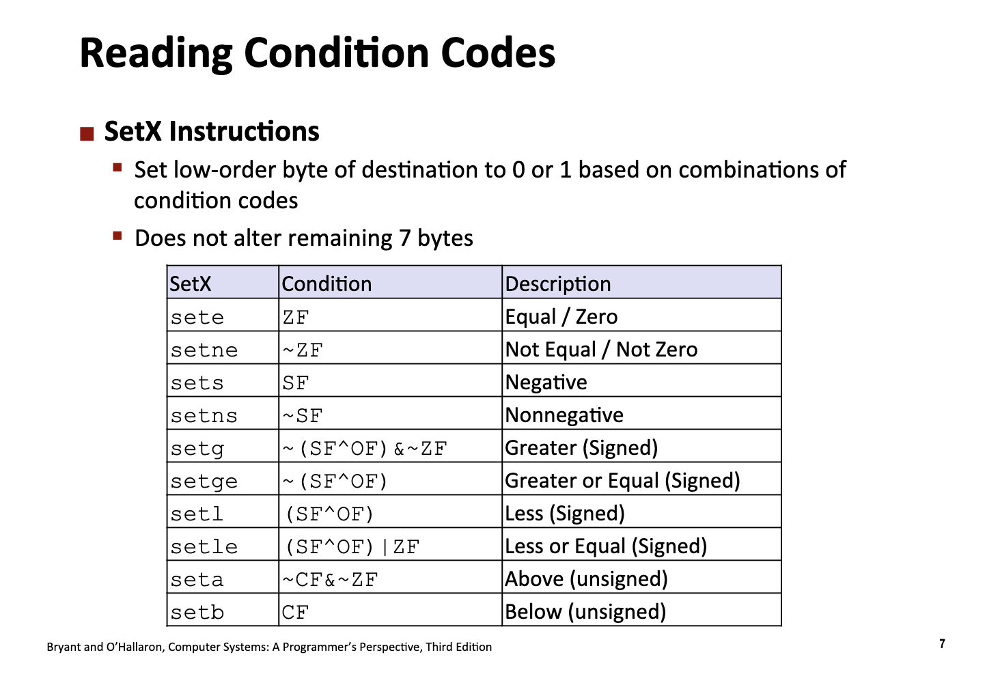
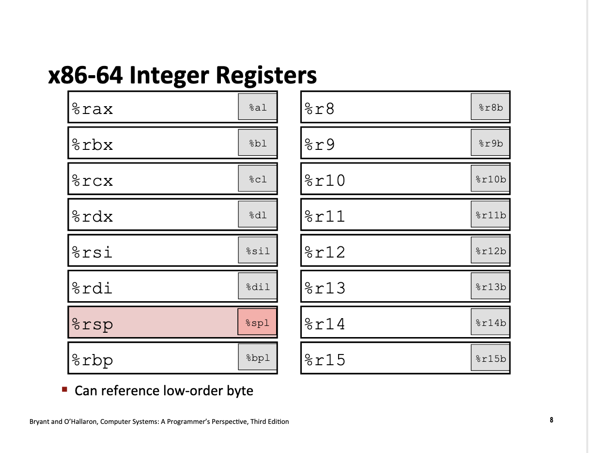

# Machine Level Programming II: Control

<link rel="stylesheet" href="https://cdn.jsdelivr.net/npm/katex@0.16.9/dist/katex.min.css">

<script defer src="https://cdn.jsdelivr.net/npm/katex@0.16.9/dist/katex.min.js"></script>

<script defer src="https://cdn.jsdelivr.net/npm/katex@0.16.9/dist/contrib/auto-render.min.js" onload="renderMathInElement(document.body, {delimiters: [
    {left: '$$', right: '$$', display: true},
    {left: '\\[', right: '\\]', display: true},
    {left: '$', right: '$', display: false},
    {left: '\\(', right: '\\)', display: false}
]});"></script>

## Control: Condition Codes

现代 CPU 中的寄存器起到了 snapshot 的作用，特定的一些寄存器会存储当前物理时刻程序运行的瞬时快照 (Information about currently executing program)

- `%rax`: temporary data
- `%rbp` 代表当前函数的**栈底指针**（栈基址指针）
- `%rsp` 代表当前函数的**栈顶指针**（会不断的变化移动）
- `%rip`: Location of current code control point
- `CF, ZF, SF, OF`: Status of recent tests. (single bit registers)
    - CF: Carry Flag for unsigned
    - SF: Sign Flag for signed
    - ZF: Zero Flag
    - OF: Overflow Flag

### Condition Codes Settings

#### Implicit Settings

当 CPU 执行大部分的算数指令的时候，会根据返回值的结果自动**更新状态寄存器**。(Side Effects)

For example, `addq Src, Dest` -> `t = a + b`

- CF Set if carry out from most significant bit (unsigned overflow)
- ZF Set if `t == 0`
- SF Set if `t < 0`
- OF Set if signed overflow: `(a>0 && b>0 && t<0) || (a<0 && b<0 && t>=0)`

#### Explicit Settings

##### `Compare`

`cmpq b,a`: computing `a-b` without setting destinations.

- CF Set if carry out from most significant bit (unsigned overflow)
- ZF Set if `a == b`
- SF Set if `a < b`
- OF Set if signed overflow: `(a>0 && b<0 && (a-b)<0) || (a<0 && b>0 && (a-b)>=0)`

##### `Test`

`testq b,a`: computing `a&b` without setting destinations

- ZF Set when `a&b == 0`
- SF Set when `a&b < 0`

### Reading Conditional Codes

CPU 设计了一套 `setX` 指令，根据标志位的某种逻辑组合，把**目标寄存器的最低 1 个字节（8位）**设置为 0 或 1。

> Conditional codes are single bytes, and `SetX` Instructions are 1 byte (8 bits).

例如，执行指令 `sete %al` 的时候，CPU 会首先读取 Conditional Codes 中的 ZF，假设 ZF 是 0，则把一个字节填充为 0，然后把 `%rax` 寄存器的最后一位填充为 0。





> 把字节填充为 1: `0000 0001`
> 把字节填充为 0: `0000 0000`

例如，对于如下的 C 代码的汇编产物：

```c
int compare_long(long a, long b) { return a > b; }

int main() {
  compare_long(12, 3);
  return 0;
}
```

```assembly
.globl	_compare_long                   ## -- Begin function compare_long
	.p2align	4, 0x90
_compare_long:                          ## @compare_long
## %bb.0:
	pushq	%rbp
	movq	%rsp, %rbp
	movq	%rdi, -8(%rbp)
	movq	%rsi, -16(%rbp)
	movq	-8(%rbp), %rax
	cmpq	-16(%rbp), %rax
	setg	%al
	andb	$1, %al
	movzbl	%al, %eax
	popq	%rbp
	retq
                                        ## -- End function
```

- `cmpq	-16(%rbp), %rax`: Compare x:y
- `setg	%al`: 根据上一步得到的 conditional codes 的状态更新 `%al`
- `movzbl	%al, %eax`: zero rest of `%rax`，`%eax` 是 `%rax` 的低位寄存器，这条指令的意思是指清空的 `%eax` 的其他部分的字节，同时会带来 side effect，CPU 会自动清理 `%rax` 中未用的剩下一半字节为 0。

## Conditional Branches

### Jumping: `jX` Instructions

Jump to different part of code depending opn conditional codes.

For example:

```c
long absdiff(long x, long y) {
  long result;
  if (x > y) {
    result = x - y;
  } else {
    result = y - x;
  }
  return result;
}

long abs_diff_j(long x, long y) {
  long result;
  int n_test = x <= y;
  if (n_test) {
    goto Else;
  }
  result = x - y;
  goto Done;
Else:
  result = y - x;
Done:
  return result;
}
```

```assembly
	.file	"jumpx.c"
	.text
	.globl	absdiff
	.type	absdiff, @function
absdiff:
.LFB0:
	.cfi_startproc
	cmpq	%rsi, %rdi
	jle	.L2
	movq	%rdi, %rax
	subq	%rsi, %rax
	ret
.L2:
	movq	%rsi, %rax
	subq	%rdi, %rax
	ret
	.cfi_endproc
.LFE0:
	.size	absdiff, .-absdiff
	.globl	abs_diff_j
	.type	abs_diff_j, @function
```

和 `setg` 类似, `jle` 根据上文指令中的 `cmpq	%rsi, %rdi` 得到的 condition codes 的值进行不同分支的跳转。(`if-else`, `goto`)


```
abs_diff_j:
.LFB1:
	.cfi_startproc
	cmpq	%rsi, %rdi
	jg	.L5
	movq	%rsi, %rax
	subq	%rdi, %rax
	ret
.L5:
	movq	%rdi, %rax
	subq	%rsi, %rax
.L6:
	ret
	.cfi_endproc
.LFE1:
	.size	abs_diff_j, .-abs_diff_j
	.ident	"GCC: (GNU) 15.2.0"
	.section	.note.GNU-stack,"",@progbits
```

We can implement a more complex case, with more branchings:

```c
long abs_diff_complex(long x, long y) {
  long result;
  long diff = x - y;
  if (diff > 5) {
    result = diff + 5;
  } else if (diff > 0) {
    result = diff;
  } else {
    result = -diff;
  }

  return result;
}
```

```assembly
abs_diff_complex:
.LFB2:
	.cfi_startproc
	movq	%rdi, %rax
	subq	%rsi, %rax
	cmpq	$5, %rax
	jle	.L8
	addq	$5, %rax
	ret
.L8:
	testq	%rax, %rax
	jle	.L10
.L7:
	ret
.L10:
	movq	%rsi, %rax
	subq	%rdi, %rax
	ret
	.cfi_endproc
.LFE2:
	.size	abs_diff_complex, .-abs_diff_complex
	.ident	"GCC: (GNU) 15.2.0"
	.section	.note.GNU-stack,"",@progbits
```

可以看到，在生成的汇编语言中，实现了两次 `jle` 的跳转，这也对应更加复杂的分支结构。

```c
long abs_diff_complex_switch(long x, long y) {
  long result;
  long diff = x - y;
  switch (diff) {
  case 10:
    result = diff + 10;
    return result;
    break;
  case 5:
    result = diff + 5;
    return result;
    break;
  case 0:
    result = diff + 0;
    return result;
  default:
    result = diff;
    return result;
  }
}

long abs_diff_complex_no_switch(long x, long y) {
  long result;
  long diff = x - y;
  if (diff == 10) {
    result = diff + 10;
    return result;
  } else if (diff == 5) {
    result = diff + 5;
    return result;
  } else if (diff == 0) {
    result = diff + 0;
    return result;
  } else {
    result = diff;
    return result;
  }
}
```

```assembly
abs_diff_complex_switch:
.LFB3:
	.cfi_startproc
	movq	%rdi, %rax
	subq	%rsi, %rax
	cmpq	$5, %rax
	je	.L12
	cmpq	$10, %rax
	jne	.L11
	addq	$10, %rax
	ret
.L12:
	addq	$5, %rax
.L11:
	ret
	.cfi_endproc
.LFE3:
	.size	abs_diff_complex_switch, .-abs_diff_complex_switch
	.globl	abs_diff_complex_no_switch
	.type	abs_diff_complex_no_switch, @function


abs_diff_complex_no_switch:
.LFB4:
	.cfi_startproc
	movq	%rdi, %rax
	subq	%rsi, %rax
	cmpq	$10, %rax
	je	.L17
	cmpq	$5, %rax
	je	.L18
.L14:
	ret
.L17:
	addq	$10, %rax
	ret
.L18:
	addq	$5, %rax
	ret
	.cfi_endproc
.LFE4:
	.size	abs_diff_complex_no_switch, .-abs_diff_complex_no_switch
	.ident	"GCC: (GNU) 15.2.0"
	.section	.note.GNU-stack,"",@progbits
```

对于 switch-case 的转化，核心仍然是 `cmpq` 的比较和 `je`的跳转逻辑，switch 和等价的 if-else 代码几乎一致。

### Conditional Moves

现代 CPU 为了运行得更快，采用了**流水线（Pipelining）**技术。这意味着 CPU 不会等一条指令彻底执行完再开始下一条，而是像流水线一样同时处理好几条指令的不同阶段。而当程序运行到分支时，CPU 会执行**分支预测**先预先选择一条路径进行运行。如果 CPU 猜错了，它必须清空整个流水线，扔掉所有算到一半的结果，回到分叉路口重新开始。这个代价非常昂贵（通常损失 15-30 个时钟周期）。

而 Conditional Move 为了弥补"预测失败"这一昂贵的损失，选择进行额外的运算，将不同分支的计算结果全部计算，这样保证因为预测失败导致的性能不确定性，从整体上提高了程序运行的效率。

例如：`res = (a > b) ? a : b;` 会计算 a 和 b 的值，然后将 b 的值存入结果寄存器中，如果分支判断正确则一路顺风，如果分支判断错误则只需要**将结果移至寄存器**即可。

但是 Condition Move 也有缺点，例如 `val = (p != NULL) ? *p : 0;` 如果执行分支预测就会产生指针的段错误。(Or computations with side effects)

## Loops

### Do-While Loops Examples

我们以如下的 C 代码为示范，展示 `do while` 循环如何转化为等价的 `goto` 分支跳转语句。

```c
long pcount_do(unsigned long x) {
  // 计算一个无符号整数的二进制中 1 的数量（汉明重量）
  long result = 0;
  do {
    result += (x & 0x1);
    x >>= 1;
  } while (x);
  return result;
}

long pcount_goto(unsigned long x) {
  long result = 0;
loop:
  result += x & 0x1;
  x >>= 1;
  if (x) {
    goto loop;
  }
  return result;
}
```

由下面的汇编可以得知，上述两个函数的汇编语言是完全等价的！

- `andl	$1, %eax`: `t = x & 0x1`
- `addq	%rdx, %rax`: `result += t`
- `shrq	%rdi`: `x >>= 1`
- `jne	.L2`: If statement for `goto`
	- shrq（逻辑右移）指令在移位后，如果移位的结果不为零，就会将 CPU 的 ZF（Zero Flag，零标志位） 设置为 0。(Implicit Settings for conditional codes!)


```assembly
	.file	"do_while.c"
	.text
	.globl	pcount_do
	.type	pcount_do, @function
pcount_do:
.LFB0:
	.cfi_startproc
	movl	$0, %edx
	.p2align 5
.L2:
	movq	%rdi, %rax
	andl	$1, %eax
	addq	%rdx, %rax
	movq	%rax, %rdx
	shrq	%rdi
	jne	.L2
	ret
	.cfi_endproc
.LFE0:
	.size	pcount_do, .-pcount_do
	.globl	pcount_goto
	.type	pcount_goto, @function
pcount_goto:
.LFB1:
	.cfi_startproc
	movl	$0, %edx
	.p2align 5
.L4:
	movq	%rdi, %rax
	andl	$1, %eax
	addq	%rdx, %rax
	movq	%rax, %rdx
	shrq	%rdi
	jne	.L4
	ret
	.cfi_endproc
.LFE1:
	.size	pcount_goto, .-pcount_goto
	.ident	"GCC: (GNU) 15.2.0"
	.section	.note.GNU-stack,"",@progbits
```

### While Translations

```c
long pcount_while(unsigned long x) {
  long result = 0;
  while (x) {
    result += x & 0x1;
    x >>= 1;
  }
  return result;
}

// equal version of goto versions
// * jump to middle versions
long pcount_goto_jtm(unsigned long x) {
  long result = 0;
  goto test;
loop:
  result += x & 0x1;
  x >>= 1;
test:
  if (x) {
    goto loop;
  }
  return result;
}

// * do-while versions
long pcount_goto_dw(unsigned long x) {
  long result = 0;
  // 相当于 do-while 加了一个前置判断
  if (!x) {
    goto done;
  }
loop:
  result += (x & 0x1);
  x >>= 1;
  if (x) {
    goto loop;
  }

done:
  return result;
}
```

具体的汇编代码：

- [`O1` Optimizations](../../src/Lecture6/while_o1.s): 将 While 代码转化为特定情况的 Do While 代码
- [`Og` Optimizations](../../src/Lecture6/while_og.s): 将 While 代码直接转化为 goto 语句，jump in the middle.

### For Loop Forms

```c
#include <stddef.h>
#include <stdio.h>
#define WSIZE 8 * sizeof(int)

long pcount_for(unsigned long x) {
  size_t i;
  long result = 0;
  for (i = 0; i < WSIZE; i++) {
    unsigned bit = (x >> i) & 0x1;
    result += bit;
  }
  return result;
}

long pcount_while(unsigned long x) {
  // do init
  size_t i;
  long result = 0;
  i = 0;
  while (i < WSIZE) {
    unsigned bit = (x >> i) & 0x1;
    result += bit;

    // update
    i++;
  }
  return result;
}
```

```assembly
	.file	"for.c"
	.text
	.globl	pcount_for
	.type	pcount_for, @function
pcount_for:
.LFB11:
	.cfi_startproc
	movl	$0, %edx
	movl	$0, %ecx
	jmp	.L2
	.p2align 5
.L3:
	movq	%rdi, %rax
	shrq	%cl, %rax
	andl	$1, %eax
	addq	%rax, %rdx
	addq	$1, %rcx
.L2:
	cmpq	$31, %rcx
	jbe	.L3
	movq	%rdx, %rax
	ret
	.cfi_endproc
.LFE11:
	.size	pcount_for, .-pcount_for
	.globl	pcount_while
	.type	pcount_while, @function
pcount_while:
.LFB12:
	.cfi_startproc
	movl	$0, %edx
	movl	$0, %ecx
	jmp	.L5
	.p2align 5
.L6:
	movq	%rdi, %rax
	shrq	%cl, %rax
	andl	$1, %eax
	addq	%rax, %rdx
	addq	$1, %rcx
.L5:
	cmpq	$31, %rcx
	jbe	.L6
	movq	%rdx, %rax
	ret
	.cfi_endproc
.LFE12:
	.size	pcount_while, .-pcount_while
	.ident	"GCC: (GNU) 15.2.0"
	.section	.note.GNU-stack,"",@progbits
```

## Switch Statements

- Multiple case labels
- Fall through cases
- Missing cases and default

```c
long switch_eg(long x, long y, long z) {
  long w = 1;
  switch (z) {
  case 1:
    w = y * z;
    break;
  case 2:
    w = y / z;
    // Fall through
  case 3:
    w += z;
    break;
  case 5:
  case 6:
    w -= z;
    break;
  default:
    w = 2;
  }
  return w;
}
```

```assembly
	.file	"switch.c"
	.text
	.globl	switch_eg
	.type	switch_eg, @function
switch_eg:
.LFB0:
	.cfi_startproc
	movq	%rdx, %rcx
	cmpq	$3, %rdx
	je	.L8
	jg	.L3
	cmpq	$1, %rdx
	je	.L4
	cmpq	$2, %rdx
	jne	.L11
	movq	%rsi, %rax
	cqto
	idivq	%rcx
.L2:
	addq	%rcx, %rax
	ret
.L11:
	movl	$2, %eax
	ret
.L3:
	leaq	-5(%rdx), %rax
	cmpq	$1, %rax
	ja	.L12
	movl	$1, %eax
	subq	%rdx, %rax
	ret
.L4:
	movq	%rdx, %rax
	imulq	%rsi, %rax
	ret
.L8:
	movl	$1, %eax
	jmp	.L2
.L12:
	movl	$2, %eax
	ret
	.cfi_endproc
.LFE0:
	.size	switch_eg, .-switch_eg
	.ident	"GCC: (GNU) 15.2.0"
	.section	.note.GNU-stack,"",@progbits
```

对于上述分支较少的 switch 语句，编译器使用**非跳转表结构**进行处理。例如上述代码中，核心的比较和跳转过程的汇编代码在:

```assembly
.LFB0:
	.cfi_startproc
	movq	%rdx, %rcx
	cmpq	$3, %rdx
	je	.L8
	jg	.L3
	cmpq	$1, %rdx
	je	.L4
	cmpq	$2, %rdx
	jne	.L11
	movq	%rsi, %rax
	cqto
	idivq	%rcx
```

### Jump Table Structures

跳转表在本质上是一个由**代码地址（指针）**组成的数组，存储在程序的只读数据段中。当编译器处理连续或密集的 `switch` 分支时，它不再生成一连串的比较和条件跳转指令（如 `if-else` 结构），而是创建一个以**分支索引为下标**的查找表。程序在运行时，仅需通过一个简单的加法和乘法计算（基地址 + 索引 × 指针长度），即可在 $O(1)$ 时间复杂度内定位到目标代码的内存地址，这种**间接跳转**机制极大地提高了多分支选择的执行效率。

#### Jumo Targets

跳转目标是指 `switch` 语句中每个 `case` 分支所对应的**实际汇编代码块**。在内存布局中，这些代码块通常带有唯一的标签（如 `Targ0`, `Targ1` 等），作为执行逻辑的落脚点。当程序通过跳转表获取到**特定分支的起始地址**后，控制流会直接“跳”到该目标位置开始执行。每个跳转目标块通常以处理具体业务逻辑的代码开始，并以一个通用的退出指令（如跳转到 `switch` 结构之外的标签）结束，从而确保程序逻辑的线性受控。

例如，我们实现一个包含更多分支的 C 代码：

```c
long switch_eg_jump_table(long x, long y, long z) {
    long w = 1;
    /* 增加分支数量并保持连续性，强制触发跳转表优化 */
    switch (z) {
        case 100:
            w = y * z;
            break;
        case 101:
            w = y / z;
            // Fall through
        case 102:
            w += z;
            break;
        case 103:
            w = y - z;
            break;
        case 104:
        case 105:
            w -= z;
            break;
        case 106:
            w = x >> 2;
            break;
        default:
            w = 2;
    }
    return w;
}
```

```assembly
switch_eg_jump_table:
.LFB1:
	.cfi_startproc
	movq	%rdx, %rcx
	leaq	-100(%rdx), %rax
	cmpq	$6, %rax
	ja	.L22
	jmp	*.L16(,%rax,8)
	.section	.rodata
	.align 8
	.align 4
.L16:
	.quad	.L21
	.quad	.L20
	.quad	.L23
	.quad	.L18
	.quad	.L17
	.quad	.L17
	.quad	.L15
	.text
.L21:
	movq	%rdx, %rax
	imulq	%rsi, %rax
	ret
.L20:
	movq	%rsi, %rax
	cqto
	idivq	%rcx
.L19:
	addq	%rcx, %rax
	ret
.L23:
	movl	$1, %eax
	jmp	.L19
.L18:
	movq	%rsi, %rax
	subq	%rdx, %rax
	ret
.L17:
	movl	$1, %eax
	subq	%rdx, %rax
	ret
.L15:
	movq	%rdi, %rax
	sarq	$2, %rax
	ret
.L22:
	movl	$2, %eax
	ret
	.cfi_endproc
.LFE1:
	.size	switch_eg_jump_table, .-switch_eg_jump_table
	.ident	"GCC: (GNU) 15.2.0"
	.section	.note.GNU-stack,"",@progbits
```


在执行跳转前，编译器做了两步关键操作：

* **`leaq -100(%rdx), %rax`**：这是**归一化**。原代码的 case 是 100-106，通过减去 100，将范围映射到 `0-6`。现在 `%rax` 里的值就是跳转表的**索引（Index）**。
* **`cmpq $6, %rax`** 与 **`ja .L22`**：这是**安全检查**。如果索引大于 6（即原值不在 100-106 范围内），直接跳到 `.L22`（即 `default` 分支）。
	- 编译器首先处理的 corner case 的情况，即 default 分支。
	- 这也是为什么编译器更加倾向在**多连续分支**的条件下使用跳转表，在这种情况下连续的 case 分布使用 Jump Table 会比 If-else 更加可读并且高效。

在 `.section .rodata`（只读数据段）中，编译器生成了真正的跳转表：

```assembly
.L16:
    .quad   .L21    # 索引 0 (case 100)
    .quad   .L20    # 索引 1 (case 101)
    .quad   .L23    # 索引 2 (case 102)
    .quad   .L18    # 索引 3 (case 103)
    .quad   .L17    # 索引 4 (case 104)
    .quad   .L17    # 索引 5 (case 105) -> 注意：104和105指向同一个目标
    .quad   .L15    # 索引 6 (case 106)

```

* 间接跳转 (Indirect Jump) **`jmp *.L16(,%rax,8)`**
	* 这行指令实现了 $O(1)$ 的跳转。
	* 它计算地址：`目标地址 = .L16 (表头) + %rax (索引) * 8 (指针大小)`。
	* CPU 像访问数组一样从内存读取目标标签地址，然后瞬间移动到对应的代码块。


* 代码下半部分的 `.L21`, `.L20`, `.L23` 等标签就是**跳转目标**。

	* **Fall-through 的实现**：观察 `.L20` (case 101) 执行完 `idivq` 后，并没有立刻 `ret`，而是顺着执行到了 `.L19` (case 102 的共享部分)，这完美还原了 C 代码中没有 `break` 的“穿透”行为。
	* **代码去重**：`.L17` 被使用了两次（索引 4 和 5），因为你的 C 代码中 `case 104` 和 `case 105` 执行的是相同的逻辑。


```assembly
.L20:
	movq	%rsi, %rax
	cqto
	idivq	%rcx
	# 这里没有 ret 处理 Fall Through 的逻辑
.L19:
	addq	%rcx, %rax
	ret
```

