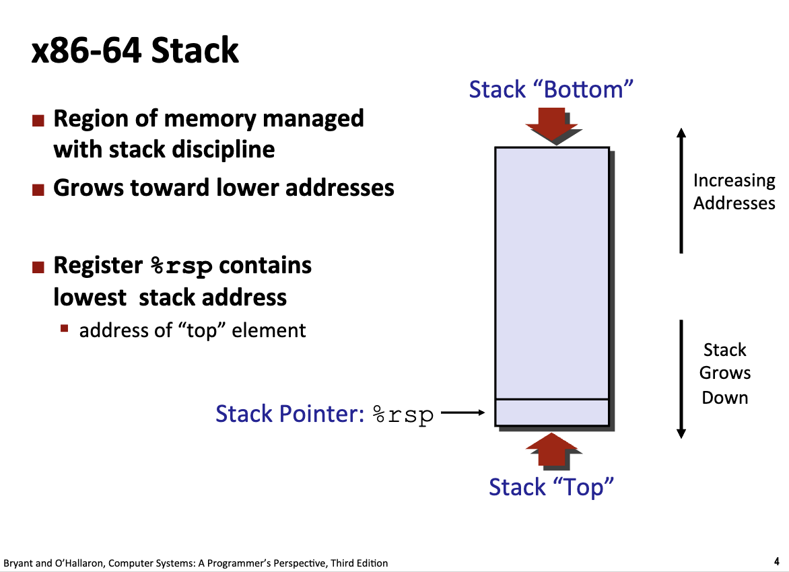
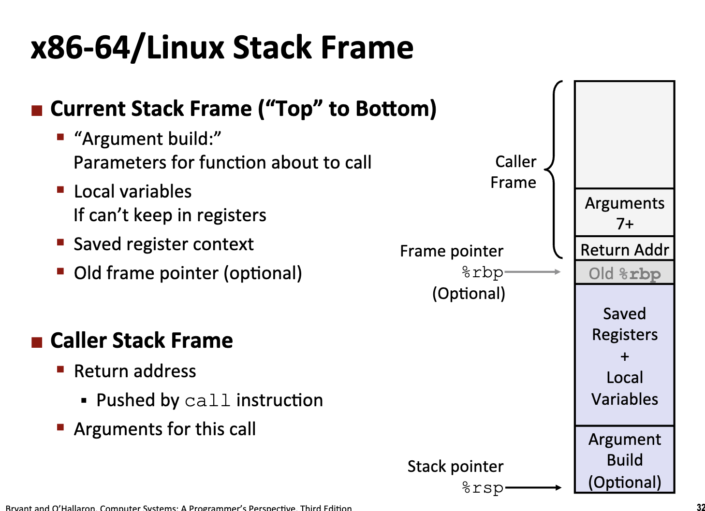
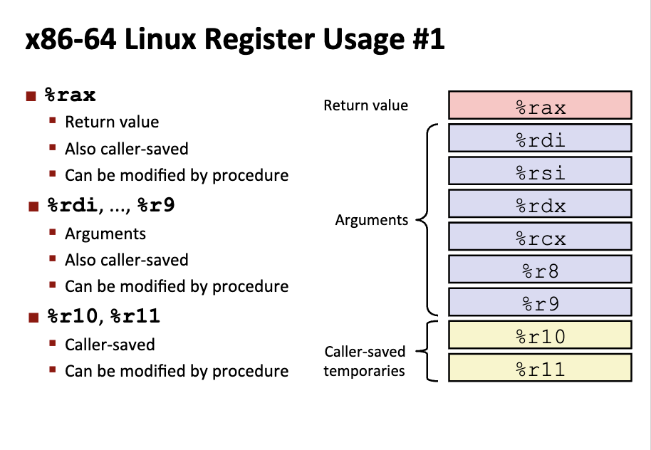
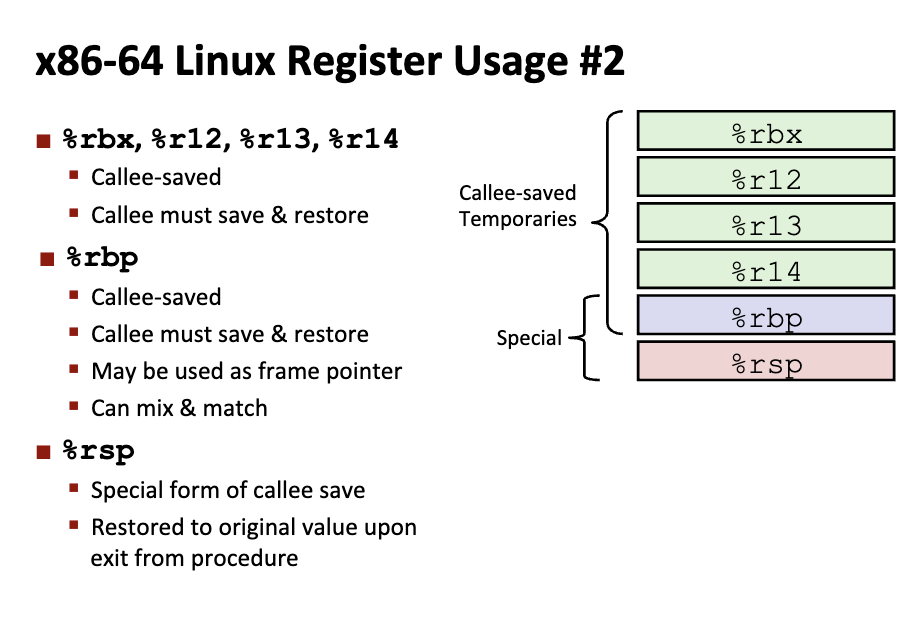
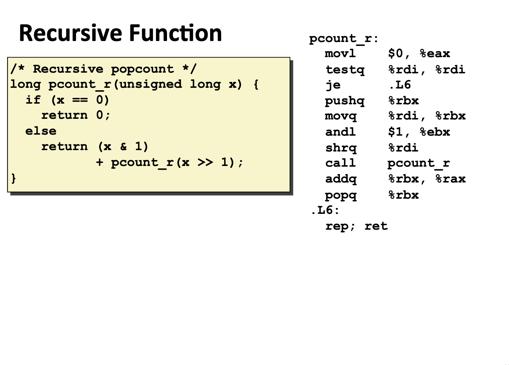

# Machine Level Programming III: Procedures

<link rel="stylesheet" href="https://cdn.jsdelivr.net/npm/katex@0.16.9/dist/katex.min.css">

<script defer src="https://cdn.jsdelivr.net/npm/katex@0.16.9/dist/katex.min.js"></script>

<script defer src="https://cdn.jsdelivr.net/npm/katex@0.16.9/dist/contrib/auto-render.min.js" onload="renderMathInElement(document.body, {delimiters: [
    {left: '$$', right: '$$', display: true},
    {left: '\\[', right: '\\]', display: true},
    {left: '$', right: '$', display: false},
    {left: '\\(', right: '\\)', display: false}
]});"></script>

## Mechanisms in Procedures

### ABI & API

**ABI** (Application Binary Interface) 是计算机体系结构中 **运行环境（Runtime）** 与 **目标代码（Object Code）** 之间的一套完全确定的低级接口协议。它在**二进制层面**强制规范了机器码执行时的所有细节:
- 指令集架构（ISA）
- 数据类型的位宽与内存对齐方式
- 寄存器分配策略与函数调用规约（Calling Convention）
- 系统调用的陷阱机制（Trap Mechanism）。

其核心意义在于确保遵循同一规范的独立编译单元（如可执行文件与动态链接库）无需重新编译，即可在符合该规范的硬件与操作系统上实现**二进制级别的互操作性（Interoperability）**。

### Mechanisms

从程序运行的角度来说，往往需要关注如下的流程:

- Passing Control:
    - 发生函数调用时控制权的转移
    - 函数调用结束时控制权的交回
- Passing Data
    - 参数传入
    - 返回值
- Memory Management
    - 内存的分配机制 (Allocate & Deallocate)

Mechanisms all implemented with machine instructions.

## Stack Structures

栈存在在内存中一段连续访问的区域：



**栈底**指针的位置不会随着栈的扩展而变化（并且在内存中的索引为最高位），栈的扩充过程伴随着栈顶指针的不断下移（寄存器递减栈顶指针）

> 栈顶指针的内存索引**低于**栈底指针。

例如，在 BombLab 中，函数入口处往往存在：

```assembly
sub    rsp,0x18
```

这样的指令，这就代表**函数正在处理参数的输入**，将栈顶指针的位置不断下移。

### Push

`pushq src`: Decrement `%rsp` by 8. 例如 `pushq %rbx` 代表把寄存器 RBX 的 64 位值压入栈中，对应的，栈顶指针会进行相应的移动。

### Pop

`popq src`: Read value at address given by `%rsp`, and increment `%rsp` by 8. Store value at Dest (must be register).

## Calling Conventions

### Passing Control

Using `call label` to pass control flow (function call).

- Push return address on stack
- Jump to label
- Return address:
    - Address of the next instruction right after call
- **Procedure Return**: Pop address from stack, jump to address.

具体来说，当一次函数调用发生时：

- CPU 会将当前的 `%rip` 寄存器的内容压入栈中，方便调用结束后继续执行。（`%rip` 存储的是 CPU 下一条需要执行的指令，即 call 指令后的下一条**指令地址**）
    - 修改 %rip：将 %rip 指向**目标函数的首地址**，程序正式“跳”入新函数。
- 在调用函数内部建立**栈帧空间**，保护调用函数的现场（上下文）：
    - 保存旧基址：`pushq %rbp`（将调用者的栈底地址存起来）
    - 设置新基址：`movq %rsp, %rbp`（让 %rbp 指向当前的栈顶）
    - 分配局部空间：`subq $16, %rsp`（通过减小栈指针，在栈上“挖”出一块空间给局部变量使用）。
- 当函数执行完毕准备回去时：
    - 清理栈帧：执行 leave（等价于恢复 %rbp 和 %rsp），让栈顶重新指向“返回地址”。
    - 弹出返回地址：执行 ret。它会从栈顶弹出之前存好的地址，并直接赋值给 %rip。
    - 恢复执行：由于 %rip 变了，CPU 下一秒就会回到 call 指令之后的那行代码继续运行。

```c
long mult2(long a, long b) {
  long s = a * b;
  return s;
}

void multstore(long x, long y, long *dest) {
  long t = mult2(x, y);
  *dest = t;
}
```

```assembly
	.file	"multstore.c"
	.intel_syntax noprefix
	.text
	.globl	mult2
	.type	mult2, @function
mult2:
	push	rbp
	mov	rbp, rsp
	mov	QWORD PTR [rbp-24], rdi
	mov	QWORD PTR [rbp-32], rsi
	mov	rax, QWORD PTR [rbp-24]
	imul	rax, QWORD PTR [rbp-32]
	mov	QWORD PTR [rbp-8], rax
	mov	rax, QWORD PTR [rbp-8]
	pop	rbp
	ret
	.size	mult2, .-mult2
	.globl	multstore
	.type	multstore, @function
multstore:
	push	rbp
	mov	rbp, rsp
	sub	rsp, 40
	mov	QWORD PTR [rbp-24], rdi
	mov	QWORD PTR [rbp-32], rsi
	mov	QWORD PTR [rbp-40], rdx
	mov	rdx, QWORD PTR [rbp-32]
	mov	rax, QWORD PTR [rbp-24]
	mov	rsi, rdx
	mov	rdi, rax
	call	mult2
	mov	QWORD PTR [rbp-8], rax
	mov	rax, QWORD PTR [rbp-40]
	mov	rdx, QWORD PTR [rbp-8]
	mov	QWORD PTR [rax], rdx
	nop
	leave
	ret
	.size	multstore, .-multstore
	.ident	"GCC: (GNU) 15.2.0"
	.section	.note.GNU-stack,"",@progbits
```

### Passing Data

- 一些寄存器来存储函数的输入值
    - `%rdi`, `%rsi`, `%rdx`, `%rcx`, `%r8`, `%r9`: The first 6 arguments. （按照从左到右的顺序）
    - Return Value: `%rax`
- Stack: 超过 6 个的参数输入在编译器中进行
- Only allocate stack space when needed.

### Managing Local Data

#### Stack Based Languages

栈帧只会处理当前的函数，栈中其他函数部分在此处被冻结了。

- Stack discipline: state for given procedure needed for limited time (From when called to when return)
- Callee returns before caller does.(符合栈的 LIFO 原则)

> 对于全局变量，存储在栈内存的一个**特定区域**，`.data` 段专门存储**已经初始化的全局变量**。



- Caller Frame: 函数调用者的栈帧（此刻被冻结）
- Callee Frame (Current Stack Frame)
    - call 指令会自动压入下一行执行指令的地址 (Return Addr)
    - 存储原先的栈底指针 `%rbp`
    - 新函数的局部变量和一些寄存器的保存值
    - 在新的函数构造参数（如果参数数量大于 6 个）
    - 最底下的栈顶指针 

#### Examples

```c
long incr(long *p, long val) {
  long x = *p;
  long y = x + val;
  *p = y;
  return x;
}

long call_incr() {
  long v1 = 15213;
  long v2 = incr(&v1, 3000);
  return v1 + v2;
}
```

```assembly
	.file	"incr.c"
	.intel_syntax noprefix
	.text
	.globl	incr
	.type	incr, @function
incr:
	push	rbp
	mov	rbp, rsp
	mov	QWORD PTR [rbp-24], rdi
	mov	QWORD PTR [rbp-32], rsi
	mov	rax, QWORD PTR [rbp-24]
	mov	rax, QWORD PTR [rax]
	mov	QWORD PTR [rbp-8], rax
	mov	rdx, QWORD PTR [rbp-8]
	mov	rax, QWORD PTR [rbp-32]
	add	rax, rdx
	mov	QWORD PTR [rbp-16], rax
	mov	rax, QWORD PTR [rbp-24]
	mov	rdx, QWORD PTR [rbp-16]
	mov	QWORD PTR [rax], rdx
	mov	rax, QWORD PTR [rbp-8]
	pop	rbp
	ret
	.size	incr, .-incr
	.globl	call_incr
	.type	call_incr, @function
call_incr:
	push	rbp
	mov	rbp, rsp
	sub	rsp, 16
	mov	QWORD PTR [rbp-16], 15213
	lea	rax, [rbp-16]
	mov	esi, 3000
	mov	rdi, rax
	call	incr
	mov	QWORD PTR [rbp-8], rax
	mov	rdx, QWORD PTR [rbp-16]
	mov	rax, QWORD PTR [rbp-8]
	add	rax, rdx
	leave
	ret
	.size	call_incr, .-call_incr
	.ident	"GCC: (GNU) 15.2.0"
	.section	.note.GNU-stack,"",@progbits
```

- 处理输入参数 rdi 和 rxi
- rax 是最终的返回值

经典的函数调用三段式出现了：

```assembly
call_incr:
	push	rbp
	mov	rbp, rsp
	sub	rsp, 16
```

### Registers Conventions

一部分寄存器承担着固定的功能，因此建立一个统一的契约是至关重要的：

- 例如，如果不建立契约，寄存器的值可能会在函数调用中被修改，导致难以**回退到函数调用之前的状态**。

- **Caller Saved**:
    - Caller saves temporary values in its frame before the call
    - 调用者需要自行保存这些寄存器的原始值到栈帧中。
- **Callee Saved**:
    - Callee saves temporary values in its frame before using
    - Callee restores them before returning to caller.
    - 被调用者使用寄存器之后需要恢复原状。





## Illustration of Recursions

栈保证递归的实现和其他函数的调用并无二异。

```c
long pcount_r(unsigned long x) {
  if (x == 0) {
    return 0;
  } else {
    return (x & 1) + pcount_r(x >> 1);
  }
}
```

```assembly
pcount_r:
    movl    $0, %eax        # 将返回值寄存器 %eax 清零（准备好基准情况的返回值）
    testq   %rdi, %rdi      # 测试参数 %rdi (n) 是否为 0
    je      .L6             # 如果 n == 0，直接跳转到 .L6 返回 0

    pushq   %rbx            # 因为我们要用 %rbx 存中间值，它是被调用者保存寄存器 Callee-Saved，必须先压栈备份
    movq    %rdi, %rbx      # 将当前的 n 复制到 %rbx
    andl    $1, %ebx        # 取 n 的最低位：n & 1，结果存入 %ebx
    
    shrq    %rdi            # 逻辑右移 1 位：n >>= 1，为递归调用准备参数
    call    pcount_r        # 递归调用 pcount_r(n >> 1)，结果会返回到 %rax 中
    
    addq    %rbx, %rax      # 将之前保存的最低位 (%rbx) 加到递归返回的结果 (%rax) 上
    popq    %rbx            # 恢复之前备份的 %rbx 值，维持栈平衡和寄存器原样

.L6:
    rep; ret                # 返回。rep; ret 是为了避免某些处理器在直接跳转到 ret 时产生分支预测性能问题
```



- rbx 是 calle-saved 的，因此实现的时候需要先将原始寄存器的值压入栈中，然后最后等函数返回的过程中出栈维持原状即可。

