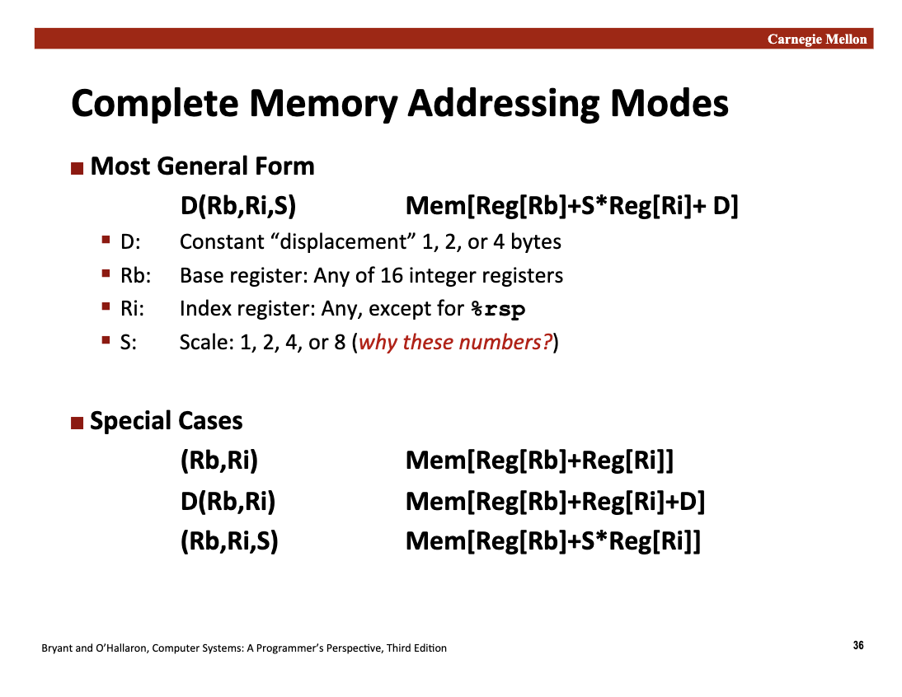
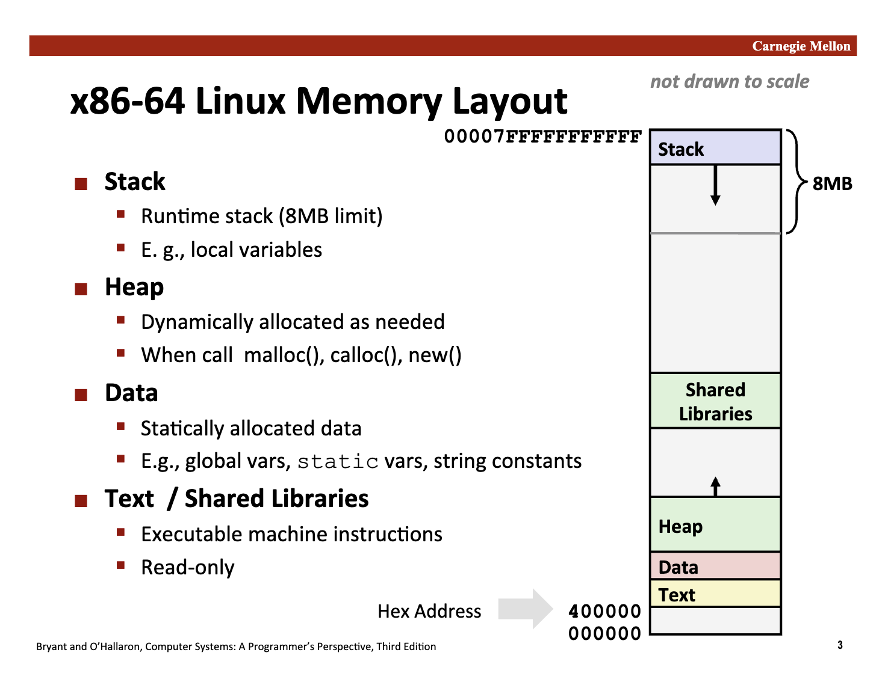
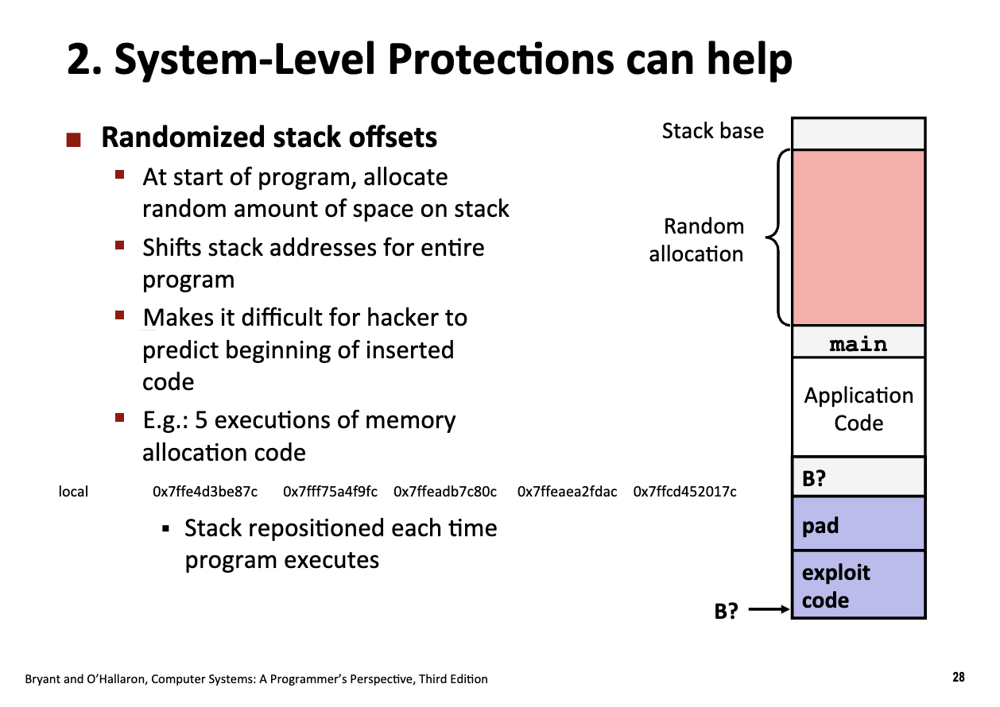
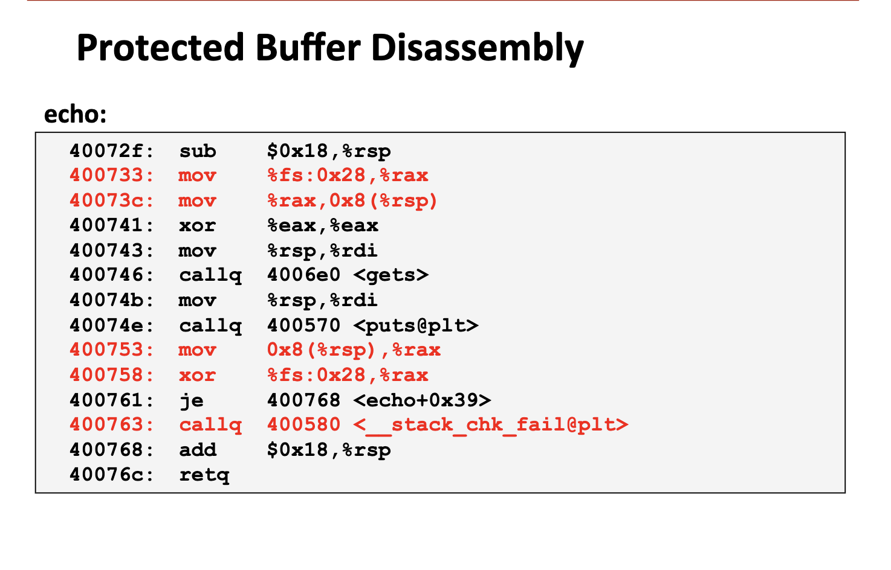

# Machine Level Programming IV: Data & V: Advanced Topics

<link rel="stylesheet" href="https://cdn.jsdelivr.net/npm/katex@0.16.9/dist/katex.min.css">

<script defer src="https://cdn.jsdelivr.net/npm/katex@0.16.9/dist/katex.min.js"></script>

<script defer src="https://cdn.jsdelivr.net/npm/katex@0.16.9/dist/contrib/auto-render.min.js" onload="renderMathInElement(document.body, {delimiters: [
    {left: '$$', right: '$$', display: true},
    {left: '\\[', right: '\\]', display: true},
    {left: '$', right: '$', display: false},
    {left: '\\(', right: '\\)', display: false}
]});"></script>

## Introduction

在之前的课程中，我们详细介绍了 C 语言中一些基本类型的表示：

- 整数（不同位数的整数，有符号和无符号）
- 浮点数
- 布尔值（一种特殊的整数）
- Char & Strings
- 指针类型

高级编程语言（包括 C）都需要更加复杂的数据结构来进行表示和建模，例如列表、结构体等等。如此之类复杂的、可动态变化的**复合数据类型**在程序运行和汇编语言中的表示更加的复杂。

- Arrays
- Structs
- Floating Points

## Array

`T A[L]`: 
- T is thr array of data type
- the length of the array: L

在栈上**连续分配** `L * sizeof(T)` bytes。

> **数组就是指针！**，数组变量在 C 代码中可以被用作一个 `T*` 类型的指针。

```c
#include <stdio.h>
#define ZLEN 6
typedef int zip_dig[ZLEN];

void show_pointer() {
  int arr[10] = {1, 2, 3, 4, 5, 6, 7, 7, 8, 9};
  printf("%p\n", arr);
  printf("%p\n", arr + 1);

  char arr_2[10] = {'1', '2', '3'};
  printf("%p\n", arr_2);
  printf("%p\n", arr_2 + 1);

  //   or another methods
  zip_dig cmu = {1, 5, 2, 1, 3};
  printf("%p\n", cmu);
  printf("%p\n", cmu + 1);

  //   this will cause damage
  //   arr += 1;
}

int main() {
  show_pointer();
  return 0;
}
```

```text
0x16d8d1dd0
0x16d8d1dd4
0x16d8d1dc0
0x16d8d1dc1
0x16d8d1da0
0x16d8d1da4
```

可以看到 arr_2 在栈内存中的地址**低于** arr，但是在指针变量内部，顺序又是从**高位到低位的**，因此可以发现**数组**在程序运行时的处理是比较特殊的。回忆一下在第五讲讲到的 Memory Addressing Modes:

`D(Rb, Ri, S)`: `Mem[Reg[Rb] + S*Reg[Ri] + D]`

- `S`: 1,2,4,8 (扩展寄存器支持特定的后缀寻址方式)
- Rb: Base register
- Ri: Index register



很显然，在数组中内存的访问非常方便使用这种模式进行：

```c
#define ZLEN 6
typedef int zip_dig[ZLEN];

int get_digit(zip_dig z, int digit) { return z[digit]; }
```

```assembly
	.file	"memory_addressing_modes.c"
	.text
	.globl	get_digit
	.type	get_digit, @function
get_digit:
.LFB0:
	.cfi_startproc
	movslq	%esi, %rsi
	movl	(%rdi,%rsi,4), %eax
	ret
	.cfi_endproc
.LFE0:
	.size	get_digit, .-get_digit
	.ident	"GCC: (GNU) 15.2.0"
	.section	.note.GNU-stack,"",@progbits
```

`movl	(%rdi,%rsi,4), %eax` 这一条指令代表从 %rdi（第一个输入参数，指针变量）开始作为 base register，然后以 4 字节为基本单位索引向后移动 `%rsi` 个单元，并取址读取值，存储到寄存器 `%eax` 中（函数的返回值）

再看一个更难的例子：

```c
void zincr(zip_dig z) {
  size_t i;
  for (i = 0; i < ZLEN; i++) {
    z[i]++;
  }
}
```

```assembly
zincr:
.LFB1:
	.cfi_startproc
	movl	$0, %eax
	jmp	.L3
	.p2align 5
.L4:
	leaq	(%rdi,%rax,4), %rcx
	movl	(%rcx), %esi
	leal	1(%rsi), %edx
	movl	%edx, (%rcx)
	addq	$1, %rax
.L3:
	cmpq	$5, %rax
	jbe	.L4
	ret
	.cfi_endproc
```

- `%rax` 寄存器始终进行 for 循环下标 i 的读取和更新
- `leaq	(%rdi,%rax,4), %rcx`: 读取对应数组下标的**地址**（注意 mov 和 lea 的指令功能不同，leaq 不会从内存中读取具体的值）
- `movl    (%rcx), %esi`: 从内存地址 %rcx 取出值，存入 %esi (即 val = arr[i])
- `leal    1(%rsi), %edx`: 利用 leal 计算 %rsi + 1，结果存入 %edx
- `movl    %edx, (%rcx)`: 将加 1 后的值写回内存地址 %rcx (即 arr[i] = val + 1)
    - 这里的自增操作貌似显的有点多余，实则也是后置++的特性，需要返回自增之前的值，因此需要使用单独一个变量进行存储。

### Nested Arrays

- `T A[R][C]`: 2D data array of data type `T`
- R rows, C columns
- Type `T` element requires `K` bytes.

- Total size: R * C * K

在内存中的存储结构和正常的一样。

$$
A+i*(C*K)+j*K = A+(i*C+j)*K
$$

```c
#include <stdio.h>
#define PCOUNT 4
#define ZLEN 6
typedef int zip_dig[ZLEN];

zip_dig pgh[PCOUNT] = {
    {1, 5, 2, 0, 6}, {1, 5, 2, 1, 3}, {1, 5, 2, 1, 7}, {1, 5, 2, 2, 1}};

int *get_pgh_zip(int index) { return pgh[index]; }

int get_pgh_digit(int index, int dig) { return pgh[index][dig]; }

```

```assembly
get_pgh_zip:
.LFB11:
	.cfi_startproc
	movslq	%edi, %rdi
	leaq	(%rdi,%rdi,2), %rax
	leaq	pgh(,%rax,8), %rax
	ret
	.cfi_endproc
.LFE11:
	.size	get_pgh_zip, .-get_pgh_zip
	.globl	get_pgh_digit
	.type	get_pgh_digit, @function
get_pgh_digit:
.LFB12:
	.cfi_startproc
	movslq	%esi, %rsi
	movslq	%edi, %rdi
	leaq	(%rdi,%rdi,2), %rax
	leaq	(%rsi,%rax,2), %rax
	movl	pgh(,%rax,4), %eax
	ret
	.cfi_endproc
.LFE12:
	.size	get_pgh_digit, .-get_pgh_digit
	.globl	pgh
	.data
	.align 32
	.type	pgh, @object
	.size	pgh, 96
```

- In `get_pgh_zip` function:
    - `leaq	(%rdi,%rdi,2), %rax`: rax = 3 * rdi
    - `leaq	pgh(,%rax,8), %rax`: $\text{rax} = \text{pgh} + (\text{rax} \times 8)$
    - 两行计算整体进行：`rax = pgh + 24 * rdi`, 24 = 3*8= 4*6!
        - 不得不感叹，聪明的编译器
- In `get_pgh_digit` function:
    - `leaq	(%rdi,%rdi,2), %rax`: `rax = 3*rdi`
    - `leaq	(%rsi,%rax,2), %rax`: `rax = rsi + rax*2`
    - 合起来：`rax = rsi + 6* rdi`
        - `rdi` 对应第一个参数 index
        - `rsi` 对应第二个参数 dig
    - `movl	pgh(,%rax,4), %eax`: eax 的值是 `pgh + 4*(rsi + 6*rdi)` 的地址上的数取值得到的结果。

### Multi-Level Array

在生成一个 Nested Array 的时候，**整个数组的元素**都存储在**栈上**的一段连续空间，可以快速通过索引计算得到，在上文的汇编中也展示了使用 leap 等汇编指令进行内存区域的快速访问。

但是如下的声明方式存在差异：

```c
#include <stddef.h>
#include <stdio.h>
#define PCOUNT 4
#define ZLEN 6
#define UCOUNT 3
typedef int zip_dig[ZLEN];

zip_dig pgh[PCOUNT] = {
    {1, 5, 2, 0, 6}, {1, 5, 2, 1, 3}, {1, 5, 2, 1, 7}, {1, 5, 2, 2, 1}};

zip_dig cmu = {1, 5, 2, 1, 3};
zip_dig mit = {0, 2, 1, 3, 9};
zip_dig ucb = {9, 4, 5, 2, 0};

int *univ[UCOUNT] = {mit, cmu, ucb};
// univ 也是一个二维数组（二维指针），在这里表示成一个一维指针的数组

int *get_pgh_zip(int index) { return pgh[index]; }

int get_pgh_digit(int index, int dig) { return pgh[index][dig]; }

int get_univ_digit(size_t index, size_t digit) { return univ[index][digit]; }
```

`univ` 是一个一维数组的指针，因此三个指针变量存储在连续的内存中，但是**三个指针指向的内容**存储在**不同的内存区域**中。

```assembly
get_univ_digit:
.LFB13:
	.cfi_startproc
	movq	univ(,%rdi,8), %rax
	movl	(%rax,%rsi,4), %eax
	ret
	.cfi_endproc
```

- `movq	univ(,%rdi,8), %rax` 将对应的一维数组中**元素**读取出来，注意这里是 `movq` 会从内存中取值。
- 取出来的值仍然是一个地址！（因为这个数组的元素是一个 int 类型的指针），接下来再读取 rsi 中的第二个函数输入参数，读取到最终的 digit。

> 对于 Multi-Level Array，需要**多次的解引用操作**。

### VLA

在 C99 中，引入了变长数组 Variable Length Array，允许**数组的长度在运行时确定而不是在编译时确定**。

```c
#include <stddef.h>

int vec_ele(size_t n, int a[n][n], size_t i, size_t j) { return a[i][j]; }
```

```assembly
vec_ele:
.LFB0:
	.cfi_startproc
	imulq	%rdx, %rdi
	leaq	(%rsi,%rdi,4), %rax
	movl	(%rax,%rcx,4), %eax
	ret
	.cfi_endproc
```

- `rax = rsi + 4* (rdi * rdx)`
    - rdx is `i`, and rdi is `n`
    - rax 读取了第一个索引对应的地址
- `movl	(%rax,%rcx,4), %eax`: 加上了第四个参数 rcx 并读取，最终读取到对应的内存位置并取得对应的值，存储在 rax 寄存器中返回。

## Structs

- 结构体中的数据存储在一段连续的内存块中 (block of memory)
- 编译器会跟踪每个数据的起始位置（编译时完成）

```c
#include <stddef.h>
struct rec {
  size_t i;
  int a[4];
  struct rec *next;
};

int get_a(struct rec *r, size_t idx) { return r->a[idx]; }

int *get_ap(struct rec *r, size_t idx) { return &(r->a[idx]); }
```

```assembly
	.file	"structs.c"
	.text
	.globl	get_a
	.type	get_a, @function
get_a:
.LFB0:
	.cfi_startproc
	movl	8(%rdi,%rsi,4), %eax
	ret
	.cfi_endproc
.LFE0:
	.size	get_a, .-get_a
	.globl	get_ap
	.type	get_ap, @function
get_ap:
.LFB1:
	.cfi_startproc
	leaq	8(%rdi,%rsi,4), %rax
	ret
	.cfi_endproc
.LFE1:
	.size	get_ap, .-get_ap
	.ident	"GCC: (GNU) 15.2.0"
	.section	.note.GNU-stack,"",@progbits

```

- `get_a` 函数会根据输入参数的索引取到特定的内存位置并取值
	- `movl	8(%rdi,%rsi,4), %eax`: 取出的目标地址是 `rdi + 8 + 4* rsi`
		- 根据定义的顺序，第一个类型是一个占 8 个字节的 size_t 变量
		- rdi 代表第一个输入参数，即地址
		- rsi 代表第二个输入参数，即数组 a 内部的偏移量，因此乘 4（是 int 类型的变量）
- `get_ap`: `leaq	8(%rdi,%rsi,4), %rax` 一模一样的操作，只不过直接取地址存入寄存器，而不是使用 movel 取出对应地址上的值。

### Linked List

```c
#include <stddef.h>
struct rec {
  size_t i;
  int a[4];
  struct rec *next;
};

void set_val(struct rec *r, int val) {
  while (r) {
    int i = r->i;
    r->a[i] = val;
    r = r->next;
  }
}
```

```assembly
	.file	"linked_list.c"
	.text
	.globl	set_val
	.type	set_val, @function
set_val:
.LFB0:
	.cfi_startproc
	jmp	.L2
	.p2align 4
.L3:
	movslq	(%rdi), %rax
	movl	%esi, 8(%rdi,%rax,4)
	movq	24(%rdi), %rdi
.L2:
	testq	%rdi, %rdi
	jne	.L3
	ret
	.cfi_endproc
.LFE0:
	.size	set_val, .-set_val
	.ident	"GCC: (GNU) 15.2.0"
	.section	.note.GNU-stack,"",@progbits
```

- 循环的判断是判断输入参数 r 是否为 0: `testq	%rdi, %rdi`
- 循环内部的代码在 L3：
	- 从寄存器 rdi 中的地址读取一个数，存入 rax 中
	- 然后将存储在 esi 中的值写入 `8(%rdi,%rax,4)`: `a[i]`
	- next 指针的位置移位是 24 位，因此最后一步是在做 next 指针的更新，把移位 24 的地址进行取值（取出来的值仍然是一个地址）更新给当前的 rdi 寄存器

### Alignment

在大多数现代系统（如 x86-64）中，对齐遵循以下两个基本原则：

- 成员对齐：每个成员的起始地址必须是它自身大小的倍数。
	- char (1 字节)：可以放在任何地址。
	- short (2 字节)：地址必须是 2 的倍数。
	- int / float (4 字节)：地址必须是 4 的倍数。
	- double / long / 指针 (8 字节)：地址必须是 8 的倍数。
	- long double (16 字节)：地址必须是 16 的倍数。
- 整体对齐：整个结构体的总大小，必须是**内部最大成员大小的倍数**（为了保证在结构体数组中，每个元素的成员都能对齐）

对于结构体组成的数组，每一个结构体需要保证对齐！

#### Why Alignment?

- CPU 和主存通过总线读取数据，不是逐字节读取的，而是每次读取一段数据块。对齐可以让 CPU 不需要读取两次数据来获得一个数据的值。


```c
#include <stdio.h>

struct a {
  short i;
  float v;
  short j;
} a_va;

struct b {
  short i;
  short j;
  float v;
} b_va;

struct c {
  char c;
  int i;
  char d;
} c_va;

struct d {
  int i;
  char c;
  char d;
} d_va;

int main() {
  printf("The length of structure a: %ld\n", sizeof(a_va));
  printf("The length of structure b: %ld\n", sizeof(b_va));
  printf("The length of structure c: %ld\n", sizeof(c_va));
  printf("The length of structure d: %ld\n", sizeof(d_va));
}
```

```text
The length of structure a: 12
The length of structure b: 8
The length of structure c: 12
The length of structure d: 8
```

可以看到，在定义结构体的时候，不同变量的摆放顺序会影响内存使用的大小！

## Unions

- 结构体为每一个字段分配连续内存并对齐
- Unions: 只为最大的变量分配内存

```c
#include <stdio.h>
typedef union {
  float f;
  unsigned u;
} bit_float_t;

float bit_2_float(unsigned u) {
  bit_float_t arg;
  arg.u = u;
  return arg.f;
}

unsigned float_2_bit(float f) {
  bit_float_t arg;
  arg.f = f;
  return arg.u;
}

int main() {
  // both for 4 bytes
  printf("The length of float: %lu\n", sizeof(float));
  printf("The length of unsigned: %lu\n", sizeof(unsigned));

  float num_1 = 0.01;
  unsigned num_2 = 20;

  printf("Casting directly: %u\n", (unsigned) num_1);
  printf("Casting directly: %f\n", (float) num_2);
  printf("Casting using float_2_bit: %u\n", float_2_bit(num_1));
  printf("Casting using bit_2_float: %f\n", bit_2_float(num_2));
  return 0;
}
```

- 直接的类型转换是 Value conversion (numeric value is converted)
- 但是使用 Union 会保证 bit-level 的类型不变！因此不可以当做 casting 用！

## Floating Points

> Skip this part for this time...

## Memory Layout



1. Text (代码段)
- 位置： 内存的最底部（靠近地址 400000）。
- 内容： 存储编译后的可执行机器指令。
- 特性： 通常是只读的，防止程序在运行时意外修改自己的代码。

2. Data (数据段)
- 内容： 存储静态分配的数据。
- 包含： 全局变量（Global variables）、静态变量（Static variables）以及字符串常量。
- 注意： 在更细致的分类中，它通常分为 .data（已初始化的变量）和 .bss（未初始化的变量）。
- 因此声明为全局变量不是存储在栈上，往往可以开更大的数组。

3. Heap (堆)
- 内容： 用于**动态内存分配**。
- 触发方式： 当你在程序中调用 malloc()、calloc() 或 C++ 中的 new 时，内存会从这里分配。
- 生长方向： 如图中箭头所示，堆是**向上（向高地址）**生长的。

4. Shared Libraries (共享库)
- 内容： 存储程序调用的外部库（如标准 C 库 libc）。
- 作用： 多个进程可以共享同一份物理内存中的库代码，从而节省空间。

5. Stack (栈)
- 位置： **内存的最顶部**（靠近地址 00007FFFFFFFFFFF）。
- 内容： 存储局部变量、函数参数和返回地址。
- 特性： * 生长方向： **向下（向低地址）**生长。
- 限制： 图中注明了 8MB limit，这是典型的 Linux 默认栈大小。如果递归过深或局部变量过大，就会导致著名的“栈溢出”（Stack Overflow）。

- 栈在内存的最顶端，生长的方向是向下生长
- 堆内存在内存的最低端，生长的方向是向上生长。(malloc)

## Buffer Overflow

不正确的内存引用操作会导致非常严重的后果，例如下面的 memory bug，对结构体中数组的不正确访问影响了结构体中其他变量的值。（并且没有任何的警告和报错信息）


```c
#include <stdio.h>

typedef struct {
  int a[2];
  double d_1;
  double d_2;
} struct_t;

struct_t fun(int i) {
  // volatile 关键词声明会禁止编译器进行优化
  volatile struct_t s;
  s.d_1 = 3.14;
  s.d_2 = 4.33;
  s.a[i] = 1073741824;
  return s;
}

int main() {
  printf("The Size of struct_t: %lu\n", sizeof(struct_t));
  for (int i = 0; i <= 6; i++) {
    printf("Current (i=%d), d_1: %.10f, d_2: %.10f\n", i, fun(i).d_1, fun(i).d_2);
  }
  return 0;
}
```

```text
The Size of struct_t: 24
Current (i=0), d_1: 3.1400000000, d_2: 4.3300000000
Current (i=1), d_1: 3.1400000000, d_2: 4.3300000000
Current (i=2), d_1: 3.1399998665, d_2: 4.3300000000
Current (i=3), d_1: 2.0000006104, d_2: 4.3300000000
Current (i=4), d_1: 3.1400000000, d_2: 4.3299989700
Current (i=5), d_1: 3.1400000000, d_2: 2.0000009918
Current (i=6), d_1: 3.1400000000, d_2: 4.3300000000
```

栈溢出的行为是在**汇编层面**发生的，因此非常危险，也更难察觉，例如，黑客可以通过栈溢出的手段修改其他部分的内存空间，实现向恶意分支的跳转操作。

例如，一个已经废弃的 `*gets` 函数，如果用户输入的长度超过了给定缓冲区的长度，额外超出的部分会覆盖缓冲区之外的数据，造成运行问题。

```c
#include <stdio.h>
char *unsafe_gets(char *dest) {
  // * 工作指针 p 指向缓冲区的起始位置

  int c = getchar();
  char *p = dest;
  while (c != EOF && c != '\n') {
    *p++ = c;
    // * 先自增、但是解引用的是自增之前的地址
    c = getchar();
  }
  *p = '\0';
  return dest;
  // * 最终 dest 指向的是缓冲区的起始位置的指针
}

char *safe_gets(char *dest, int size) {
  int c = getchar();
  char *p = dest;
  int count = 0;
  // 增加了一个条件：count < size - 1
  // * 避免读入的字符超过缓冲区
  while (count < size - 1 && c != EOF && c != '\n') {
    *p++ = c;
    count++;
    c = getchar();
  }
  *p = '\0';
  return dest;
}

int main(){
    char buffer[16];
    // ! unsafe methods
    printf("%s\n", unsafe_gets(buffer));

    // safe methods
    printf("%s\n", safe_gets(buffer, sizeof(buffer)));
    return 0;
}
```


### Examples

- The original Internet Worm (1988)
- IM War
- Worms and Viruses

### Avoid Overflow Problems

#### `fgets`

- `fgets` instead of `gets`
- `strncpy` instead of `strcpy`
- Do not use `scanf` with `%s` conversion specifications
	- Use `fgets` to read the strings
	- `%ns`

```c
#include <stdio.h>
#include <string.h>

#define MAX_BUF 16

int main() {
  char input_id[MAX_BUF];
  char bio[MAX_BUF];
  char secure_backup[8];

  printf("Enter a String with maximum length of %d: ", MAX_BUF - 1);
  scanf("%15s", input_id);

  // * 清除缓冲区中的回车符
  int c;
  while ((c = getchar()) != '\n' && c != EOF)
    ;

  printf("Enter another string with maximum length of %d: ", MAX_BUF - 1);
  if (fgets(bio, sizeof(bio), stdin) != NULL) {
    bio[strcspn(bio, "\n")] = '\0';
  }

  printf("Using strncpy...\n");
  strncpy(secure_backup, bio, sizeof(secure_backup) - 1);
  secure_backup[sizeof(secure_backup) - 1] = '\0';

  printf("String 1: %s\n", input_id);
  printf("String 2: %s\n", bio);
  printf("String 3: %s\n", secure_backup);

  return 0;
}
```

这些更加安全的标准库用法可以保证读取输入&字符串指针的时候不会产生栈溢出！

#### Randomized Stack Offsets

ASLR: Address Space Layout Randomization



代码注入攻击首先需要了解缓冲区在内存中的起始地址，因此现代编译器引入了随机化操作，让黑客无法直接定位缓冲区。无法进行注入攻击。

每次程序启动时，操作系统都会在栈的最顶端随机分配一段空余空间（Random allocation）。这会导致整个栈的所有地址向下平移。同一个局部变量 local 的地址从 0x7ffe... 变成了 0x7fff...。每次运行，地址都在变。

#### Data Execution Prevention (DEP)

- 在老旧的处理器架构中，内存通常只区分“**只读**”或“**可写**”。只要是 CPU 能读到的内存区域，它就默认可以执行其中的指令。这意味着攻击者只要把代码写进栈里，就能运行它。

- 现代解决方案 (X86-64)： 引入了明确的 “执行 (Execute)” 权限。硬件现在可以给内存贴上标签：
	- 代码区: 可读、可执行，但不可写。
	- 数据/栈区: 可读、可写，但不可执行。

即便攻击者成功地把恶意代码（图中蓝紫色部分）塞进了栈里，当 CPU 试图去运行这块区域的内容时，硬件会立刻发现“这块区域禁止执行”，从而强制关闭程序，防止攻击成功。

> **内存的执行权限**

和文件的执行权限类似，内存的执行权限会控制 CPU 执行某块内存区域中的代码，例如栈内存、堆内存是不可执行的，防止黑客恶意使用栈溢出进行工具、注入危险程序。

- text 等存储程序机器执行代码的位置是可执行的。


#### Stack Canary Protections

当你编译程序并开启了保护（如 -fstack-protector）时，编译器会在每个“危险”函数的栈帧中插入一个随机生成的秘密数值。这个值被放置在 **局部变量**（如你的 buffer） 和 **返回地址**（Return Address） 之间。

一旦 Buffer Overflow 发生，金丝雀随机数会被覆写，此时程序会抛出 Abort Trap。如果保证严格的独立性，**每一个栈帧**中间都需要加上金丝雀保护（夹在 Caller Frame 的 Return Address 和旧的栈帧指针 与 Callee Frame 的局部变量存储（缓冲区）之间。

Canary 通常为 8 bytes，是一个 long 类型的随机数。



- `mov %fs:0x28, %rax`: 从线程局部存储（TLS）中读取一个随机值（Canary），存入 %rax 寄存器。`%fs:0x28` 是一个特殊的内存地址，存放着当前线程的 Stack Canary 值。
- `mov %rax, 0x8(%rsp)`: 保存 canary 到栈上
- `mov 0x8(%rsp), %rax`: 读取 canary 值
- `xor %fs:0x28, %rax`: 与原始的 canary 值进行异或比较。

这会保证 caller 的下一个地址不会被篡改，避免程序的控制流被恶意篡改。

> Return-Oriented Programming Attacks
- 不注入代码，而是使用现有代码，得到系统权限。（同样利用栈溢出）

